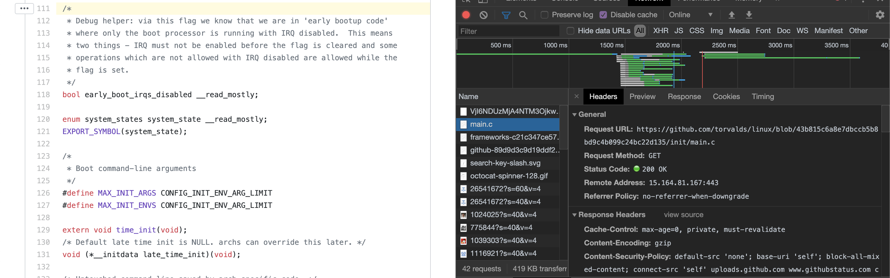
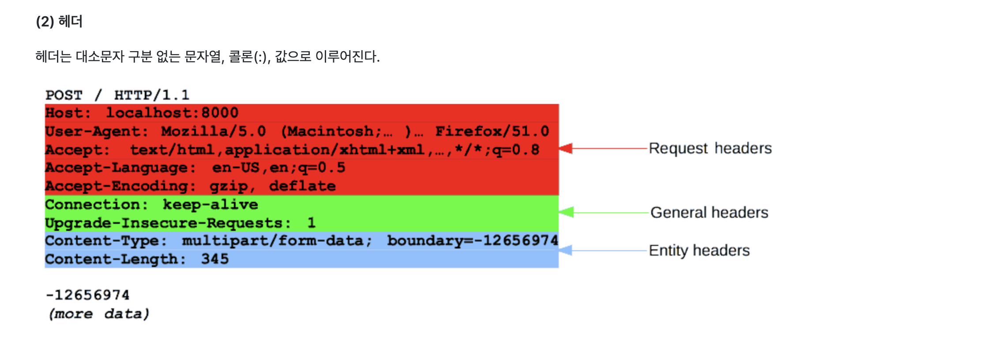
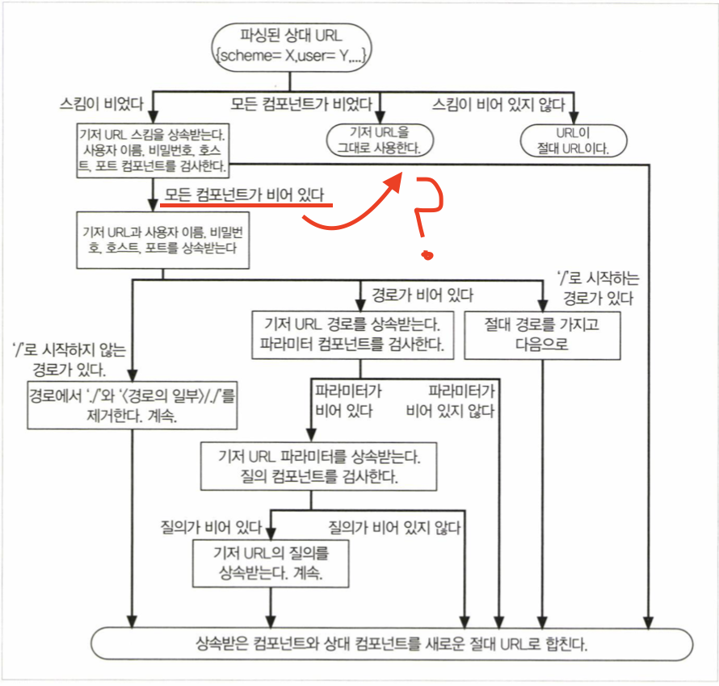

# Answers

#### Q. URL 문법에서 파라미터와 질의가 어떻게 다른지 잘 모르겠어요

> 파라미터와 질의는 모두 key-value 형태로 URL 상에 추가적인 정보를 제공해주지만, 가장 큰 차이는 질의는 언제나 URL 의 일부여야 한다는 것입니다. 반면 파라미터는 form-data 형태로 URL 에 나타나지 않은 채로 전송될 수 있습니다.

[What is the difference between URL parameters and query strings? - Stack Overflow](https://stackoverflow.com/questions/39266970/what-is-the-difference-between-url-parameters-and-query-strings).

#### Q. 프래그먼트 예시

> github 의 linux 프로젝트 main.c 의 111 번째 프래그먼트를 요청해보았다 (https://github.com/torvalds/linux/blob/43b815c6a8e7dbccb5b8bd9c4b099c24bc22d135/init/main.c#L111)



> 실제로 request url 에는 fragment(\#) 이 포함되어 있지 않지만 browser 에서는 111번째 라인부터 표시해준다

#### Q. 상대 URL 예시

> https://github.com/jeuxdeau/http-the-definitive-guide/blob/master/i.http-the-webs-foundation/01.overview-of-http/01.overview-of-http-answers.md



```html
<p><strong>(2) 헤더</strong></p>
<p>헤더는 대소문자 구분 없는 문자열, 콜론(:), 값으로 이루어진다.</p>
<p>
  <a
    target="_blank"
    rel="noopener noreferrer"
    href="/jeuxdeau/http-the-definitive-guide/blob/master/.gitbook/assets/http_request_headers2.png"
    ></a>
</p>
```

1. .png 의 경로가 /jeuxdeau/... 로 시작한다 (상대 참조)
2. <BASE> tag 가 없다
3. 기저 URL 이 명시되지 않았으므로 해당 리소스의 URL 을 기저 URL 로 사용한다
4. URL 분해 알고리즘을 사용하여 기저 URL 을 파싱한다
   1. 스킴이 비었다 (https://github.com/jeuxdeau/http-the-definitive-guide/blob/master/i.http-the-webs-foundation/01.overview-of-http/01.overview-of-http-answers.md 에서 스킴을 상속받고 사용자 이름, 비밀번호, 호스트, 포트 컴포넌트를 검사)
      - https://
   2. 적어도 한 개 이상의 컴포넌트가 존재한다 (사용자 이름, 비밀번호, 호스트, 포트를 상속받는다)
      - https://github.com
   3. '/'로 시작하는 경로가 있다
   4. 상속받은 컴포넌트와 상대 컴포넌트를 합친다
      - https://github.com/jeuxdeau/http-the-definitive-guide/blob/master/.gitbook/assets/http_request_headers2.png

> 모든 컴포넌트가 비어 있다가 오른쪽 방향 아닌가?



5. 이미지의 source 는 https://github.com/jeuxdeau/http-the-definitive-guide/blob/master/.gitbook/assets/http_request_headers2.png 가 된다
