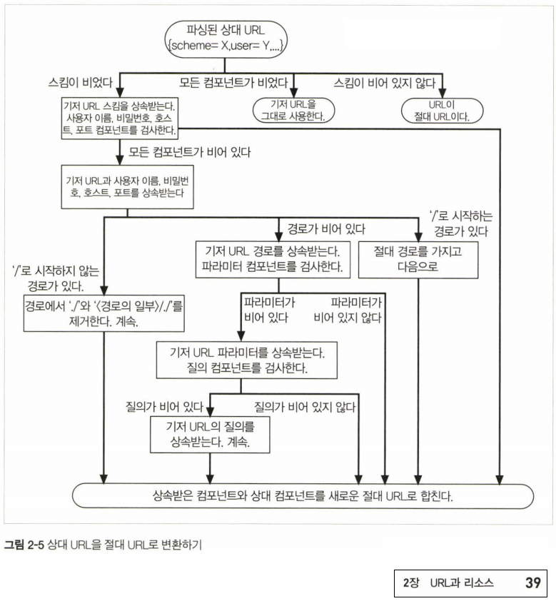

# 02. URL과 리소스

이 장에서는 리소스를 표현하는 약속. URL(URI)에 대해 알아봅니다.

### 2.1 인터넷의 리소스 탐색하기

아래 URL을 예시로 간단하게 URL 구조를 알아봅시다.

    스킴://서버위치/경로
    http://www.joes-hardware.com/seasonal/index-fall.html

#### `http://` : URL 스킴

* 웹 클라이언트가 어떤 프로토콜로 접근해야 하는지의 명세

#### `http://www.joes-hardware.com` : 호스트 (서버 위치)

* 서버의 위치
* 웹 클라이언트가 요청하는 리소스가 어디에 호스팅 되어있는지 (어느 서버에 위치해 있는지) 식별
* 해당 컴포넌트는 도메인 네임이며 대신에 ip 사용 가능

#### `/seasonal/index-fall.html` : 리소스의 경로

클라이언트가 리소스를 요청하면 서버는 해당 리소스를 찾아 응답해준다.

이 때, 해당 컴포넌트를 통해 어떤 경로에 있는 리소스인지 식별한다.

#### 2.1.1 이러한 규칙이 없었다면?

1. 특정 리소스에 접근하기 위해 각기 다른 프로토콜로 접근해야 한다.
2. 규칙이 없었을 땐, 리소스 접근을 위해 프로토콜 별로 애플리케이션을 사용해야만 했다.
3. 불편함을 해소하고자 리소스 탐색 방법을 통합 시켰다.
4. 하나의 애플리케이션(브라우저)를 통해 탐색할 수 있어 매우 편리해졌다.
5. 유저는 프로토콜, 그리고 프로토콜을 위한 애플리케이션들에 대해 알 필요가 없다.

### 2.2 URL 문법

URL 문법에 대해 좀 더 자세히 들어가 봅니다.

대다수 URL 스킴의 문법은 일반적으로 9개 부분으로 나뉜다.

    <스킴>://<사용자이름>:<비밀번호>@<호스트>:<포트>/<경로>;<파라미터>?<질의>#<프래그먼트>

#### 2.2.1 스킴

사용할 프로토콜

#### 2.2.2 호스트와 포트

호스트는 위에서 설명한 바와 같이 리소스를 실제 가지고 있는 장비를 칭한다.

포트는 서버가 이 리소스를 응답해주기 위해 열어놓은 포트를 말한다.

프로토콜 별 기본 포트는 [Well-known-port](https://en.wikipedia.org/wiki/List_of_TCP_and_UDP_port_numbers#Well-known_ports)를 참고

#### 2.2.3 사용자 이름과 비밀번호

리소스에 접근할 때 서버가 사용자 이름과 비밀번호를 요구한다면 작성해주어야 한다.

대표적인 예로 ftp 서버가 그렇다.

사용자 이름은 기본 값으로 `anonymous` 이고 비밀번호는 브라우저 별로 상이한 메일 형식의 더미 값이다.

#### 2.2.4 경로

파일 시스템과 같은 계층적 구조를 띈다.

서버가 클라이언트에게 줄 리소스를 찾기 위해 사용하는 위치 정보이다.

#### 2.2.5 파라미터

경로는 `/<경로 조각>/<경로 조각>/.....` 과 같은 형식으로 이루어져 있는데

`/`로 구분된 경로 조각은 자체만의 파라미터를 가질 수 있다.

예를 들어 `http://www.joes-hardware.com/hammer/index.html` 에 접근할 때 서버에게 더 많은 정보를 주기 위해 다음과 같이 파라미터를 추가할 수 있다. (또는 서버의 규칙에 따라 추가해야만 한다.)

`[http://www.joes-hardware.com/hammer;sale=false/index.html;graphics=true](http://www.joes-hardware.com/hammer/index.html을)`

파라미터는 2개 이상 쓸 수도 있고 파라미터에 들어가는 값도 아예 없거나 여러 값이 될 수 있다.

`[http://www.joes-hardware.com/hammer;param1;param2=a,b,c](http://www.joes-hardware.com/hammer/index.html을)`

ref : [https://doriantaylor.com/policy/http-url-path-parameter-syntax](https://doriantaylor.com/policy/http-url-path-parameter-syntax)

#### 2.2.6 질의 문자열

일반적으로 웹 데이터베이스 게이트웨이에 질의하는데 사용된다.

예시는 다음과 같다.

`http://www.joes-hardware.com/inventory-check.cgi?item=12731&size=big&color=blue&location=`

제품번호가 12731이고 사이즈가 big 이면서 색상이 파란색인 재고를 확인하기 위해 요청한 리소스 예제이다.

질의 문자열의 값에 대해 생길 수 있는 모든 케이스는 [@vouriliikaluoma의 comment](https://github.com/axios/axios/issues/1139#issuecomment-459728126)를 참고.

#### 2.2.7 프래그먼트

HTML 같은 리소스를 paragraph(절) 등을 사용하여 잘게 나눌 수 있는데, 이를 이용하여 브라우저가 특정 위치를 가리킬 수 있도록 한다.

이 기능은 서버까지 전달되지는 않고 웹 클라이언트가 리소스를 응답 받은 뒤 특정 위치를 가리킨다.

예를 들어 `[http://www.joes-hardware.com/tools.html#drills](http://www.joes-hardware.com/tools.html#drills)` 라는 요청을 했을 때, 웹 클라이언트는 `tools.html` 리소스를 받은 뒤 drills 가 있는 위치를 가리킨다.

대표적으로 id를 사용하는 방법이 있다.

    ...
    <h1 id='drills'>drill...s...</h1>
    ...

### 2.3 단축 URL

URL이 너무 길죠. 편하게(짧게) 써 봅시다.

#### 2.3.1 상대 URL

상대 위치로 리소스의 위치를 나타내는 방법.

##### 기저 URL

현재 리소스 또는 명시된 정보를 통해 알 수 있는 URL 정보

계층적 폴더 시스템에 따라 현재 디렉토리와 유사한 정보를 사용한다.

다음과 같은 규칙으로 제공된다.

- 리소스에서 명시적으로 제공. (HTML에서 <BASE> 태그와 같은 명시적인 방법)
- 리소스가 포함하고 있는 기저 URL
    - 예시

        현재 URL이 `[http://www.joes-hardware.com/tool.html](http://www.joes-hardware.com/tool.html)` 이면 기저 URL은 `[http://www.joes-hardware.com`이](http://www.joes-hardware.com이) 된다.

        이 때 새로운 상대 URL `./hammer.html`을 적용하면 새로운 URL인 `[http://www.joes-hardware.com/hammer.html](http://www.joes-hardware.com/hammer.html가)` 가 된다.

- 기저 URL 이 없는 경우
    - 절대 URL 으로만 이루어져 있거나, 불완전하거나, 깨진 URL의 경우이다.

##### 상대 참조 해석

#### 2.3.2 URL 확장

브라우저가 검색창에서 자동완성 기능을 제공해주는 방법이다.

> 아래 문제에 대해 발생할 수 있는 문제는 6장에서 상세히 다룬다.

##### 호스트 명 확장

단순하게 `yahoo`라고 입력하면 `www.`과 `.com`을 붙여서 `www.yahoo.com`을 만든다.

만약 찾지 못하면 추가로 url을 제시해 주기도 한다.

##### 히스토리 확장

사용자가 과거에 방문했던 기록을 통해 `www.yah`라고 입력하면 `www.yahoo.com`을 만든다.

### 2.4 안전하지 않은 문자

URL에 아무 문자나 집어 넣을 순 없다.

URL은 모든 프로토콜의 문자셋과 호환하기 위해 US-ASCII 인코딩을 사용한다.

US-ASCII와 호환되지 않는 다른 언어나 특수기호의 경우 [퍼센트 인코딩](https://en.wikipedia.org/wiki/Percent-encoding)을 사용한다.

> 퍼센트 인코딩은 %xx 와 같이 나타내며 x는 0\~9, a\~f 인 16비트 값이다.
> 예를 들어 공백을 나타내는 값은 `%20` 이다.

몇몇 문자는 URL 규칙과 혼동될 수 있기에 선점되어 있다.

`% / . .. # ? ; : $ + @ & = { } | \ ~ [ ] < > " 등`

이 경우 퍼센트 인코딩으로 인코딩해주어야 한다.

#### 브라우저에서는 어떻게 작동할까?

최초로 입력받은 애플리케이션(브라우저)에서 안전하지 않은 문자(`선점되어 있는 문자`와 `US-ASCII와 호환되지 않는 문자`)를 퍼센트 인코딩한다.

결과적으로 한글을 치든 특수문자를 치든 전송하기 전에 US-ASCII 문자셋으로 만든다.

### 2.5 스킴의 바다

이 절에는 웹에서 자주 쓰이는 스킴들과 그에 대한 URL 문법에 대해 정리되어 있다.

프로토콜별 문법은 [rfc1738](https://tools.ietf.org/html/rfc1738)에 명세되어 있다.

> 기술되어 있지 않은 문법은 표준이 아니거나 페이지 좌측 상단의 Updated by 에서 찾아보길 바람.

### 2.6 미래

#### URL의 단점

- 리소스가 옮겨지면 URL을 더는 사용할 수 없다.
- 기존 URL이 가리키고 있던 객체를 찾을 방법이 없어진다.

#### 대안

- URN을 사용한다.
- 지속 통합 자원 지시자(PURL)을 사용한다. (URL을 URN처럼 쓸 수 있게 하는 기능)

#### URN은 왜 아직도 안 쓰고 있는가?

- 여러 애플리케이션이 수정되어야 함.
- 엄청난 작업.
- URL 이 한계를 갖긴 해도 지금까지 잘 써져 왔다.
    - 긴급하게 다뤄지지 않는다.
- 굳이 쓰고 싶으면 PURL을 쓰면 된다.
