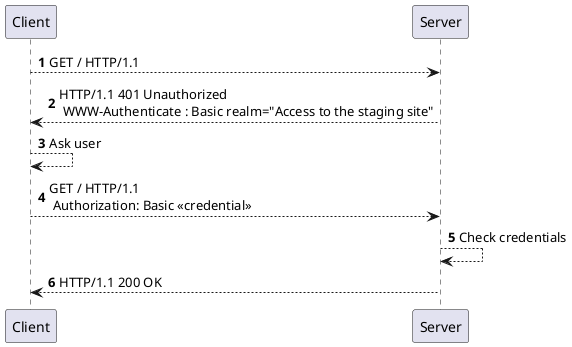
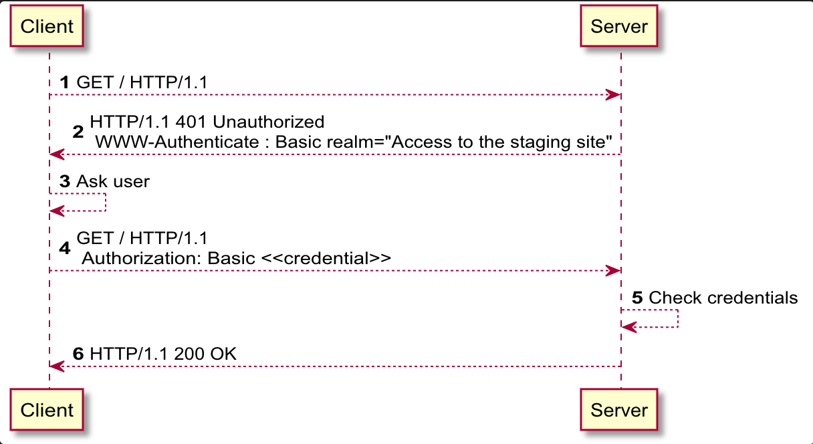

# Answers

## Answers

### 3.1 메시지의 흐름 <a id="3-1"></a>

### 3.2 메시지의 각 부분 <a id="3-2"></a>

#### Q. 스펙은 CRLF 이지만 개행도 처리해야 한다 ??

> CR \(Carriage Return - 커서를 라인 맨 앞으로 옮기는 것\) 과 LF\(Line Feed - 커서를 바로 아래 라인으로 이동시키는 것\) 로 개행, EOL 을 의미한다. 그러나 OS 별로 CR, LF 을 개행으로 처리할 수 있게 하면서 역시 HTTP 메세지의 시작줄과 헤더, 본문의 개행 문자 또한 영향을 받을 수 있다 [Newline - Wikipedia](https://en.wikipedia.org/wiki/Newline)

### 3.3 메서드 <a id="3-3"></a>

#### Q. http method idempotent, safe?

> safe method : 서버 자원의 상태를 변경하지 않는 method. read only method 들이 해당한다 \(GET, HEAD, OPTIONS, TRACE\) idempotent method : 서버 자원 상태를 변경하지만, 동일한 요청에 대한 서버의 응답과 상태가 항상 일정한 method \(safe method + PUT, DELETE\)
>
> ```text
> +---------+------+------------+
> | Method  | Safe | Idempotent |
> +---------+------+------------+
> | CONNECT | no   | no         |
> | DELETE  | no   | yes        |
> | GET     | yes  | yes        |
> | HEAD    | yes  | yes        |
> | OPTIONS | yes  | yes        |
> | POST    | no   | no         |
> | PUT     | no   | yes        |
> | PATCH   | no   | no         |
> | TRACE   | yes  | yes        |
> +---------+------+------------+
> ```
>
> - POST 는 입력 데이터를 전송하기 위한 목적의 메서드이다. 따라서 서버가 데이터를 받아 일관된 동작을 할 것이라는 보장이 없다
> - PATCH 는 PUT 과 유사해보이지만 리소스의 일부만을 업데이트하기 때문에 항상 idempotent 임이 보장되지 않는다
>
>   \(기존 리소스에 새로운 데이터를 추가하는 동작의 경우 \(UPDATE\), 메서드가 호출된 횟수만큼의 데이터가 추가되어 호출 할 때마다 결과가 달라진다\)

#### Q. TRACE 를 허용하는 사이트를 찾아보기가 힘들다... 왜죠??

> [Cross Site Tracing - OWASP](https://www.owasp.org/index.php/Cross_Site_Tracing) Cross Site Scripting 에 의한 세션 탈취를 방지하기 위한 HttpOnly \(오로지 Http 통신에서만 쿠키를 사용하도록 함\) 를 우회하는 방법. TRACE 요청에 대한 응답에 클라이언트의 쿠키가 포함되어 있는 것이 문제가 됨
>
> - 이 외에도 디버깅 및 테스트 용도가 아니라면 TRACE 메서드를 굳이 열어둘만한 이유가 없고, 불필요한 인터페이스를 닫음으로써 혹시라도 존재할지 모르는 취약점을 방어하는 효과도 있다고 함

#### http safe method는 무엇, 왜 safe?

- `GET`, `HEAD` 등이 포함.
- 정보의 retrieval 외 다른 어떤 액션도 기대하지 않는다.
- client 입장에서, get 요청 등은 서버에게 어떤 변화도 기대하지 않는다는 의미.
- 서버는 자체적으로 부하가 되는 변화를 해도 상관없으나, client 에게는 책임이 없음.
- cache 될 수 있고, prefetch 될 수 있음.
- `return value` 는 바뀔 수 있으나, `return form` 은 변하지 않는다는 의미

  When a call is issued, the response can be broken generally into two different camps – the **return form**, and the **return value**. If we were to make a GET request for a resource status update, for instance, we might get vastly different results depending on the resource that is being inspected and the time in which we do the inspection.

  Regardless of that change, which is simply a change in value, **we would expect the format of that result** \(i.e. the package type, the way in which data is shown, the method in which it is encrypted, etc.\) **to be exactly the same**. While the expected result should be identical, the value of that result can change. You can still make idempotent calls to resources that change, as long as the resource is returned in a known structure, with all known endpoints responding correctly.

- safe method를 unsafe하게 사용하는 건 잘못된 것인가?
  - 잠재적으로 그러하다. bad design.

#### post vs get?

- put request는 리소스의 위치가 정확히 지정되었을 때, 리소스를 생성 또는 업데이트함.
  - idempontent함. - 몇번을 수행하더라도 같은 결과를 보장함.
- post request는 리소스의 위치가 정확히 지정되지 않았을 때, 리소스를 생성하기 위해 사용됨.
  - idempontent 하지 않음 - 서로 다른 곳에 다른 리소스가 계속 생길 수 있음.
- post request에서, request uri의 의미는 해당 enclosed entity를 다룰 수 있는 리소스를 지칭함.
- PUT request에서, request uri는 요청에 포함된 entity를 가리키는 리소스를 지칭함.
  - 다른 리소스에 해당 요청을 처리하면 안됨. - 301로 처리해야.

RFC2616

The fundamental difference between the POST and PUT requests is reflected in the different meaning of the Request-URI. The URI in a POST request identifies the resource that will handle the enclosed entity. That resource might be a data-accepting process, a gateway to some other protocol, or a separate entity that accepts annotations. In contrast, the URI in a PUT request identifies the entity enclosed with the request -- the user agent knows what URI is intended and the server MUST NOT attempt to apply the request to some other resource. If the server desires that the request be applied to a different URI,

it MUST send a 301 \(Moved Permanently\) response; the user agent MAY then make its own decision regarding whether or not to redirect the request.

[https://www.w3.org/Protocols/rfc2616/rfc2616-sec9.html\#sec9.6](https://www.w3.org/Protocols/rfc2616/rfc2616-sec9.html#sec9.6)

#### OPTIONS method 는 무엇이고 언제 사용되는가?

- 해당 리소스에 대해 가능한 operation 이 무엇인가.
  - 허용되지 않은 메서드라면? 405 method not allowed 와 함께, `Allow: GET` 등으로 응답.
  - 클라이언트는 해당 리소스에 대해 어떤 요구사항과 옵션이 있는지를 서버로부터 알 수 있음.
- 캐시가 불가능한 요청.
  - http는 정보에 대한 캐싱이므로, 정보에 대해 어떤 연산이 가능한지에 대해서는 캐싱할 필요가 없다.
- 서버가 CORS를 허용하는지 물어볼때 쓰임. (Preflighted request)
  - `Access-Control-Request-Method` 로 실제로 보내고자 하는 메서드를 알리고, `Access-Control-Request-Headers` 로 실제로 보내고자 하는 헤더들을 알림.
  - `Allow` 와 `Request` 가 매치됨.

```
# request header
OPTIONS /resources/post-here/ HTTP/1.1
Host: bar.other
Accept: text/html,application/xhtml+xml,application/xml;q=0.9,*/*;q=0.8
Accept-Language: en-us,en;q=0.5
Accept-Encoding: gzip,deflate
Accept-Charset: ISO-8859-1,utf-8;q=0.7,*;q=0.7
Connection: keep-alive
Origin: http://foo.example
Access-Control-Request-Method: POST
Access-Control-Request-Headers: X-PINGOTHER, Content-Type

# response header
HTTP/1.1 200 OK
Date: Mon, 01 Dec 2008 01:15:39 GMT
Server: Apache/2.0.61 (Unix)
Access-Control-Allow-Origin: http://foo.example
Access-Control-Allow-Methods: POST, GET, OPTIONS
Access-Control-Allow-Headers: X-PINGOTHER, Content-Type
Access-Control-Max-Age: 86400
Vary: Accept-Encoding, Origin
Content-Encoding: gzip
Content-Length: 0
Keep-Alive: timeout=2, max=100
Connection: Keep-Alive
Content-Type: text/plain
```

- request uri 가 asterisk 라면, ping, no-op 등의 작업으로 사용된다.

* 해당 리소스에 대해 가능한 operation 이 무엇인가.
  - 허용되지 않은 메서드라면? 405 method not allowed 와 함께, `Allow: GET` 등으로 응답.
  - 클라이언트는 해당 리소스에 대해 어떤 요구사항과 옵션이 있는지를 서버로부터 알 수 있음.
* 캐시가 불가능한 요청.
  - http는 정보에 대한 캐싱이므로, 정보에 대해 어떤 연산이 가능한지에 대해서는 캐싱할 필요가 없다.
* 서버가 CORS를 허용하는지 물어볼때 쓰임. \(Preflighted request\)

  - `Access-Control-Request-Method` 로 실제로 보내고자 하는 메서드를 알리고, `Access-Control-Request-Headers` 로 실제로 보내고자 하는 헤더들을 알림.
  - `Allow` 와 `Request` 가 매치됨.

```
## request header

OPTIONS /resources/post-here/ HTTP/1.1
Host: bar.other
Accept: text/html,application/xhtml+xml,application/xml;q=0.9,_/_;q=0.8
Accept-Language: en-us,en;q=0.5
Accept-Encoding: gzip,deflate
Accept-Charset: ISO-8859-1,utf-8;q=0.7,\*;q=0.7
Connection: keep-alive
Origin: [http://foo.example](http://foo.example)
Access-Control-Request-Method: POST
Access-Control-Request-Headers: X-PINGOTHER, Content-Type

## response header

HTTP/1.1 200 OK
Date: Mon, 01 Dec 2008 01:15:39 GMT
Server: Apache/2.0.61 \(Unix\)
Access-Control-Allow-Origin: [http://foo.example](http://foo.example)
Access-Control-Allow-Methods: POST, GET, OPTIONS
Access-Control-Allow-Headers: X-PINGOTHER, Content-Type
Access-Control-Max-Age: 86400
Vary: Accept-Encoding, Origin
Content-Encoding: gzip
Content-Length: 0
Keep-Alive: timeout=2, max=100
Connection: Keep-Alive
Content-Type: text/plain
```

- [https://1ambda.github.io/javascripts/rest-api-put-vs-post/](https://1ambda.github.io/javascripts/rest-api-put-vs-post/)
- [https://www.zerocho.com/category/HTTP/post/5b4c4e3efc5052001b4f519b](https://www.zerocho.com/category/HTTP/post/5b4c4e3efc5052001b4f519b)
- [http://jeonghwan-kim.github.io/options-메쏘드에-대해/](http://jeonghwan-kim.github.io/options-%EB%A9%94%EC%8F%98%EB%93%9C%EC%97%90-%EB%8C%80%ED%95%B4/)
- [https://www.w3.org/Protocols/rfc2616/rfc2616-sec9.html](https://www.w3.org/Protocols/rfc2616/rfc2616-sec9.html)
- [https://developer.mozilla.org/ko/docs/Web/HTTP/Methods/OPTIONS](https://developer.mozilla.org/ko/docs/Web/HTTP/Methods/OPTIONS)
- [https://tools.ietf.org/html/rfc7231\#section-4.3.7](https://tools.ietf.org/html/rfc7231#section-4.3.7)
- [https://developer.mozilla.org/en-US/docs/Web/HTTP/CORS](https://developer.mozilla.org/en-US/docs/Web/HTTP/CORS)

### 3.4 상태 코드 <a id="3-4"></a>

### 3.5 헤더‌ <a id="3-5"></a>

#### Q. `x-` 는 어떤 헤더들일까?

### Q. OPTIONS 에 많이 사용되는 CORS에는 어떤 헤더가 사용될까?

- cross origin resource sharing
- 웹브라우저는, 다른 origin으로 요청을 보내는 것을 기본적으로 차단함.
  - 새로운 http header를 추가하여, server 의 허가를 받아 요청을 보내게 함.
  - credential 이 필요한지도 알 수 있음.
- `Access-Control-Allow-Origin` - 서버로부터, 어떤 도메인으로의 요청을 허용할 것인지를 알려준다.
  - `Access-Control-Allow-Origin:*` 이면, 모든 도메인으로부터의 요청을 허용한다는 의미.
  - `Access-Control-Allow-Origin: [https://foo.example](https://foo.example/)` - `foo.example` 로부터의 요청만을 허용.
- `Access-Control-Max-Age` - preflight request에 대한 응답이 얼마나 유효한가.

- preflighted request - OPTIONS 메서드로 다른 도메인에 요청을 보내, 허용되었다면 실제로 요청을 보냄.

- [https://developer.mozilla.org/en-US/docs/Web/HTTP/CORS](https://developer.mozilla.org/en-US/docs/Web/HTTP/CORS)

### Q. `x-` 는 어떤 헤더들일까?

- `X-Forwarded-For`, `X-Forwarded-Host`, `X-Forwarded-Proto`
  - 요청이 어디에서부터 왔는가
  - 다단구조의 서버, 클라이언트 사이에 원래 요청이 누구로부터 왔는지를 유지하는데 사용
  - 완전히 믿어선 안됨.
  - for - 현재까지 거쳐온 서버의 ip
  - host - 원 서버의 호스트명
  - proto - 원 서버의 프로토콜.
  - `Forwarded` 이 표준헤더. 이 안에 세가지의 정보를 모두 담을 수 있음.
- `X-Frame-Options`
  - frame, iframe, object 태그 안에서 페이지 렌더링하는 것을 통제.
  - `X-Frame-Options: DENY` - 아예 렌더링을 막음.
  - `X-Frame-Options: SAMEORIGIN` - 같은 origin 만 허용.
- `X-Content-Type-Options`
  - 브라우저가 자체적으로 컨텐츠 타입을 추론하는 것을 방지하는데 쓰임.
  - `X-Content-Type-Options : nosniff`

[https://www.zerocho.com/category/HTTP/post/5b611b9e33b4636aa8bb1fc4](https://www.zerocho.com/category/HTTP/post/5b611b9e33b4636aa8bb1fc4)

### 캐시헤더에 명시된 캐시될 데이터는 어디에 캐시됨?

- shared cache - 여러 유저를 위해 응답을 저장
- private cache - 한 유저에 국한됨.
- browser, proxy, gateway caches

- private browser cache
  - http 에 의해 다운받은 모든 문서들을 저장.
  - back/forward navigation, saving, viewing-as-source 등을 할 때, 서버에 요청을 보내지 않아도 됨.
  - offline browsing에도 유용.
- shared proxy caches

  - isp나 회사는 local network infra에 web proxy를 세우고, 인기많은 리소스들은 저장하여 재사용하게 할 수 있다.
  - network traffic, latency 를 줄인다.

- cache 되는 요청들

  - `GET` 이 주로 캐시됨.
  - cache key는 request method와 target URI이다.
  - `200`, `301`, `404`, `206`
  - 그외 cache key로 사용할만한 게 정의된 것들에 대해 캐시. - graphql?

- [https://developer.mozilla.org/en-US/docs/Web/HTTP/Caching](https://developer.mozilla.org/en-US/docs/Web/HTTP/Caching)
- [https://developers.google.com/web/fundamentals/performance/optimizing-content-efficiency/http-caching](https://developers.google.com/web/fundamentals/performance/optimizing-content-efficiency/http-caching)
- [https://developer.mozilla.org/ko/docs/Web/HTTP/Headers/Cache-Control](https://developer.mozilla.org/ko/docs/Web/HTTP/Headers/Cache-Control)
- [https://www.zerocho.com/category/HTTP/post/5b594dd3c06fa2001b89feb9](https://www.zerocho.com/category/HTTP/post/5b594dd3c06fa2001b89feb9)

#### Q. 일반적인 HTTP 인증 과정 - (Autorization?, WWW-Authenticate?)





1. Client Request
2. Server 는 Unauthorized 응답 코드와 함께 Client 에게 WWW-Authenticate 헤더를 통해 인증 방법에 대한 정보를 제공
3. Client 는 인증 정보를 생성
4. Client 는 헤더에 Authorization 인증 정보를 포함시켜 Request
5. Server 는 Client 의 credential 검증
6. Server Response
   > Basic : 일반적인 인증 스킴 / realm : 인증이 필요한 접근 영역이나 범위를 알리기 위한 필드
   > WWW-Autenticate 필드는 Server 가 Client 측에 인증을 요청함에 앞서 인증 방법에 대한 정보를 제공하기 위한 목적이며, Authorization 필드는 Client 가 Server 가 요구하는 인증을 통과하기 위한 정보를 담기 위한 목적이다

> Proxy 가 구성된 환경에서 Proxy 서버 접근에 대한 인증을 요구하는 경우도 존재한다
> 위와 동일한 시퀀스를 가지면서 아래와 같은 헤더 필드가 추가된다

```
Response Unauthorized
WWW-Authenticate : <type(인증 스킴)> realm=<realm>
Proxy-Authenticate : <type(인증 스킴)> realm=<realm>

Request Authorization
Auhorization : <typee(인증 스킴)> <credential>
Proxy-Auhorization : <typee(인증 스킴)> <credential>
```

### 3.6 추가 정보 <a id="3-6"></a>

​
