# 04. 커넥션 관리
**HTTP 가 TCP 커넥션을 사용하는 다양한 방법들과 그것들이 성능에 어떻게 영향을 주는지, 성능 최적화를 위해 무엇을 알아야 하는지를 살펴봅니다**
## 4.1 TCP 커넥션
* 현재 전 세계 대부분의 HTTP 통신은 TCP/IP 프로토콜을 통해 이루어지고 있다
* HTTP 커넥션을 다루기 위해서는 TCP 의 동작에 대해 자세히 알아야 한다
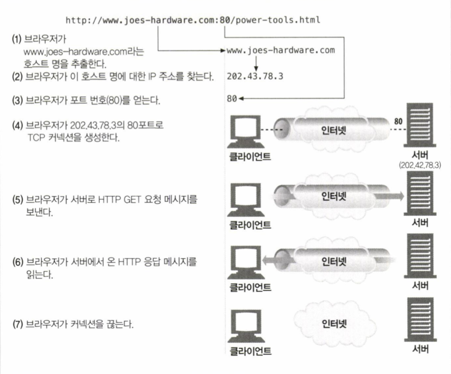
> HTTP 요청에 따른 TCP 커넥션 동작

### 신뢰할 수 있는 데이터 전송 통로인 TCP
* HTTP 프로그래머는 TCP/IP 계층에서 무슨 일이 일어나는지 보이지 않는다 
[TCP 소켓 프로그래밍](https://github.com/jeuxdeau/http-the-definitive-guide/blob/master/i.http-the-webs-foundation/04.connection-management/README.md#tcp-%EC%86%8C%EC%BC%93-%ED%94%84%EB%A1%9C%EA%B7%B8%EB%9E%98%EB%B0%8D)

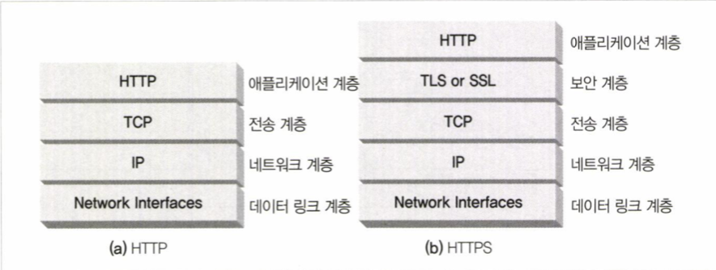
> HTTP 와 HTTPS 네트워크 프로토콜 스택
> 추상화된 계층 구조를 통해 하위, 상위 프로토콜의 동작에 대해 알지 못해도 통신이 가능하도록 설계되었다

* IP 패킷은 TCP 세그먼트를 포함하고 있다

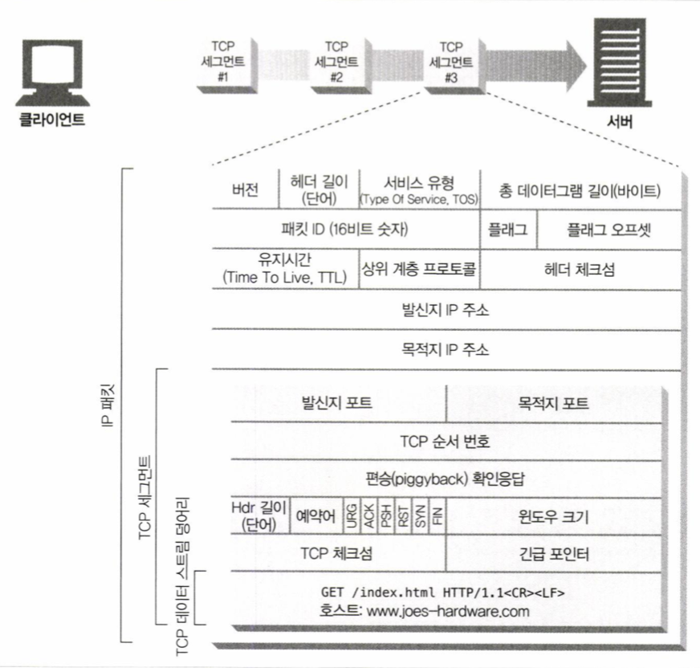
> IP 패킷의 구조
> TCP 세그먼트는 IP 패킷에 담겨 네트워크 상에 나가게 된다

### TCP 커넥션 유지하기
* TCP 커넥션은 네 가지 값으로 식별될 수 있다
* 다음의 값들 중 하나라도 다르다면 두 커넥션은 서로 다른 커넥션이다
	* Source IP Address
	* Source port
	* Destination IP Address
	* Destination port
### TCP 소켓 프로그래밍
* 운영체제에서 제공하는 TCP 소켓 API 들은 HTTP 프로그래머에게 TCP 와 IP 의 세부사항을 알지 못해도 TCP 커넥션을 이용할 수 있게 해준다
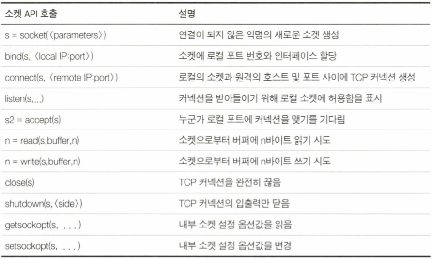
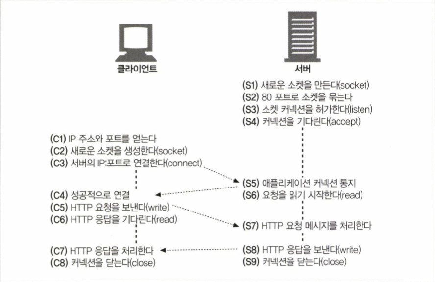

> TCP 공용 소켓 인터페이스 함수
> 소켓 API 를 통해 handshake, segmenting,  segment and reassembly 등등 구현에 대한 세부사항을 외부로부터 숨긴다 

## 4.2 TCP의 성능에 대한 고려
* TCP 성능은 HTTP 의 성능에 직접적인 영향을 준다
* HTTP 트랜잭션 시간에 영향을 주는 요소들
	* TCP 커넥션 설정
	* 요청 전송
	* 요청 처리
	* 응답 전송
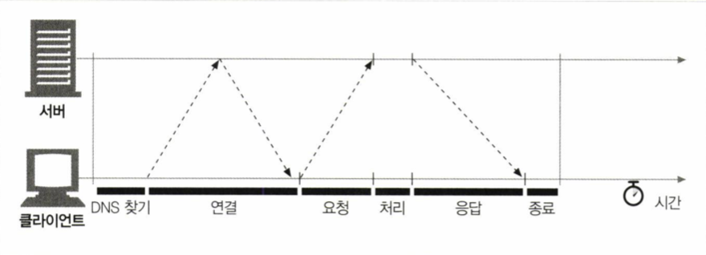
> 하나의 HTTP 트랜잭션 처리에 드는 시간
> 실제 요청을 처리하는 시간에 비해 TCP 네트워크 지연이(커넥션 연결, 요청, 응답) 훨씬 큰 것을 볼 수 있다

### TCP 성능 관련 중요 요소
---
* TCP handshake 설정
	* TCP 프로토콜은 연결 설정을 위한 초기 3-way handshake 과정을 필요로 한다
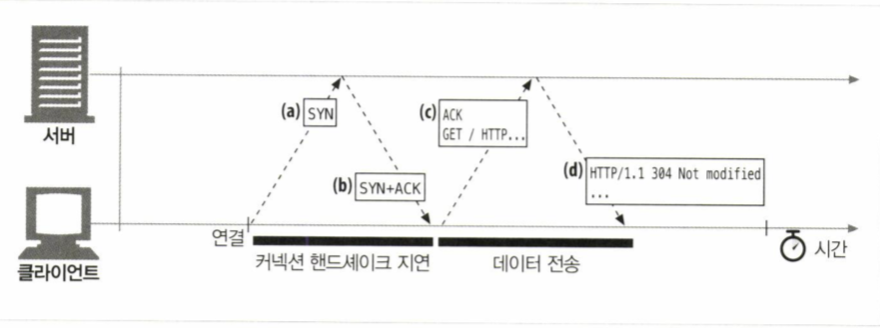
> 3-way handshake sequence
> 모든 연결 시 거쳐야하는 과정이기 때문에 크기가 작은 HTTP 트랜잭션은 tcp handshake 로 인한 오버헤드가 부담이 될 수 있다

#### TCP status diagram
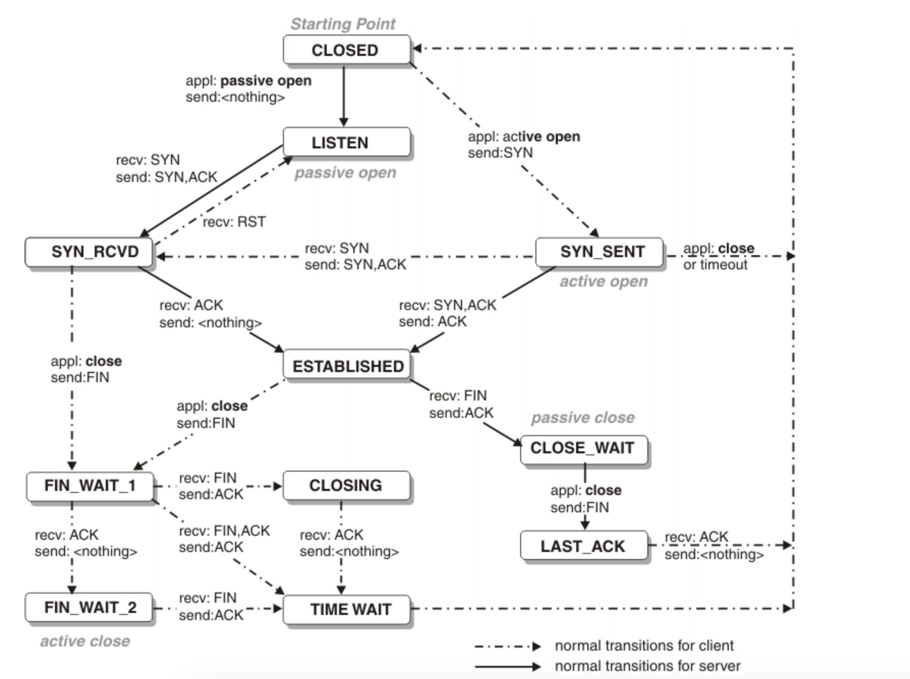
> TCP Fast Oepn ([TCP Fast Open - Wikipedia](https://en.wikipedia.org/wiki/TCP_Fast_Open))
> - Client 에서 SYN + TFO cookie request 을 보내고 서버는 SYN + ACK + TFO cookie 를 응답으로 보낸다 -> 1RTT
> - 이후 Client 는 TFO cookie 로 암호화된 데이터와 함께 SYN 을 보내며 서버와 3-way handshake 를 진행한다 -> handshake 중 데이터 교환이 가능

---
---
* slow start
	* TCP 프로토콜은 현재 네트워크 망의 혼잡 상태를 확인하여 한번에 전송하는 패킷의 양을 조절하는 알고리즘이 존재한다 (tcp congestion control)
	* congestion window 의 크기는 1부터 시작하여 임계값에 도달할 때 까지 2의 지수배로 증가한다 (이후 1씩 증가)
	* 기존의 커넥션은 새로 생성된 커넥션에 비해 현재 네트워크 망의 혼잡 상태에 맞춰 congestion window 의 튜닝이 완료된 상태이기 때문에 더 효율적인 데이터 전송이 가능하다

#### TCP congestion control
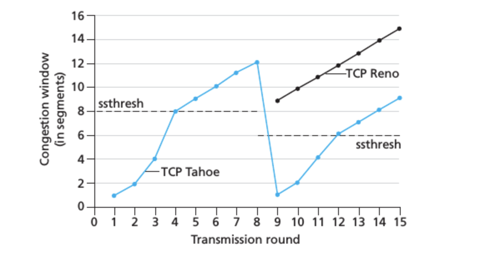
---
---
* nagle algorithm
	* TCP 세그먼트는 40바이트 상당의 헤더를 포함하기 때문에 아주 작은 크기의 데이터를 전송하면 오버헤드로 인한 부하가 증가할 수 있다
	* nagle algorithm 은 세그먼트가 ack 를 수신하거나 혹은 충분한 크기가 되기 전까지 전송하지 않고 데이터를 쌓아두었다가 전송한다
* piggyback ack
	* TCP 프로토콜은 신뢰성 있는 전송을 보장하기 위해 ARQ 프로토콜을 사용한다
	* 하나의 ack (확인응답) 메세지만을 전달하기 위한 오버헤드를 줄이기 위해 같은 방향으로 송출되는 데이터 패킷에 ack 를 편승(piggyback) 시킬 수 있다
		* 특정 시간 (보통 0.1 ~ 0.2 sec) 동안 버퍼에 ack 를 저장해두고 해당 방향의 데이터 패킷이 있다면 편승
	* HTTP 는 요청 - 응답 방식이기 때문에 일반적으로 새로운 요청이 없다면 해당 방향으로 송출되는 데이터 패킷을 찾기 어렵고, piggyback ack 를 활용할 기회가 줄어든다
		* nagle algorithm 과 함께 사용될 경우 ack 가 오기 전까지 데이터를 버퍼에 쌓아두고있는 동안, 다른 쪽은 ack 를 버퍼에 쌓아두는 동작을 하기 때문에 주의해서 사용해야 한다
* TIME_WAIT 지연과 포트 고갈
	* TCP 커넥션이 종료된 후 곧바로 같은 IP adress 와 port 를 사용하는 커넥션이 생성될 경우, 뒤늦게 도착한 이전 커넥션의 패킷이 존재할 경우 데이터 충돌이 발생할 수 있다
	* 커넥션이 종료된 후, 이전 커넥션의 IP adress 와 port 를 TCP control block 에 저장해놓는다
		* 일반적으로 2MSL (Max Segment Lifetime - 약 1분)
	* 현재는 라우터들의 성능이 향상되 중복 패킷이 발생하는 경우는 거의 없다
	* TIME_WAIT 상태의 소켓을 재사용할 수 있도록 하는 옵션들도 
---
---
#### TIME_WAIT 소켓 재사용
* Linger 구조체 옵션
	* LINGER.l_ onoff   / LINGER.l_ linger
		* 1 / 0 일때 buff 에 남은 데이터 다 버리고 time wait 없이 종료 (비정상종료)
		* 1/ non-zero 일때 timeout 기다렸다가 종료 (비정상종료)
		* 0 일때 백그라운드에서 버퍼 비우고 종료 (default, 정상종료)
* socket 옵션을 이용해 TIME_WAIT 상태의 소켓을 바로 할당
	* SO_REUSEADDER 
		* 서버 소켓에 적용되는 옵션
	* tcp_ tw_reuse 
		* 클라이언트 소켓에 적용되는 옵션

* **(1) 애플리케이션에서 connection pool을 사용**
  * 성능과 유연성면에서 가장 추천하는 방법이지만, 애플리케이션을 고쳐야 합니다.
* **(2) TW_REUSE 옵션을 사용**
  * 사용할 수 있는 local port 수가 모자라면, 현재 TIME_WAIT 상태의 소켓 중 프로토콜상 사용해도 무방해 보이는 소켓을 재사용합니다.
* **(3) TW_RECYCLE 옵션을 사용**
  * TIME_WAIT 상태에 머무르는 시간을 변경하여 TIME_WAIT 상태의 소켓 수를 줄입니다. 1분 대신 RTO(Retransmission Timeout) 시간만큼으> 로 TIME_WAIT 상태에 머무르는 시간이 경감되는데, 리눅스에서는 200ms까지 이 시간이 줄 수 있습니다. (최소 RTO가 200ms)
* **(4) Socket linger 옵션을 굉장히 짧은 시간을 매개변수로 주어 사용**
  * FIN 대신 RST를 보내게 유도하며, 이 때 소켓을 파괴하여 소켓이 TIME_WAIT 상태에 머무르지 않게 합니다.
---

## 4.3 HTTP 커넥션 관리
### 흔히 잘못 이해하는 Connection 헤더
* HTTP 는 클라이언트와 서버 사이 프록시와 캐시와 같은 중개 서버를 허용한다
* HTTP 의 Connection 헤더는 인접한 HTTP 어플리케이션 사이의 커넥션에만 적용될 옵션을 지정할 수 있게 해준다
> Connection 헤더에 전달할 수 있는 세가지 토큰
	* HTTP 헤더 필드 이름
		* 이 커넥션에만 해당되는 헤더들을 나열 (hop-by-hop)
			* 특정 두 서버에만 영향 
			(Proxy-Authenticate, Proxy-Connection, Trasfer-Encoding, Upgrade 등의 헤더도 동일하게 취급되야 함)
		* 다음 커넥션에 전달 시 삭제해서 전달해야 함
	* 임시 토큰 값
		* 커넥션에 대한 비표준 옵션
	* close
		* 현재 작업 완료 후 커넥션 종료
### 순차적인 트랜잭션 처리에 의한 지연
* 커넥션 관리가 제대로 이루어지지 않으면 하나의 리소스 당 하나의 커넥션을 새로 생성해야 할 수도 있기 때문에 성능이 떨어질 수 있다
	* 다른 리소스 객체에 의존적인 리소스 객체가 존재하는 경우 의존 리소스를 모두 내려받기 전까지 아무 동작도 하지 않는 경우도 발생할 수 있다
  
## 4.4 병렬 커넥션
* 여러개의 리소스를 요청할 경우, 한번에 여러개의 커넥션을 생성해서 병렬로 내려받을 수 있게 한다
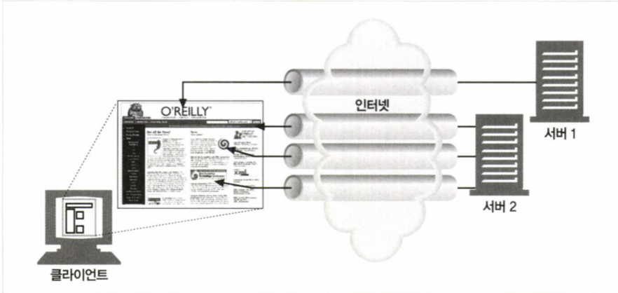
> 4개의 컴포넌트 리소스를 필요로 하는 웹 페이지에서 동시에 4개의 커넥션을 생성하여 병렬로 내려받을 수 있다
### 병렬 커넥션은 페이지를 더 빠르게 내려받는다
* 각각의 리소스를 내려받는데 필요한 지연시간이 겹치기 때문에 전체 지연시간이 줄어든다
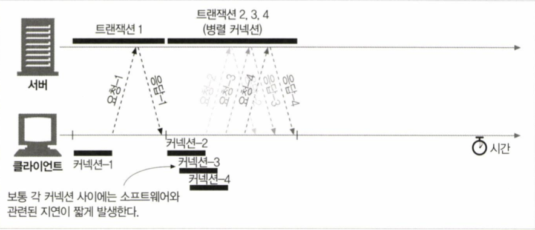
> HTML 페이지를 내려받은 뒤 로드 할 이미지 리소스 3개를 병렬 커넥션으로 동시에 처리한다
### 그렇다고 병렬 커넥션이 항상 더 빠르지는 않다
* 클라이언트의 인터넷 대역폭이 충분해야 한다
	* 동시에 여러 요청을 전송하는데 대부분의 대역폭이 사용된다면, 리소스를 내려받는데 필요한 대역폭이 부족해 성능상의 장점이 거의 사라진다
* 커넥션을 생성하는데 소모되는 부하가 성능을 감소시킬 수 있다
* 일반적으로 서버 입장에서는 한번에 여러 클라이언트들의 요청을 처리해줘야 하기 때문에 단일 클라이언트의 병렬 커넥션 수를 제한하고 있다 (보통 4개)
### 병렬 커넥션은 더 빠르게 느껴질 수 있다
* 사용자 경험 측면에서는 최종적으로 페이지가 렌더링 되는데 소요되는 시간이 동일하거나 더 오래걸린다고 하더라도, 여러 작업이 일어나는 과정을 눈으로 확인할 수 있으면 더 빠르다고 느껴질 수 있다

## 4.5 지속 커넥션
* 대부분의 웹 클라이언트는 사이트 지역성을 가진다
	* 웹 페이지에 첨부된 대부분의 리소스들은 보통 같은 웹 사이트에 있기 때문에 같은 서버로 또 요청하게 된다
* HTTP/1.1 에서는 처리가 완료된 TCP 커넥션을 바로 종료하지 않고 이어지는 HTTP 요청에 재사용할 수 있다
	* 이러한 TCP 커넥션을 지속 커넥션 (Persistent Connection) 이라고 함
* TCP handshake, slow start 로 인한 지연을 완화하여 더 빠른 데이터 전송이 가능하게 한다
### 지속 커넥션 vs 병렬 커넥션
* 병렬 커넥션은 이러한 단점이 존재한다 [그렇다고 병렬 커넥션이 항상 더 빠르지는 않다](https://github.com/jeuxdeau/http-the-definitive-guide/blob/master/i.http-the-webs-foundation/04.connection-management/README.md#%EA%B7%B8%EB%A0%87%EB%8B%A4%EA%B3%A0-%EB%B3%91%EB%A0%AC-%EC%BB%A4%EB%84%A5%EC%85%98%EC%9D%B4-%ED%95%AD%EC%83%81-%EB%8D%94-%EB%B9%A0%EB%A5%B4%EC%A7%80%EB%8A%94-%EC%95%8A%EB%8B%A4)
* 지속 커넥션의 장점
	* 새로운 커넥션 수립에 드는 비용 감소
	* 커넥션 튜닝에 드는 비용 감소
	* 전체 커넥션의 수 감소
* 지속 커넥션의 단점
	* 계속 연결된 상태의 수많은 커넥션이 쌓이게 될 수 있음
	* 불필요한 서버, 클라이언트의 리소스 소모
* 지속 커넥션과 병렬 커넥션을 함께 사용하는 것이 가장 효과적이다
	* 적은 수의 병렬 커넥션을 지속 커넥션으로 맺어 사용
### HTTP/1.0+ 의 Keep-Alive 커넥션
* 연속 커넥션과 지속 커넥션

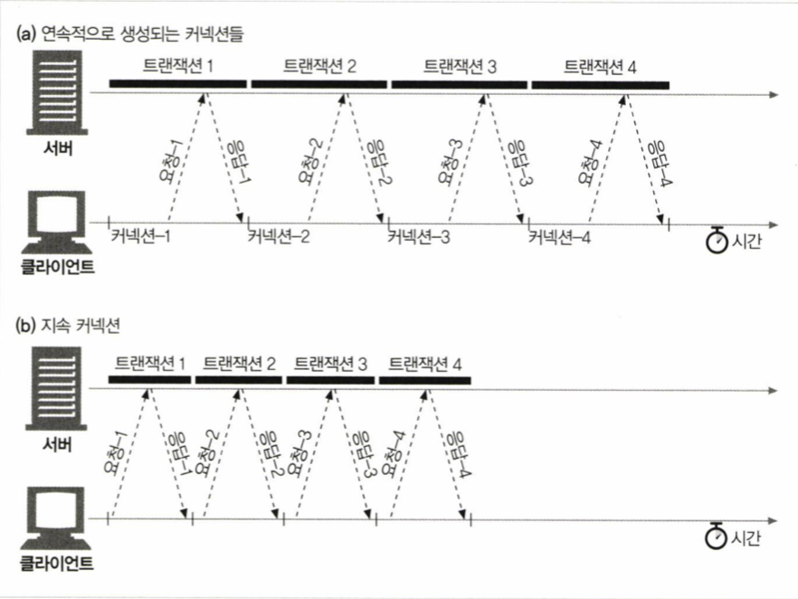
> 지속 커넥션은 연속 커넥션에 비해 커넥션 수립/해제에 필요한 비용을 줄여 좋은 성능을 보여준다
### Keep-Alive 동작
* Keep-Alive 는 depreacted 되어 HTTP/1.1 명세에서 빠졌다
	* 하지만 지금도 많이 사용되고 있음
	
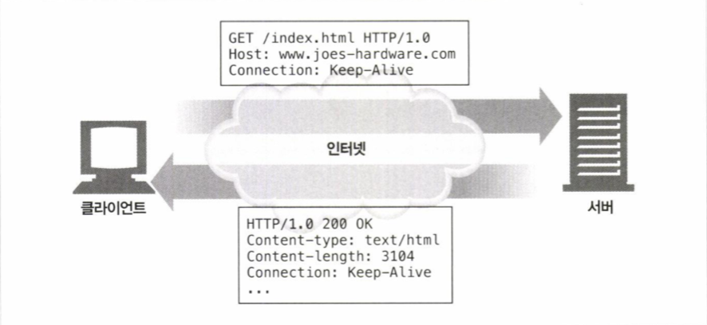
> Client가 요청에 Connection : Keep-Alive 헤더를 포함시킨다
> Server 는 응답에 Connection : Keep-Alive 헤더를 내려보내는데, 존재하지 않으면 클라이언트는 서버가 지원하지 않으며 커넥션이 종료될 것으로 추정한다
### Keep-Alive 옵션
* Keep-Alive 헤더는 요청일 뿐이며, 클라이언트와 서버 모두 따라야 할 강제성은 없다
	* 언제든 Keep-Alive 커넥션을 끊고 제한할 수 있음
* Keep-Alive 옵션들
	* timeout
		* 응답 헤더에 포함
		* keep-alive 커넥션의 유지 시간
		* 역시 보장하지는 않는다
	* max 
		* 응답 헤더에 포함
		* keep-alive 커넥션이 처리할 수 있는 HTTP 트랜잭션 수
		* 역시 보장하지는 않는다
	* 기타 디버깅을 목적으로 하는 임의의 속성들도 존재한다
	* Connection : Keep-Alive 헤더가 있을 때만 사용할 수 있다
### Keep-Alive 커넥션 제한과 규칙
* Connection : Keep-Alive 헤더가 없으면 사용되지 않는다 (default 가 아님)
* 사용하려면 모든 HTTP 메세지에 Connection : Keep-Alive 헤더가 포함되야 한다
* 응답 헤더의 Connection : Keep-Alive 여부를 통해 커넥션이 끊어질 지 판단할 수 있다
* 정확한 Content-Length 값과 멀티파드 미디어 형식, 또는 chunked transfer encoding 으로 인코드 되어야 한다
	* 연결이 지속되기 때문에 이전 메세지와 새로운 메세지의 경계를 정확히 알 수 있어야 하기 때문이다
* 프록시와 게이트웨이는 Connection 헤더 규칙을 철저히 지켜야 한다
	* 요청을 relay 하기 전 Connection 헤더와 관련된 모든 필드를 제거해야 한다 
* 중개 서버에 Connection 헤더를 인식하지 못하는 프록시가 있다면 사용해선 안된다
* HTTP/1.0 을 따르는 기기로부터 받는 모든 Connection 헤더 필드는 무시해야 한다
	* 오래된 프록시 서버로부터 잘못 포함된 헤더가 있을 수 있다
* 클라이언트는 전체 응답을 다 받기 전에 커넥션이 끊어졌을 경우 다시 요청을 보낼 수 있어야 한다
### Keep-Alive 와 멍청한 프록시
* 중개 서버는 요청을 전달할 때 Connection 헤더와 관련된 필드를 모두 제거해야 한다
* Connection 헤더를 인식하지 못하는 중개 서버가 Connection 헤더를 포함시켜 요청을 전달하는 문제가 발생할 수 있다

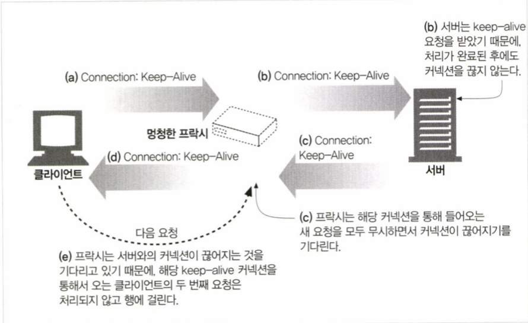
> 멍청한 프록시가 존재할 때 Connection:  Keep-Alive 헤더가 포함된 요청을 날리면?
	1. 클라이언트는 Connection : Keep-Alive 헤더를 포함한 요청을 날린다
	2. 멍청한 프록시는 Connection 헤더를 단순한 확장 헤더로 인식하여 그대로 다음 서버로 전달한다
		* Connection 헤더는 hop-by-hop 헤더로 특정 두 서버 사이에서만 동작해야 함
	3. 서버가 요청을 수락할 경우 프록시와 커넥션을 유지하기를 원하는 것으로 판단하고 Connection : Keep-Alive 규약에 따른 응답을 내려준다
	4. 멍청한 프록시는 서버의 Connection 헤더를 그대로 클라이언트에 전달하고, 클라이언트는 프록시와 커넥션이 유지되는 것으로 생각하고 Keep-Alive 규약에 맞춰 요청을 보낸다
	5. 하지만 멍청한 프록시는 Keep-Alive 를 전혀 모르기 떄문에 커넥션 종료를 기다리지만, 서버는 커넥션을 유지하는 것으로 판단하여 끊지 않고 멍청한 프록시는 계속 대기한다
	6. 한편 클라이언트는 응답 메세지를 받고 다음 요청을 프록시로 보내는데, 프록시는 같은 커넥션으로부터 다른 요청이 오는 경우에 대한 처리는 알지 못하기 때문에 클라이언트의 요청을 무시한다
	7. 클라이언트나 서버의 커넥션 타임아웃이 발생할 때 까지 idle 커넥션이 유지된다
> 프록시와 홉별 헤더
> 위와 같은 문제를 피하기 위해 중개 서버는 Connetion 헤더와 관련된 모든 필드를 제거한 채 다음 서버로 전달해야 한다 (Proxy-Authenticate, Proxy-Connection, Transfer-Encoding, Upgrade 와 같은 헤더들도 홉별 헤더에 포함된다)
### Proxy-Connection 살펴보기
* 모든 헤더를 무조건 전달하는 문제를 해결하기 위한 방안 중 하나로써 제시되었다

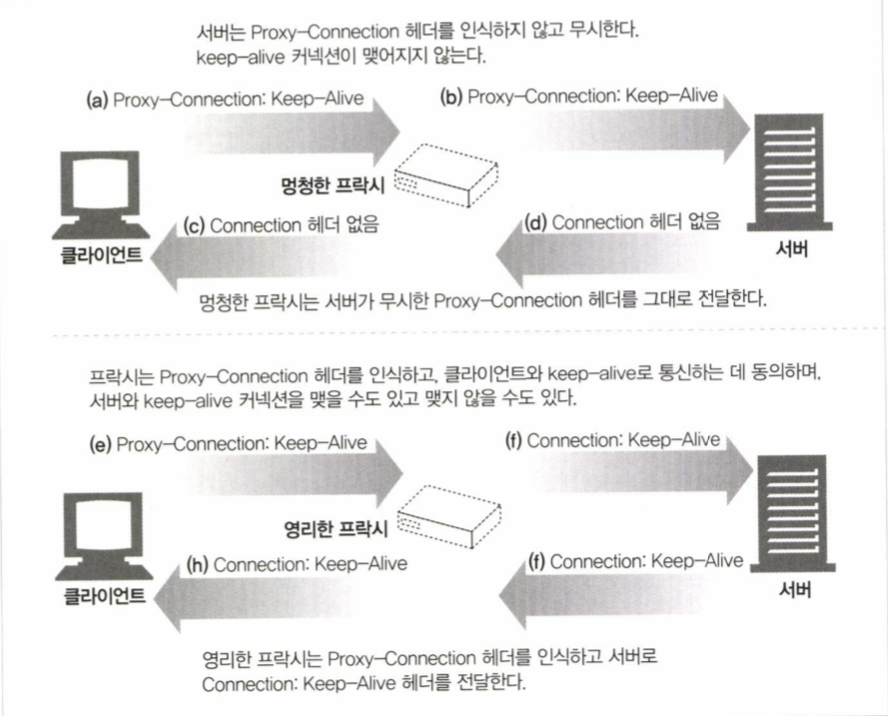
> Connection 헤더 대신 비표준 헤더인 Proxy-Connection 을 대신 사용함으로써 문제를 회피하고자 함.
> 서버는 Proxy-Connection 헤더는 무시하고 Connection 헤더만 처리하며, 영리한 프락시는 Proxy-Connection 을 Connection 헤더로 바꿔 서버로 전송한다
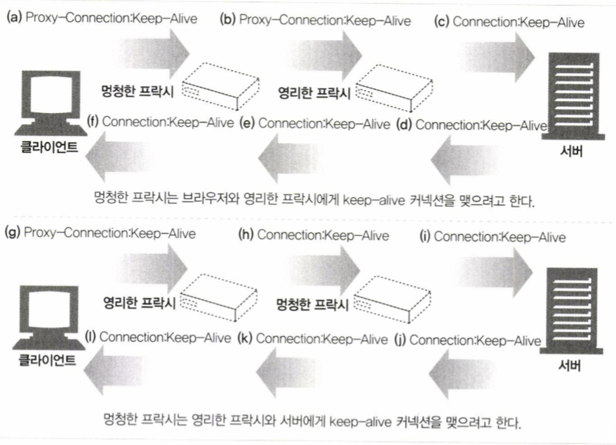
> 그러나 영리한 프록시와 서버 사이에 멍청한 프록시가 존재한다면?
> 일반적으로 클라이언트는 네트워크상의 모든 중개 서버의 존재를 알기 힘들기 때문에 Proxy-Connection 해결책이 될 수는 없다
> -> 중개 서버 어플리케이션들이 지속 커넥션을 명확히 구현해야 함
### HTTP/1.1 의 지속 커넥션
* HTTP/1.1 에서는 keep-alive 커넥션 대신 개선된 지속 커넥션을 지원한다
	* HTTP/1.1 에서는 지속 커넥션이 기본 설정이다 (default)
	* 커넥션을 끊기 위해선 Connection : close 헤더를 명시해야 한다
	* 역시 보장하지는 않는다
### 지속 커넥션의 제한과 규칙
* 클라이언트가 Connection : close 헤더를 포함한 요청을 보낸 뒤에는 추가 요청이 불가능하다
* 추가 요청이 없다면 마지막 요청에 Connection : close 헤더를 포함시켜야 한다
* 커넥션의 모든 메세지가 자신의 정확한 길이 정보를 포함하고 있을 때만 가능하다
* HTTP/1.1 프록시는 클라이언트와 서버 각각에 대해 별도의 지속 커넥션을 관리해야 한다
* HTTP/1.1 프록시 서버은 클라이언트가 지원 가능한 커넥션 관련 기능에 대해 알지 못하는 경우 지속 커넥션을 맺으면 안된다
* HTTP/1.1 어플리케이션은 중간에 끊어지는 커넥션을 복구할 수 있어야 한다
* 커넥션이 끊어졌을 때 클라이언트는 반복 요청에 대한 문제가 없는 경우 요청 재전송이 가능해야 한다
* 하나의 클라이언트 당 2개 이하의 지속 커넥션을 유지해야 한다

## 4.6 파이프라인 커넥션
* HTTP/1.1 은 지속 커넥션을 통해 요청을 파이프라이닝 할 수 있다
	* 응답이 도착하기 전까지 요청들은 큐에 쌓인다
	* 이전 요청의 응답을 기다리지 않고 다음번 요청을 바로바로 전송한다
	* 네트워크를 왕복하는 시간을 줄여 성능을 향상시킨다
	
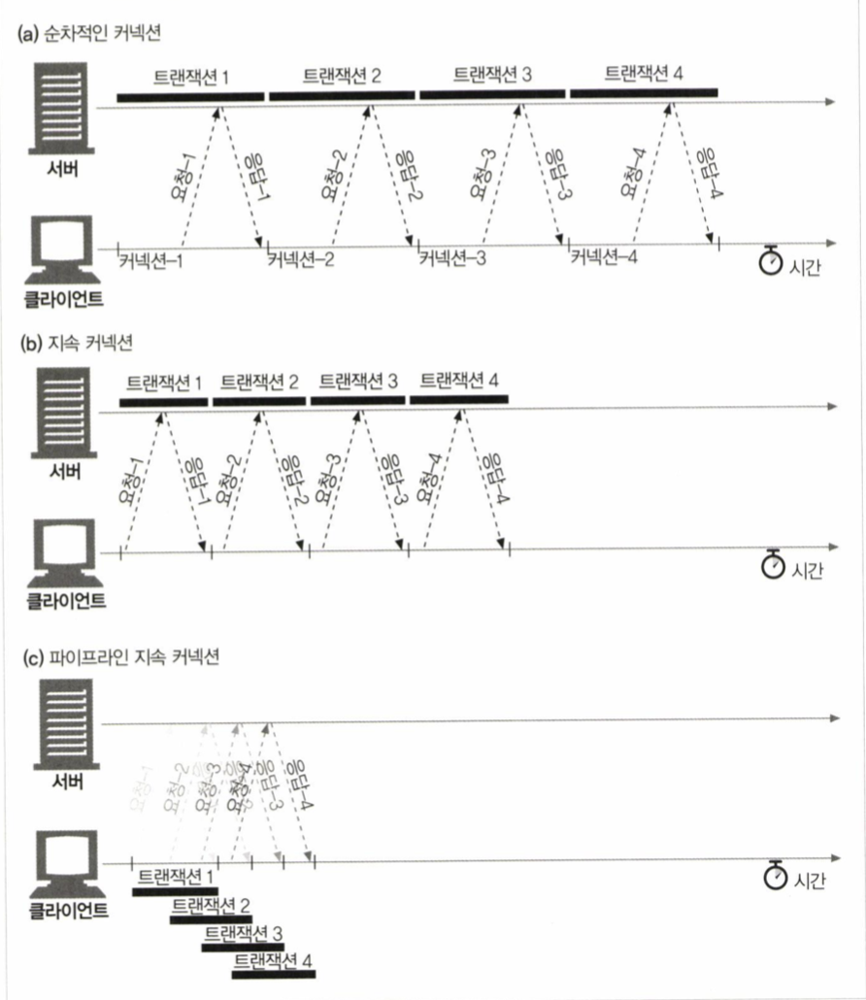
> 네 개의 트랜잭션을 처리하는 커넥션들

* 파이프라인 커넥션의 제약사항
	* HTTP 클라이언트는 커넥션이 지속 커넥션인지 확인하기 전까지 파이프라인을 이으면 안된다
	* HTTP 응답순서는 요청 순서와 같아야 한다
	* HTTP 클라이언트는 예상치 못하게 끊어진 커넥션을 다시 맺고 요청을 보낼 준비가 되어야 한다
	* non-idempotnet 메서드 요청은 파이프라인을 통해 보내면 안된다
		* 클라이언트는 에러 발생 시 어떤 요청들이 이미 처리되었는지 알 수 가 없다

## 4.7 커넥션 끊기에 대한 미스테리
**커넥션 관리에는 명확한 기준이 없다**
### 마음대로 커넥션 끊기
* TCP 전송 커넥션은 언제든 끊을 수 있다
	* 어디서, 어느 시점에 끊어질지 확실하게 보장할 수 없음
### Content-Length 와 Truncation
* HTTP 응답은 본문의 크기 값을 가지는 Content-Length 헤더를 가지고 있어야 한다
	* 일부 HTTP 서버의 경우 Content-Length 를 생략하거나 잘못된 값을 전달하고 커넥션을 끊는 경우가 있음
	* 클라이언트나 프록시는 실제 전달된 Entity 의 길이와 Content-Length 값이 다르면 서버에 다시 물어봐야 함
	* 프록시의 경우 응답을 캐시하면 안됨
		* 위 사례와 같은 잠재적인 에러를 방지하기 위해
### 커넥션 끊기의 허용, 재시도, 멱등성
* 커넥션은 언제든 끊어질 수 있기 때문에 HTTP 어플리케이션은 그 시점에 적절히 대응할 준비가 되있어야 한다
	* 클라이언트 입장에서는 응답이 오기 전에 커넥션이 끊기면 서버에서 얼마나 처리되었는지 알 수가 없다
		* non-idempotnet 한 요청들의 경우 반복 시 어떤 부작용이 일어날지 모름
		* 이러한 요청들은 자동으로 재시도하면 안된다
	* 파이프라인 요청은 idempotnet 한 요청만 보내야 한다
### 우아한 커넥션 끊기
* TCP 커넥션은 양방향 커넥션이다

> TCP 커넥션의 양쪽에는 각각의 입/출력 큐가 존재한다
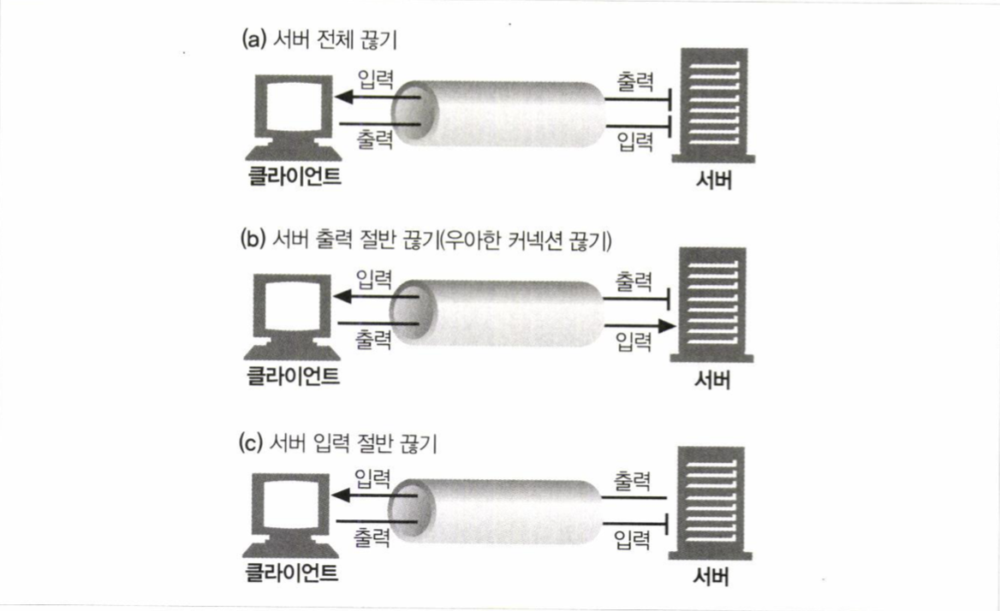
> 어플리케이션은 TCP 커넥션의 입/출력 채널을 선택적으로 끊을 수 있다
	* close(s)
		* 입력과 출력채널 모두를 끊는다
	* shoutdown(s, <sdie>)
		* 입력, 출력 채널 중 하나를 끊는다
* TCP 끊기와 리셋 에러
	* 예상치 못한 쓰기 에러를 예방하기 위해 절반 끊기를 사용해야 한다
		* 일반적으로 출력 채널을 끊는 것이 안전하다
	* 클라이언트로부터 더 이상 요청이 오지 않을 것임을 확신하지 못하는 이상 입력 채널을 끊는 것은 위험하다
		* 클라이언트 입장에서 rst 메세지를 받을 경우 운영체제는 버퍼의 읽히지 않는 데이터를 모두 삭제할 수 있다
* 우아하게 커넥션 끊기
	* 출력 채널을 먼저 닫고 반대편 출력 채널이 끊기는 것을 기다린다
		* 더 이상의 데이터 전송이 없을 것임을 알림
	* 서로가 절반 끊기를 구현하고 있다는 보장이 없고, 우아한 커넥션 끊기 프로세스를 따른다는 보장도 없다
		* 출력 채널을 닫은 뒤에도 입력 채널에 대한 상태 검사를 주기적으로 해야 함

