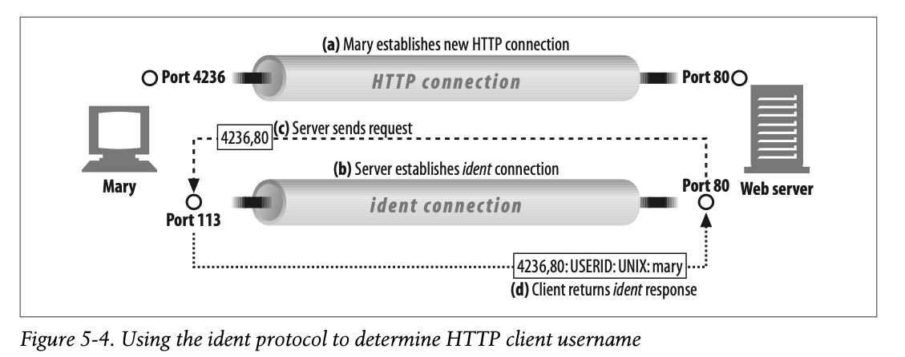

# 05. 웹 서버
## 5.1 다채로운 웹 서버

- 모든 웹서버는 리소스에 대한 HTTP 요청을 받아, 콘텐츠를 클라이언트에게 돌려준다.

**웹 서버 구현**

- 웹서버는 리소스를 관리하고 웹 서버를 설정, 통제, 확장하기 위한 관리 기능을 제공한다.
- 웹 서버는 TCP 커넥션 관리에 대한 책임을 운영체제와 나눠 갖는다.

**다목적 소프트웨어 웹 서버**

- 웹 서버 소프트웨어는 거의 모든 컴퓨터와 운영체제에서 동작한다.
- 마이크로소프트 웹 서버, 아파치 웹 서버, nginx 서버 등이 있다.

**임베디드 웹 서버**

- 일반 소비자용 제품에 내장될 목적으로 만들어진 작은 웹 서버.

## 5.2 간단한 펄 웹 서버

- 최소한으로 기능하는 HTTPT서버 - `type-o-serve`
- 요청을 받자마자 화면에 메시지를 출력한다.
- 그 후, 클라이언트에게 답해줄 응답 메시지를 타이핑하기를 기다린다.
- HTTP 요청 메시지를 정확히 기록하고, 어떤 응답을 돌려보내줄 지를 흉내낸다.

    #!/usr/bin/perl
    
    use Socket;
    use Carp;
    use FileHandle;
    
    $port = (@ARGV ? $ARGV[0] : 8080);
    
    $proto = getprotobyname('tcp');
    socket(S, PF_INET, SOCK_STREAM, $proto) || die;
    
    setsockopt(S, SOL_SOCKET, SO_REUSEADDR, pack("l", 1)) || die;
    
    bind(S, sockaddr_in($port, INADDR_ANY)) || die;
    
    listen(S, SOMAXCONN) || die;
    
    print(" <<<Type-O-Serve Accepting on Port $d>>>\n\n", $port);
    
    while (1) {
      $cport_caddr = accept(C, S);
      ($cport, $caddr) = sockaddr_in($cport_caddr);
      C->autoflush(1);
    
      $cname = gethostbyaddr($caddr, AF_INET);
      print(" <<<Request From '%s'>>>\\n", $cname);
    
      while ($line = <C>) {
        print $line;
        if ($line =~ /^\r/)  { last; }
      }
    
      printf(" <<<Type Response Followed by '.'>>>\n");
    
      while ($line = <STDIN>) {
        $line =~ s/\r//;
        $line =~s/\n//;
        if ($line =~ /^\./) { last; }
        print C $line . "\r\n";
      }
    
      close(C);
    }

## 5.3 진짜 웹 서버가 하는 일

1. 커넥션을 맺는다
    - 클라이언트의 접속을 받거나, 원치 않는 클라이언트라면 닫는다.
2. 요청을 받는다
    - HTTP 요청 메시지를 네트워크로부터 읽어들인다.
3. 요청을 처리한다
    - 요청 메시지를 해석하고 행동을 취한다.
4. 리소스에 접근한다
    - 메시지에서 지정한 리소스에 접근한다.
5. 응답을 만든다
    - 올바른 헤더를 포함한 HTTP 응답 메시지를 생성한다.
6. 응답을 보낸다
    - 응답을 클라이언트에게 돌려준다.
7. 트랜잭션을 로그로 남긴다
    - 로그파일에 트랜잭션 완료에 대한 기록을 남긴다.

## 5.4 클라이언트 커넥션 수락

**새 커넥션 다루기**

- 클라이언트가 TCP 커넥션을 요청하면 웹 서버는 커넥션을 맺고 TCP커넥션에서 IP 주소를 추출하여 커넥션 맞은편에 어떤 클라이언트가 있는지 확인한다.
- 새 커넥션이 맺어지면, 서버는 새 커넥션을 커넥션 목록에 추가, 오가는 데이터를 지켜보기 위한 준비를 한다.
- 웹 서버는 어떤 커넥션이든 마음대로 거절하거나 즉시 닫을 수 있다.
    - 클라이언트의 IP 주소나 호스트 명이 인가되지 않았거나 악의적이라고 알려진 것일 경우 커넥션을 닫는다.

**클라이언트 호스트 명 식별**

- 역방향 DNS를 사용, 클라이언트의 IP 주소를 호스트 명으로 변환한다.
- 이는 구체적인 접근 제어와 로깅을 위해 사용할 수 있다.
- hostname lookup은 많은 시간이 걸릴 수 있어, 꺼두거나 특정 콘텐츠에 대해서만 켜놓는다.
- Apache server 설정으로 hostname lookup을 끄고, 특정 리소스에 대해서만 켜놓기

    HostnameLookups off
    <Files ~ "\.(html|htm|cgi)$">
    	HostnameLookups on
    </Files>

**ident를 통해 클라이언트 사용자 알아내기**

- 몇몇 웹 서버는 IETF ident 프로토콜을 지원한다.
- 서버에게 어떤 사용자 이름이 HTTP 커넥션을 초기화했는지 알아낼 수 있다.
- 웹 서버 로깅에 유용하다.
    - 일반 로그 포멧(Common log format)의 두 번째 필드는 ident 사용자 이름을 담고 있다.
    - RFC 1413

        1.  INTRODUCTION
        
           The Identification Protocol (a.k.a., "ident", a.k.a., "the Ident
           Protocol") provides a means to determine the identity of a user of a
           particular TCP connection.  Given a TCP port number pair, it returns
           a character string which identifies the owner of that connection on
           the server's system.
        
           The Identification Protocol was formerly called the Authentication
           Server Protocol.  It has been renamed to better reflect its function.
           This document is a product of the TCP Client Identity Protocol
           Working Group of the Internet Engineering Task Force (IETF).
        
        2.  OVERVIEW
        
           This is a connection based application on TCP.  A server listens for
           TCP connections on TCP port 113 (decimal).  Once a connection is
           established, the server reads a line of data which specifies the
           connection of interest.  If it exists, the system dependent user
           identifier of the connection of interest is sent as the reply.  The
           server may then either shut the connection down or it may continue to
           read/respond to multiple queries.
        
           The server should close the connection down after a configurable
           amount of time with no queries - a 60-180 second idle timeout is
           recommended.  The client may close the connection down at any time;
           however to allow for network delays the client should wait at least
           30 seconds (or longer) after a query before abandoning the query and
           closing the connection.

- 클라이언트가 ident 프로토콜을 지원한다면, ident 결과를 위해 113번 포트를 listen한다.
- 동작
    - 클라이언트는 HTTP 커넥션을 연다.
    - 서버는 자신의 커넥션을 클라이언트의 ident서버 포트를 향해 열고, 새 커넥션에 대응하는 사용자 이름을 묻는 요청을 보낸다.

    

- 공공 인터넷에서는 잘 동작하지 않는다.
    - 많은 클라이언트가 ident 프로토콜 데몬 소프트웨어를 실행하지 않는다.
    - HTTP 트랜잭션을 지연시킨다.
    - 방화병이 막는다.
    - 안전하지 않고 조작하기 쉽다.
    - 가상 IP를 잘 지원하지 않는다.
    - 사용자 이름 노출로 프라이버시 침해 우려가 있다.

## 5.5 요청 메시지 수신

- 웹 서버는 네트워크 커넥션에서 데이터를 읽어 들이고 파싱하여 요청 메시지를 구성한다.
- 파싱
    - 요청줄을 파싱하여 요청 메서드, 리소스의 식별자(URI), 버전 번호를 찾는다.
        - 스페이스로 분리, 요청줄은 캐리지 리턴 줄바꿈(CRLF) 문자열로 끝난다.
    - 메시지 헤더들을 읽는다. 각 메시지 헤더는 CRLF로 끝난다.
    - CRLF로 끝나는 빈 줄을 찾아 헤더의 끝으로 인식한다.(존재한다면)
    - 요청 본문이 있다면 읽어들인다.(길이는 Content-Length)
- 네트워크 커넥션은 언제라도 무효화될 수 있으므로, 이해 가능한 수준의 분량을 확보할 때 까지 데이터를 읽어 메시지 일부분을 메모리에 임시로 저장할 필요가 있다.

**메시지의 내부 표현**

- 몇몇 웹 서버는 요청 메시지를 내부의 자료 구조에 저장한다.
- 요청 메시지의 각 조각에 대한 포인터와 길이 등을 저장한다.
- 빠르고 신속하게 접근 가능.

### **커넥션 입력/출력 처리 아키텍쳐**

**단일 스레드 웹 서버**

- 한 번에 하나씩 요청 처리.
- 트랜잭션 완료 후 다음 커넥션이 처리.
- 처리 도중에 다른 커넥션은 무시됨.

**멀티프로세스와 멀티스레드 웹 서버**

- 여러 요청을 동시에 처리하기 위해 여러 개의 프로세스 혹은 고효율 스레드를 할당한다.
    - 많은 고성능 서버는 멀티프로세스인 동시에 멀티스레드다.
- 스레드/프로세스는 필요할 때 만들어지거나 미리 만들어진다.
    - 스레드가 미리 생성되는 시스템을 worker pool이라 부른다.
- 수만 개의 동시 커넥션을 처리할 때, 수많은 프로세스나 스레드가 너무 많은 메모리나 시스템 리소스를 소비하므로, 많은 웹 서비스가 스레드/프로세스의 최대 개수에 제한을 건다.

**다중 I/O 서버**

- 모든 커넥션은 동시에 그 활동을 제한당한다.
- 커넥션의 상태가 바뀌면 그 커넥션에 대해 작은 양의 처리가 수행된다.
- 처리가 완료되면, 커넥션은 다음번 상태 변경을 위해 열린 커넥션 목록으로 들어간다.
- 특정 커넥션에 대해 작업을 수행하는 것은 실제 할 일이 있을 때 뿐이다.
- 스레드/프로세스는 유휴 상태의 커넥션에 리소스를 낭비하지 않는다.

**다중 멀티스레드 웹 서버**

- 멀티스레딩과 다중화(multiplexing)를 결합.
- 여러 개의 스레드가 각각 열려있는 커넥션을 감시하고, 각 커넥션에 대해 조금씩 작업을 수행한다.

## 5.6 요청 처리

- 서버는 요청으로부터 메서드, 리소스, 헤더, 본문 등을 얻어내어 처리한다.
- GET은 요청 메시지에 엔터티 본문이 있는 것을 금지한다.

## 5.7 리소스의 매핑과 접근

- 요청 메시지의 URI에 대응하는 알맞은 콘텐츠나 콘텐츠 생성기를 웹 서버에서 찾아 그 콘텐츠의 원천을 식별해야 한다.

### Docroot

- 리소스 매핑의 가장 단순한 형태는 요청 URI를 웹 서버의 파일 시스템 안에 있는 파일 이름으로 사용하는 것이다.
- 웹 서버 파일 시스템 내에 웹 콘텐츠를 위해 예약된 특별한 폴더를 docroot로 부른다.
- 상대적인 URL이 docroot를 벗어나지 않도록 주의해야 한다.

**가상 호스팅된 docroot**

- 한 웹 서버에서 여러 개의 웹 사이트를 호스팅하는 방법.
- URI나 host헤더에서 얻은 IP주소나 호스트 명을 이용, 올바른 문서 루트를 식별한다.
- 하나의 웹 서버 위에서 두 개의 사이트가 완전히 분리된 콘텐츠를 갖고 호스팅 되도록 한다.
- Apache web server에서 가상 호스트 설정하기

    <VirtualHost www.joes-hardware.com>
    	ServerName www.joes-hardware.com
      DocumentRoot /docs/joe
      TransferLog /logs/joe.access_log
      ErrorLog /logs/joe.error_log
    </VirtualHost>
    <VirtualHost www.marys-antiques.com>
      ServerName www.marys-antiques.com
      DocumentRoot /docs/mary
      TransferLog /logs/mary.access_log
      ErrorLog /logs/maery.error_log
    </VirtualHost>

**사용자 홈 디렉터리 docroots**

- 한 대의 웹 서버에서 각자의 개인 웹 사이트를 만들 수 있도록 해준다.
- `/`, `~` 다음에 사용자 이름이 오는 것으로 개인 문서 루트를 가리킨다.
    - `GET /~bob/index.html`

**디렉터리 목록**

- 경로가 파일이 아닌 디렉터리를 가리키는 요청을 받을 수 있다.
- 서버는 클라이언트가 디렉터리 URL을 요청했을 때
    - 에러를 반환한다.
    - 디렉터리 대신 특별한 색인 파일을 반환한다.
    - 디렉터리를 탐색해서 그 내용을 담은 HTML페이지를 반환한다.

**동적 콘텐츠 리소스 매핑**

- URI를 동적 리소스에 매핑한다. - 요청에 맞게 콘텐츠를 생성
- 아파치에서 특정 확장자의 파일만 실행하도록 설정할 수 있다.
    - `AddHandler cgi-script .cgi` - `.cgi`로 끝나는 모든 웹 리소스는 실행되어야 한다.

**서버사이드 인클루드**

- Server-Side Includes, SSI
- 리소스의 콘텐츠를 클라이언트에 보내기 전에 처리한다.

**접근제어**

- 각각의 리소스에 접근 제어를 할당한다.
- 클라이언트의 IP 주소에 근거하여 접근을 제어하거나, 리소스에 접근하기 위한 비밀번호를 물어본다.

## 5.8 응답 만들기

- 서버는 리소스를 식별 후, 요청 메서드로 서술되는 동작을 수행한 뒤 응답 메시지를 반환한다.
    - 응답 메시지는 상태 코드, 헤더, 본문을 포함한다.

**응답 엔터티**

- 만약 본문이 있다면 주로 다음을 포함한다.
    - `Content-Type` 헤더
    - `Content-Length` 헤더
    - 응답 본문 내용

### **MIME 타입 결정하기**

- 웹 서버는 응답 본문의 MIME 타입을 결정해야 하는 책임이 있다.
- MIME 타입과 리소스를 연결하는 여러가지 방법
    - **mime.types**
        - 웹 서버는 MIME 타입을 나타내기 위해 파일 이름의 확장자를 사용할 수 있다.
    - 매직 타이핑(magic typing)
        - 파일의 내용을 검사해 알려진 패턴에 대한 테이블에 해당하는 패턴이 있는지 찾아본다.
        - 느리지만 파일이 표준 확장자 없이 이름 지어진 경우 편리하다.
    - 유형 명시(explicit typing)
        - 특정 파일이나 디렉터리 안의 파일들에 대한 유형을 명시한다.
    - 유형 협상(type negotiation)
        - 한 리소스가 여러 종류의 문서 형식에 속하도록 설정한다.
        - 이때 웹 서버가 사용자와의 협상 과정을 통해 사용하기 가장 좋은 형식을 판별할 것인지 설정한다.
        - 특정 파일이 특정 MIME 타입을 갖게끔 설정한다.

### 리다이렉션

- 3XX 응답 코드로 지칭한다.
- Location 헤더는 콘텐츠의 새로운 혹은 선호하는 위치에 대한 URI를 포함한다.

**영구히 리소스가 옮겨진 경우**

- 리소스에 새 URL이 부여되어 새로운 위치로 옮겨졌거나 이름이 바뀐 경우.
- `301 moved permanently`

**임시로 리소스가 옮겨진 경우**

- 서버는 클라이언트가 나중에 원래 URL로 찾아오고 북마크를 갱신하지 않기를 원한다.
- `303 See Other`, `307 Temprary Redirect`

**URL 증강**

- 문맥 정보를 포함하기 위해 재 작성된 URL로 리다이렉트.
- 상태 정보를 내포한 새 URL을 생성하고 사용자를 리다이렉트.
    - FAT URL
- 클라이언트는 리다이렉트를 따라가, 상태 정보가 추가된 완전한 URL을 포함한 요청을 다시 보낸다.
- 트랜잭션 간 상태를 유지하는 유용한 방법.
- `303 See Other`, `307 Temprary Redirect`

**부하 균형**

- 과부화된 서버가 요청을 받으면, 덜 부하가 걸린 서버로 리다이렉트할 수 있다.
    - Q - 다른 서버가 부하가 덜 걸렸는지 어떻게 판별?
- `303 See Other`, `307 Temprary Redirect`

**친밀한 다른 서버가 있을 때**

- 클라이언트에 대한 정보를 갖고 있는 다른 서버로 리다이렉트.
- `303 See Other`, `307 Temprary Redirect`

**디렉터리 이름 정규화**

- 클라이언트가 디렉터리 이름에 대한 URI요청할 때, 끝에 `/`를 빠뜨리면 정상 디렉터리로 리다이렉트.

## 5.9 응답 보내기

- 서버는 커넥션 상태를 추적해야 한다.
- 비지속적인 커넥션일 경우 모든 메시지를 보내고 자신 쪽의 커넥션을 닫는다.
- 지속적인 커넥션이면, Content-Length 헤더를 바르게 계산하기 위해, 클라이언트 응답이 언제 끝날지 알 수 없는 경우 열린 상태를 유지한다.

## 5.10 로깅

- 트랜잭션 완료 후 트랜잭션이 어떻게 수행되었는지를 로그 파일에 기록한다.

## ref

### 아파치 서버 설정

- [https://webdir.tistory.com/178](https://webdir.tistory.com/178)

### ident

- [https://tools.ietf.org/html/rfc1413](https://tools.ietf.org/html/rfc1413)

### web server transaction

- [https://gmlwjd9405.github.io/2018/10/27/webserver-vs-was.html](https://gmlwjd9405.github.io/2018/10/27/webserver-vs-was.html)

### thread pool

- [https://heowc.dev/2018/02/08/thread-pool/](https://heowc.dev/2018/02/08/thread-pool/)
- [https://en.wikipedia.org/wiki/Thread_pool](https://en.wikipedia.org/wiki/Thread_pool)

### nodejs multithreaded

- [http://www.nextree.co.kr/p7292/](http://www.nextree.co.kr/p7292/)
- [https://itnext.io/going-multithread-with-node-js-492258ba32cf](https://itnext.io/going-multithread-with-node-js-492258ba32cf)
- [https://itnext.io/multi-threading-and-multi-process-in-node-js-ffa5bb5cde98](https://itnext.io/multi-threading-and-multi-process-in-node-js-ffa5bb5cde98)
- [https://sjh836.tistory.com/79](https://sjh836.tistory.com/79)

### server side includes

- [http://www.terms.co.kr/SSI.htm](http://www.terms.co.kr/SSI.htm)
- [https://httpd.apache.org/docs/current/ko/howto/ssi.html](https://httpd.apache.org/docs/current/ko/howto/ssi.html)
- [https://en.wikipedia.org/wiki/Server_Side_Includes](https://en.wikipedia.org/wiki/Server_Side_Includes)

