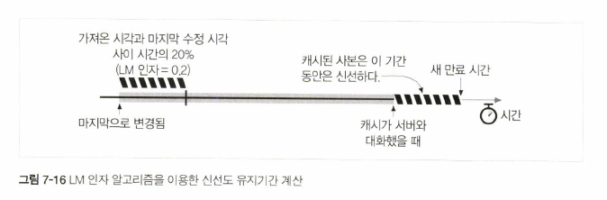

# 07. 캐시

#### 캐시의 역할

* \(7.1\) 불필요한 데이터 전송 감소 \(-&gt; 네트워크 요금 감소\)
* \(7.2\) 네트워크 병목을 줄여 줌
* \(7.3\) 원 서버에 대한 부하를 줄여 줌
* \(7.4\) 거리로 인한 지연을 줄여 줌

## 7.1 불필요한 데이터 전송

* 자주 쓰이는 웹 페이지에는 서로 다른 여러 클라이언트가 접근한다.
* 첫 번째 요청에 대한 응답을 캐시에 보관하여 중복 트래픽을 줄인다.

## 7.2 대역폭 병목

* 로컬 네트워크 클라이언트의 대역폭 &gt; 원격 서버의 대역폭
* 클라이언트들이 서버에 접근하는 속도는 그 경로에 있는 가장 느린 네트워크의 속도와 같다.
* LAN에 있는 캐시로부터 사본을 가져오면 성능을 대폭 개선할 수 있다.

## 7.3 갑작스런 요청 쇄도

* 갑작스런 사건으로 인해 많은 클라이언트가 동시에 같은 웹 문서에 접근할 수 있다.
* 트래픽이 갑자기 늘어나면 네트워크와 웹 서버에 심각한 장애가 일어날 수 있다.

## 7.4 거리로 인한 지연

* 대역폭이 충분하더라도 거리 자체가 문제가 될 수 있다.
* 1\) 빛의 속도 그 자체가 트래픽을 지연시킨다. 한 지점에서 다른 지점까지 신호가 전달되는 데는 최소한 빛의 속도만큼의 지연이 발생한다. \(실제로는 신호는 빛보다 약간 느리게 이동한다. 또한 네트워크가 모두 일직선으로 놓여있지 않기 때문에 지연이 더 발생한다.\)
* 2\) 모든 네트워크 라우터는 트래픽을 지연시킨다. 신호가 한 지점에서 다른 지점까지 가는 동안은 수많은 라우터, 게이트웨이, 스위치, 기지국 등을 거치게 된다.

> [https://johngrib.github.io/wiki/latency/](https://johngrib.github.io/wiki/latency/) \(책\) 러닝 HTTP/2 부분 참고

## 7.5 적중과 부적중

* 캐시 적중\(cache hit\): 캐시에 요청이 도착했을 때, 요청에 대응하는 사본으로 요청을 처리하는 것
* 캐시 부적중\(cache miss\): 요청에 대응하는 사본이 없어서 원 서버로 전달되는 것

### 7.5.1 재검사 \(Revalidation\)

* HTTP 재검사: 캐시가 갖고 있는 사본이 최신인지 검사하는 것
* 전체 객체를 가져오지 않고도 콘텐츠가 최신인지 검사할 수 있다.
* 네트워크 대역폭이 부족하기 때문에 모든 문서를 재검사하지는 않는다.
* 1\) 클라이언트가 사본을 요청하였으며 2\) 사본이 충분히 오래된 경우에만 재검사를 한다.

#### 재검사 적중 \(느린 적중\)

클라이언트가 사본 요청 -&gt; 캐시가 원 서버에 재검사 요청

```text
GET /index.html HTTP/1.0
If-Modified-Since: Sat, 29 Jun 2009, 14:30:00 GMT
```

ex. `If-Modified-Since` 헤더: 캐시된 시간 이후에 변경된 경우에 사본을 보내달라고 요청 -&gt; 원 서버에서 `304 Not Modified` 응답

```text
HTTP/1.0 304 Not Modified
Date: Wed, 03 Jul 2002, 19:18:23 GMT
Content-type:text/plain
Content-length: 67
Expires: Fri, 05 Jul 2002, 05:00:00 GMT
```

cf. `Expires` 헤더: 문서의 유효기간 \(날짜\) -&gt; 캐시는 사본이 신선하다고 임시로 표시한 뒤 클라이언트에 제공

* 순수 캐시 적중보다는 느림: 원 서버에 검사하고 와야 해서
* 캐시 부적중보다는 빠름: 원 서버로부터 데이터를 다시 받아올 필요는 없기 때문

#### 재검사 부적중

원 서버는 원본 콘텐츠 전체와 함께 `HTTP 200 OK` 응답

#### 객체 삭제

원 서버는 `404 Not Found` 응답을 보내고, 캐시는 사본을 삭제한다

### 7.5.2 적중률

#### 캐시 적중률 \(문서 적중률\)

* 캐시가 요청을 처리하는 비율
* 얼마나 많은 웹 트랜잭션을 외부로 내보내지 않았는지 보여줌
* 트랜잭션에 따르는 고정 소요 시간이 있기 때문에, 문서 적중률을 개선하면 전체 대기시간을 줄일 수 있다.

### 7.5.3 바이트 적중률

* 크기가 큰 문서는 덜 접근되더라도 전체 트래픽에는 더 큰 영향을 줄 수 있다.
* 바이트 적중률: 캐시를 통해 제공된 바이트의 비율
* 트래픽이 절감된 정도를 표현한다. ex\) 100%: 모든 바이트가 캐시에서 왔기 때문에, 어떤 트래픽도 인터넷으로 나가지 않음
* 대역폭 절약을 최적화한다.

### 7.5.4 적중과 부적중의 구별

* 응답이 캐시 적중이었든 원 서버 접근이든 모두 `200 OK` 응답이 내려온다.
* `Date` 헤더 값을 현재 시각과 비교해서 응답의 생성일이 더 오래되었다면 응답이 캐시된 것이다.
* `Age` 헤더는 문서가 캐시에 머무른 시간을 초단위로 표시한다.
* 어떤 상용 프락시 캐시는 `Via` 헤더에 추가 정보를 붙이기도 한다.

## 7.6 캐시 토폴로지

### 7.6.1 개인 전용 캐시

* ex. 웹브라우저에 내장된 캐시

### 7.6.2 공용 프락시 캐시

* ex. 프락시 캐시 \(캐시 프락시 서버\)
* 여러 요청에 대해 공유된 사본을 제공하여 트래픽을 줄인다.
* 수동 프락시를 지정하거나, 프락시 자동설정 파일을 설정하거나, 인터셉트 프락시를 사용할 수 있다.

### 7.6.3 프락시 캐시 계층들

* 캐시 계층: 작은 캐시 부적중 -&gt; 부모 캐시가 트래픽 처리하는 구조
* 클라이언트 주위에 작고 저렴한 캐시를 사용하고, 계층 상단에는 크고 강력한 캐시를 사용

> 프락시 연쇄가 길어질수록 각 중간 프락시에 성능 저하가 발생하기 때문에, 보통 네트워크는 두 개 혹은 세 개의 프락시만 거치도록 제한된다. 미래의 고성능 서버들은 연쇄 길이가 문제가 되지 않도록 할 수 있다.

### 7.6.4 캐시망, 콘텐츠 라우팅, 피어링

#### 캐시망

캐시에 대한 결정을 동적으로 내림

* 1\) 부모 캐시와 원 서버 중 하나를 동적으로 선택한다.
* 2\) 특정 부모 캐시를 동적으로 선택한다.
* 3\) 부모 캐시에게 가기 전에 캐시된 사본을 로컬에서 찾아본다.
* 4\) 다른 캐시들의 접근을 허용하되, 인터넷 트랜짓은 허용하지 않는다.

cf. 형제 캐시: 캐시끼리 연결되어 서로 찾아볼 수 있는 캐시. HTTP에서는 지원하지 않음.

## 7.7 캐시 처리 단계

### 7.7.1 요청 받기

네트워크로부터 도착한 요청 메시지를 읽는다.

### 7.7.2 파싱

* 메시지를 파싱하여 URL과 헤더들을 추출한다.
* 대소문자, 날짜 형식 차이, 절대 URL, 상대 URL 등의 차이를 숨긴다.

### 7.7.3 검색

* 로컬 복사본이 있는지 검사하고, 사본이 없다면 사본을 받아온다\(그리고 로컬에 저장한다\).
* 로컬 복사본은 메모리, 디스크, 근처의 다른 컴퓨터 등에 있을 수 있다.

### 7.7.4 신선도 검사

* 캐시된 사본이 충분히 신선한지 검사하고, 신선하지 않다면 변경사항이 있는지 서버에게 물어본다.

### 7.7.5 응답 생성

* 새로운 헤더와 캐시된 본문으로 응답 메시지를 만든다.
* 응답을 원 서버에서 온 것처럼 보이게 하고 싶기 때문에, 캐시된 서버 응답 헤더를 토대로 응답 헤더를 생성한다.
* 클라이언트에 맞게 헤더를 조정한다.
  * 클라이언트가 HTTP/1.1 응답을 기대하는 상황에서 서버가 HTTP/1.0 또는 HTTP/0.9 응답을 반환한 경우
  * 캐시 신선도 정보 \(`Cache-Control`, `Age`, `Expires`, `Via`\) 삽입
  * 단, `Date` 헤더를 조정해서는 안 된다. `Date`는 원 서버에서 최초로 생겨난 일시를 표현한다.

### 7.7.6 발송

네트워크를 통해 응답을 클라이언트에게 돌려준다.

### 7.7.7 로깅

* \(선택적으로\) 로그파일에 트랜잭션에 대해 서술한 로그를 남긴다.
* 캐시에 대한 통계를 갱신한다.

## 7.8 사본을 신선하게 유지하기

### 7.8.1 문서 만료

* 문서가 만료되기 전에는 서버와 접촉 없이 사본을 제공할 수 있지만, 문서가 만료되면 변경된 것이 있는지 검사하고 새로운 사본을 얻어 와야 한다.

### 7.8.2 유효기간과 나이

* `Cache-Control: max-age` 헤더: 문서의 최대 나이 \(초 단위\)
* `Expires` 헤더: 문서의 유효기간 \(날짜\)

```text
Cache-Control: max-age=484200
Expires: Fri, 05 Jul 2020, 05:00:00 GMT
```

### 7.8.3 서버 재검사

#### 재검사 결과

* 콘텐츠가 변경됨: 새로운 사본을 가져오고 저장한 뒤 클라이언트에 보내준다
* 콘텐츠가 변경되지 않음: 새로운 헤더만 가져와서 캐시 안의 헤더들을 갱신한다 \(ex. 새로운 만료일\)
* 원 서버가 다운됨: 에러 메시지
* 결과가 부정확함: 경고 메시지를 부착된 사본을 보냄

매 요청마다 신선도를 검증할 필요가 없기 때문에, 서버 트래픽을 절약하고 사용자 응답 시간을 개선한다.

### 7.8.4 조건부 메서드와의 재검사

* 조건부 GET: GET 요청 메시지에 `If-`로 시작하는 헤더를 추가

### 7.8.5 If-Modified-Since: 날짜 재검사

* `If-Modified-Since: <date>`, 줄여서 IMS 요청
* 리소스가 특정 날짜\(캐시된 마지막 수정일\) 이후로 변경된 경우에만 요청한 본문을 보내야 함
* 몇몇 웹 서버는 날짜 비교 대신 문자열 비교를 하기 때문에, "정확히 이 날짜에 마지막 변경이 일어난 것이 아니라면"이라는 의미로 사용되기도 함
* 리소스가 주어진 날짜 이후로 변경됨: 요청 성공, 새 문서가 새로운 만료 날짜와 함께 캐시에 반환
* 리소스가 주어진 날짜 이후로 변경되지 않음: 서버는 304 Not Modified 응답 메시지를 클라이언트에 돌려줌. 본문은 보내지 않지만 새로운 만료 날짜는 보내줌.
* `Last-Modified` 서버 응답 헤더: 최근 변경 일시

### 7.8.6 If-None-Match

#### 날짜 검사의 문제점

* 내용에는 변화가 없어도 변경 시각은 바뀔 수 있음
* 철자나 주석 변경처럼 모든 캐시들이 다시 읽어들이기에는 사소한 변경일 수도 있음
* 어떤 서버들은 최근 변경 일시를 정확하게 판별하지 못함
* 1초보다 작은 간격으로 문서를 갱신하는 경우 1초가 충분하지 못한 정밀도가 될 수 있음

#### If-None-Match

* 엔터티 태그\(`Etag`, ex. `v2.6`\)가 변경되었는지 검사
* 변경된 경우 `200 OK` 응답과 새 `Etag` 반환
* 변경되지 않은 경우 `304 Not Modified` 응답
* 캐시가 여러 개의 사본을 갖고 있는 경우 여러 개의 `Etag`를 포함시킬 수 있다. \(ex. `If-None-Match: "v2.4", "v2.5", "v2.6"`\)

### 7.8.7 약한 검사기와 강한 검사기

* 약한 검사기: \(HTTP/1.1\) 콘텐츠가 조금 변경되었더라도 "그 정도면 같은 것"이라고 주장할 수 있게 해줌
  * `W/` 접두사: ex. `Etag: W/"2.6"`
* 강한 검사기: 콘텐츠가 바뀔 때마다 바뀜. 강한 `Etag` 값을 재활용해서는 안 됨.

### 7.8.8 언제 엔터티 태그를 사용하고 언제 Last-Modified 일시를 사용하는가

1. 서버가 엔터티 태그를 반환했다면 클라이언트는 엔터티 태그를 써야 함
2. 서버가 Last-Modified 값만 반환했다면 클라이언트는 if-Modified-Since 검사를 할 수 있음
3. 서버가 둘 다 반환했다면 클라이언트는 둘 다 사용해야 함 \(HTTP/1.0과 HTTP/1.1 캐시 모두 지원하기 위함\)
4. HTTP/1.1 원 서버는 엔터티 태그를 보내야 하고, Last-Modified 값을 같이 보낼 수도 있음
5. HTTP/1.1 캐시나 서버가 If-Modified-Since와 엔터티 태그 조건부 헤더를 모두 받았다면, 두 가지 조건에 모두 부합할 때만 `304 Not Modified` 응답을 보낼 수 있음

## 7.9 캐시 제어

문서가 만료되기 전까지 얼마나 오랫동안 캐시될 수 있는지 서버가 설정하는 것

**헤더 우선순위**

1. Cache-Control: no-store
2. Cache-Control: no-cache
3. Cache-Control: must-revalidate
4. Cache-Control: max-age
5. Expires
6. 아무 만료 정보도 주지 않고 캐시가 스스로 결정

### 7.9.1 no-cache와 no-store 응답 헤더

#### `Cache-Control: no-store`

* 캐시가 응답의 사본을 만드는 것을 금지함
* 캐시는 클라이언트에 no-store 응답을 전달하고 객체를 삭제함

#### `Cache-Control: no-cache`

* 실제로는 캐시 저장소에 저장될 수 있음
* 서버와 재검사하기 전에는 캐시에서 클라이언트로 제공될 수 없음

cf. `Pragma: no-cache`: HTTP/1.0+와의 하위호환성

### 7.9.2 Max-Age 응답 헤더

#### `Cache-Control: max-age`

* 문서가 서버로부터 온 이후 최대 유효 시간 \(초 단위\)
* s-maxage 헤더는 공용 캐시에만 적용됨

### 7.9.3 Expires 응답 헤더

* 실제 만료 날짜 명시
* 많은 서버가 부정확한 시계를 갖고 있기 때문에 절대시각 대신 경과된 시간으로 표현하는 것이 나음
* 문서가 항상 만료되도록 `Expires: 0`과 같은 헤더를 보내는 것은 문법 위반임

### 7.9.4 Must-Revalidate 응답 헤더

* 때때로 캐시는 성능을 위해 만료된 객체를 제공할 수 있음
* 서버가  `Cache-Control: must-revalidate` 헤더를 보내면 캐시는 원 서버와의 재검사 없이 객체를 제공할 수 없음
* 원 서버가 고장난 상태면 `504 Gateway Timeout error`

### 7.9.5 휴리스틱 만료

* 응답에 `Cache-control: max-age` 헤더나 `Expires` 헤더 중 어느 것도 포함하지 않고 있는 경우
* 경험적인 방법으로 최대 나이를 계산해서 Heuristic Expiration 경고 헤더를 응답에 추가함
* 일반적으로는 1주일~하루 정도의 상한을 설정해 둠
* 아무런 단서가 없을 때는 한 시간이나 하루 같은 기본 유지 기간을 설정하거나, 보수적으로 수명을 0으로 설정

#### LM 인자 알고리즘

* 문서가 최근 변경 일시를 포함하고 있을 때 사용
* 마지막으로 변경된 것이 상당히 예전이라면, 잘 변하지 않는 안정적인 문서로 추측하고 더 오래 보관한다
* 최근에 변경되었다면 자주 변경될 것으로 추측하고 짧은 기간 동안만 캐시한다



```text
마지막 수정 이후로 경과한 시간 = max(0, (서버의 date) - (서버의 Last_Modified))
서버 신선도 한계 = (마지막 수정 이후로 경과한 시간) * (lm 인자)
```

### 7.9.6 클라이언트 신선도 제약

* 클라이언트는 `Cache-control` 헤더를 사용해 캐시 만료 제약을 엄격하게 또는 느슨하게 할 수 있다.

#### 엄격하게

강제로 재검사하거나, 서버로부터 새로 가져온다. \(ex. 수동 리프레시 버튼\)

* Cache-Control: min-fresh = &lt;s&gt; 만료 시간 이전 최소 s초의 여유 시간이 남아 있어야 한다.
* Cache-Control: max-age = &lt;s&gt; s초보다 오래된 캐시된 문서를 반환할 수 없다.

#### 느슨하게

성능, 신뢰성, 비용 개선을 위해 느슨하게 검사한다.

* Cache-Control: max-stale = &lt;s&gt; : 신선하지 않은 문서를 제공할 수 있다. 값이 있으면 s초 지난 것도 받아들인다.
* Cache-Control: only-if-cached: 클라이언트는 캐시에 들어있는 사본만을 원한다.

### 7.9.7 주의할 점

문서 만료는 완벽한 시스템이 아니다. 유효기간을 너무 길게 잡는 경우나, 유효기간을 사용조차 하지 않는 경우도 있다.

## 7.10 캐시 제어 설정

아파치 서버가 캐시 제어를 지원하는 방법

> 너무 아파치에 특정된 것이어서 간단히만 짚고 넘어갑니다

### 7.10.1 아파치로 HTTP 헤더 제어하기

* mod\_headers: 개별 헤더 설정
* mod\_expires: Expires 헤더 자동 생성
* mod\_cern\_meta: 제어하고자 하는 파일에 대응되는 메타파일들을 생성해줌

### 7.10.2 HTTP-EQUIV를 통한 HTML 캐시 제어

* `HTTP-EQUIV` 태그: 문서의 최상단에 위치하여 문서와 연동되어야 하는 HTTP 헤더들을 정의함
* 대부분의 웹 서버에서 지원하지 않음
* 문제를 일으키기 때문에 대부분의 소프트웨어가 무시함
* 캐시 제어를 위해서는 HTTP 헤더를 이용할 것

## 7.11 자세한 알고리즘

### 7.11.1 나이와 신선도 수명

```text
(충분히 신선한가?) = (나이) < (신선도 수명)
```

* 나이: 서버가 문서를 보낸\(or 마지막 재검사\) 후 지난 시간. age 헤더 또는 date 헤더를 통해 판별함.
* 신선도 수명: 아직 문서가 신선하다고 볼 수 있는 수명
* 클라이언트의 요구사항 고려: ex. max-stale 헤더로 신선하지 않은 문서를 받아들이거나, min-fresh 헤더로 아직 신선한 문서도 안 받을 수 있음

### 7.11.2 나이 계산

#### 점층적 나이 계산

```text
(겉보기 나이) = max(0, (응답을 받은 시각) - (date 헤더값)
(보정된 겉보기 나이) = max((겉보기 나이) - (age 헤더값))
```

* 클록 스큐\(clock skew\): 두 컴퓨터의 시계 설정 차이로 인한 문제. 모든 컴퓨터 시계가 잘 동기화되지 않았기 때문임.
* 클록 스큐 때문에 겉보기 나이는 종종 부정확하거나 음수가 될 수 있음
* Age 헤더는 문서가 프락시나 캐시를 통과할 때마다 나이를 누적해서 더해줌
* HTTP/1.1이 아닌 장치는 Age 헤더를 인식하지 못하기 때문에 헤더를 고치지 않거나 삭제할 수 있음. 따라서 Age 헤더 역시 추정값임.
* 보정된 나이는 겉보기 나이와 age 중 큰 것이 선택됨

#### 네트워크 지연에 대한 보상

```text
(응답 지연 추정값) = (응답을 받은 시각) - (요청을 보낸 시각)
(문서가 캐시에 도착했을 때의 나이) = (보정된 겉보기 나이) + (응답 지연 추정값)
(사본이 캐시에 머무른 시간) = (현재 시각) - (응답을 받은 시각)
(나이) = (문서가 캐시에 도착했을 때의 나이) + (사본이 캐시에 머무른 시간)
```

* 문서가 프락시들과 부모 캐시의 긴 연쇄를 거쳐서 온 경우 네트워크 지연이 발생할 수 있다.
* 서버에서 캐시로 오는 데 얼마만큼의 시간이 들었는지를 더하는 것은 측정이 어렵기 때문에, 넉넉히 캐시 -&gt; 서버 -&gt; 캐시의 왕복 시간을 더해 준다.

### 7.11.3 완전한 나이 계산 알고리즘

문서의 현재 나이를 계산하기 위해서는 \(도착했을 때의 나이\)에 \(문서가 캐시에 머무른 시간\)을 더해 준다.

### 7.11.4 신선도 수명 계산

클라이언트의 요구사항에 충실히 따라야 한다.

### 7.11.5 완전한 서버 신선도 알고리즘

#### 서버가 명시한 신선도 한계 계산

```text
휴리스틱 = false
if (max-age 값이 설정되었나?) {
  서버 신선도 한계 = max_age 값
} else if (expires 값이 설정되었나?) {
  서버 신선도 한계 = expires 값 - date 값
} else if (Last_Modified 값이 설정되었나?) {
// Last_Modified 값이 있는 경우에도 만료 시간은 알 수 없기 때문에 휴리스틱을 이용한다.3
  마지막으로 변경된 시각 = max(0, date 값 - last_modified 값)
  서버 신선도 한계 = 마지막으로 변경된 시각 * lm 인자
  휴리스틱 = true
} else {
  서버 신선도 한계 = 캐시 최소 수명 기본값
  휴리스틱 = true
}

if (휴리스틱) {
  if (서버 신선도 한계 > 캐시 최대 수명 기본값) {
    서버 신선도 한계 = 캐시 최대 수명 기본값
  }
  if (서버 신선도 한계 < 캐시 최소 수명 기본값) {
    서버 신선도 한계 = 캐시 최소 수명 기본값
  }
}

return 서버 신선도 한계
```

#### 클라이언트가 수정한 신선도 한계

```text
나이 한계 = 서버 신선도 한계() // 위 코드에서 계산한 것

// Max-Stale = <s>: <s>초 지난 것도 받아들임
if (Max-Stale 값이 설정되었나?) {
  if (Max-Stale 값 == INT_MAX) {
    나이 한계 = INT_MAX
  } else {
    나이 한계 = 서버 신선도 한계() + Max_Stale 값
  }
}

// Min-Fresh = <s>: <s>초 미만으로 남은 건 안 받음 
if (Min-Fresh 값이 설정되었나?) {
  나이 한계 = min(나이 한계, 서버 신선도 한계() - Min-Fresh 값)
}

// Max-Age <s>: 최대 나이
if (Max-Age 값이 설정되었나?) {
  나이 한계 = min(나이 한계, Max-Age 값)
}
```

## 7.12 캐시와 광고

* 캐시는 성능을 개선하고 트래픽을 줄일 수 있다.
* 캐시는 사용자 경험을 개선할 수 있다.

### 7.12.1 광고 회사의 딜레마

#### 캐시의 장점

* 네트워크 요금 감소
* 같은 데이터를 몇 번이고 반복해서 보여줄 수 있음
* 호화로운 기사나 광고를 빠르게 보여줄 수 있음

#### 캐시의 단점

* 사용자들의 접근 횟수에 따라 돈을 버는데, 캐시를 거쳐 가면 원 서버에서는 실제 접근 횟수를 알 수 없게 됨

### 7.12.2 퍼블리셔의 응답

#### 캐시 무력화

* 캐시과 광고 시청 수를 가로채지 못하도록 CGI 게이트웨이를 통해 광고 제공 \(cf. CGI: 웹 서버에서 외부 프로그램 호출\)
* 매 접근마다 광고 URL이 변경되도록 함
* 프락시 캐시뿐만 아니라 주로 브라우저 캐시를 대상으로 함
* 장기적으로는 캐시가 트래픽을 흡수하되, 얼마나 적중이 일어났는지를 알려주는 방향으로 가야 함
  * ex. 모든 접근에 대한 재검사 -&gt; 트랜잭션 느려짐

### 7.12.3 로그 마이그레이션

* 서버로 요청이 가지 않도록 해서 캐시가 모든 로그를 유지하도록 함
* 보통 로그의 크기가 너무 크기 때문에 서버로 옮기기 어려움
* 또한 로그를 콘텐츠 제공자별로 분리해서 보여주기도 어려움

### 7.12.4 적중 측정과 사용량 제한

> [RFC 2227 "HTTP를 위한 간단한 캐시 적중량 측정과 사용량 제한"](https://www.ietf.org/rfc/rfc2227.txt)

* Meter 헤더: 특정 URL에 대한 캐시 적중 횟수를 정기적으로 서버에게 돌려줌
* 사용량 제한: 서버는 캐시가 문서를 제공할 수 있는 횟수나 소모할 수 있는 처리 시간을 제한할 수 있음

> 토의 내용: 최근의 광고 양상은 매우 다르다. 문서 전체가 아니라 문서에서 특정 부분이 보여졌는지 \(cf. Intersection Observer\) 등을 판단하고 ajax 요청을 보낼 수 있고... 등등.

