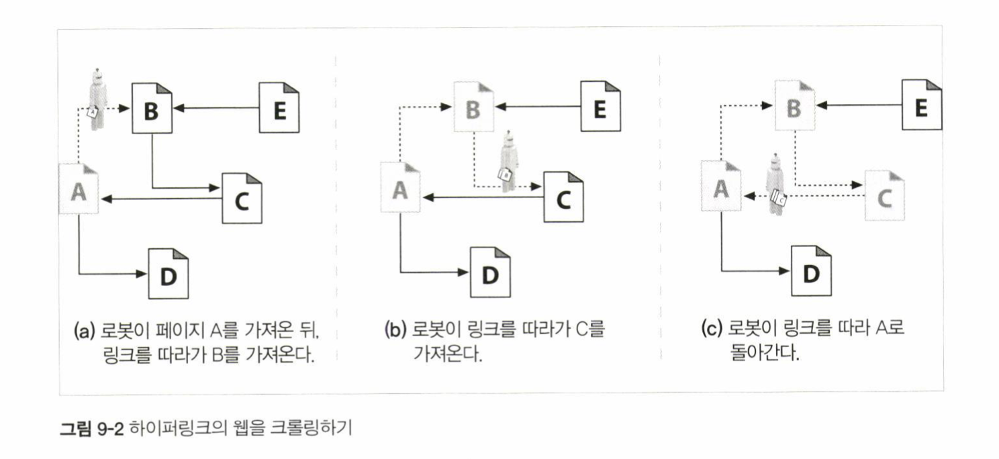
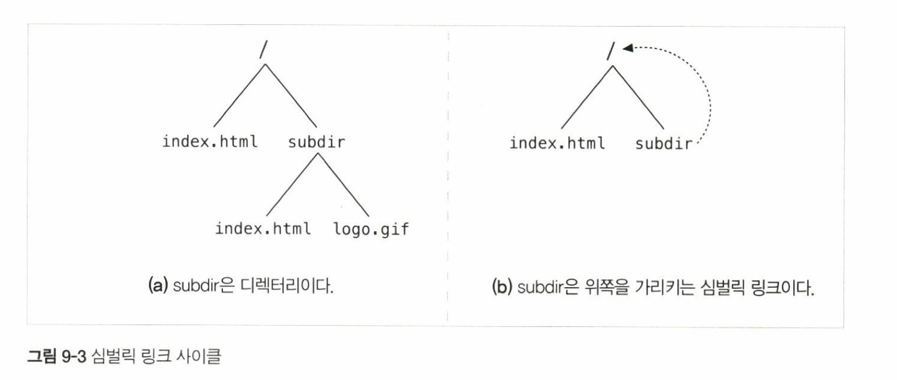
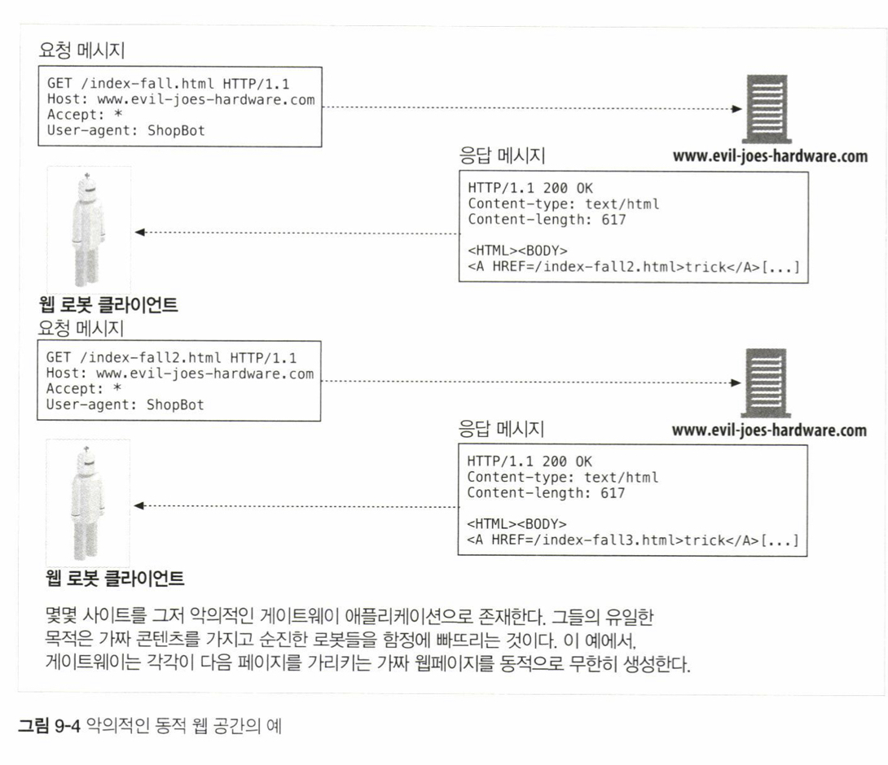
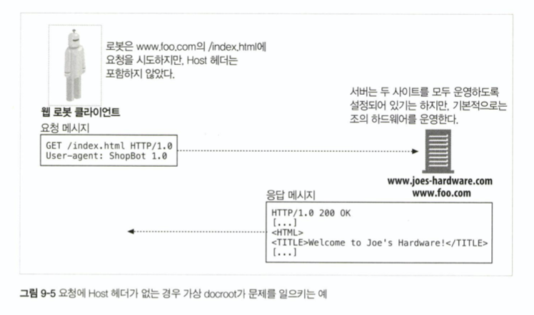
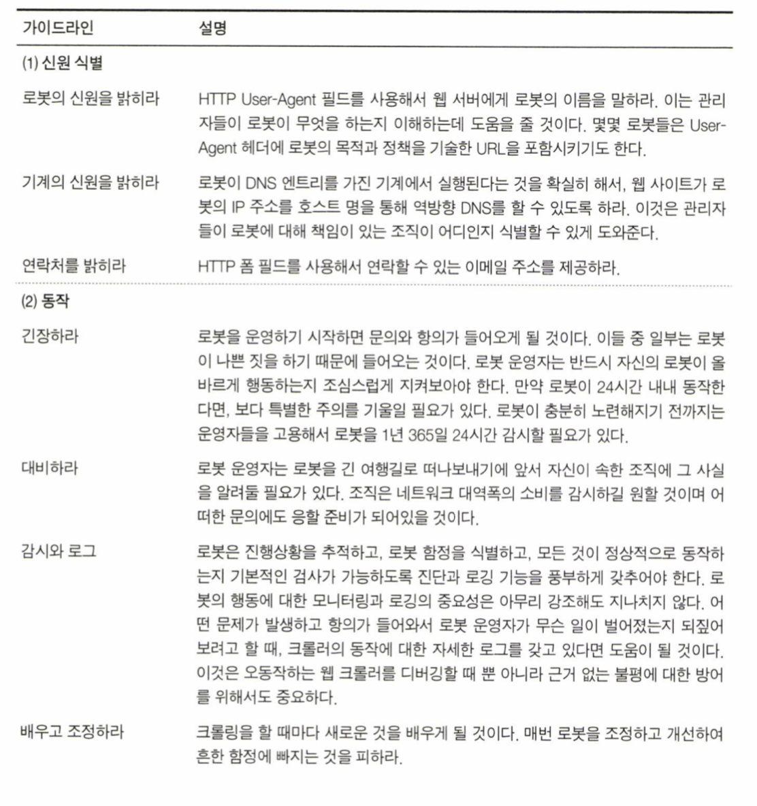
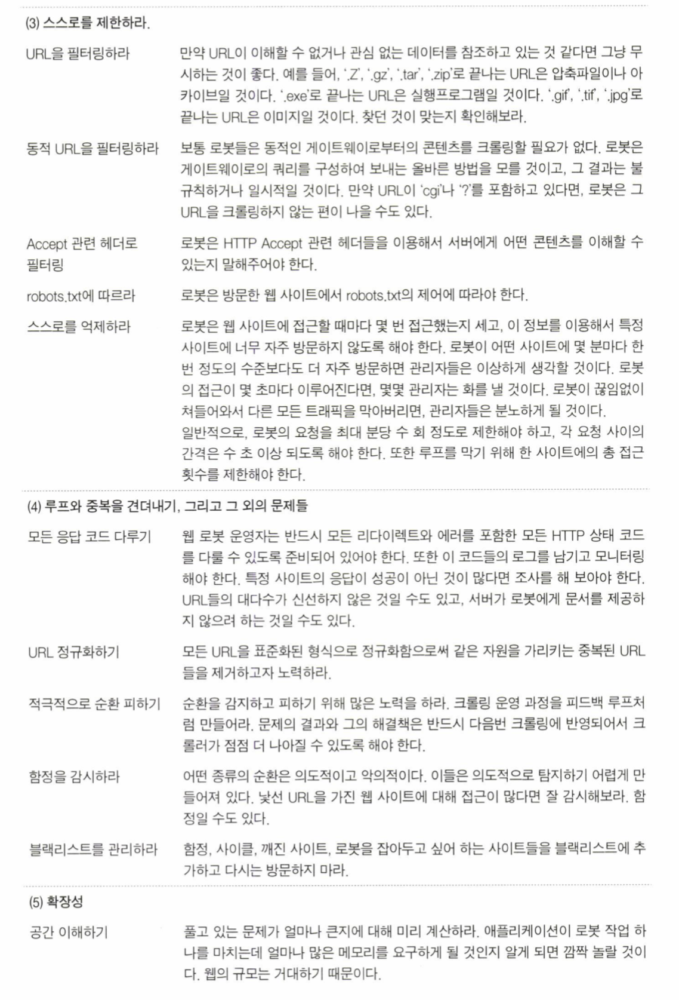
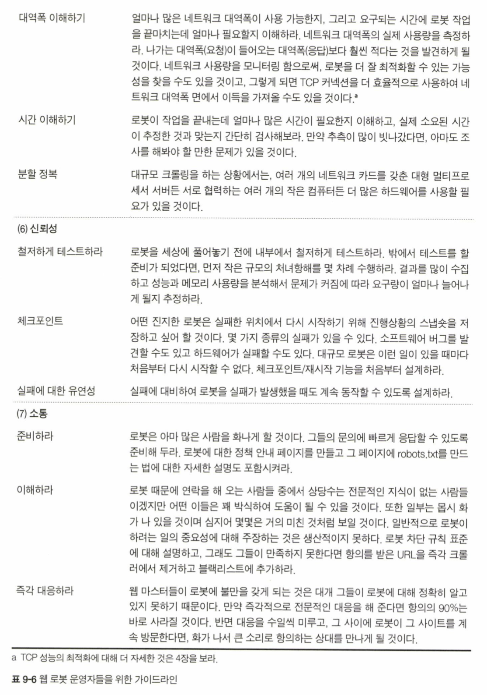

# 09. 웹 로봇

## 09. 웹 로봇

## ch 9 - web robots

Created: Dec 17, 2019 8:19 AM

* web robot은 사람과의 상호작용 없이 연속된 웹 트랜잭션들을 자동으로 수행하는 소프트웨어 프로그램.
* crawlers, spiders, worms, bots 등으로 불림.
* 주식 그래프 로봇, 웹 통계 조사 로봇, 검색엔진 로봇, 가격 비교 로봇 등이 예시.

### 9.1 크롤러와 크롤링

* 웹 크롤러는 웹 페이지를 가져오고, 그 페이지가 가리키는 모든 웹페이지를 가져오는 일을 재귀적으로 반복하는 방식으로 웹을 순회하는 로봇.
* 크롤러, 스파이더라 부르는데, HTML 하이퍼링크로 만들어진 웹을 따라 기어다니기\(crawl\) 때문.
* 인터넷 검색엔진은 크롤러를 사용.
  * 검색 데이터베이스를 만들어, 사용자가 특정 단어를 포함한 문서를 찾을 수 있게 해준다. - full-text index.

#### 9.1.1 루트 집합

* 루트 집합\(root set\) - 크롤러가 방문을 시작하는 URL들의 초기 집합.
* 충분히 다른 장소에서 URL들을 선택해야.
* 루트 집합에 너무 많은 페이지가 있을 필요는 없다.
* 크고 인기있는 웹사이트, 새로 생성된 페이지 목록, 자주 링크되지 않는 페이지들의 목록 등으로 구성됨.
* 루트 집합은 시간에 따라 성장하고, 새로운 크롤링을 위한 시드 목록이 됨.

#### 9.1.2 링크 추출과 상대 링크 정상화

* 크롤러는 검색한 각 페이지 안의 URL 링크들을 파싱, 크롤링할 페이지 목록에 추가해야 함.
* 이 목록은 급속히 확장됨. - 더이상 크롤러가 방문할 새 링크가 없게 될 때까지 성장.

#### 9.1.3 순환 피하기

* 페이지 A를 가져와, B가 A에 링크된 것을 보고 B를 가져옴.
* B에서 C가 B에 링크되어있는 것을 보고 C를 가져옴.
* C에서 A가 링크되는 것을 보고 A를 가져옴.
* 반복.

#### 9.1.4 루프와 중복

* 순환은 크롤러에게 해로움.
  * 루프에 빠져 같은 페이지를 반복해서 가져오게 되고, 네트워크 대역폭을 다 차지하면서 그 어떤 페이지도 가져올 수 없게 됨.
  * 웹 서버의 부담이 늘어남. 크롤러의 네트워크 접근 속도가 충분히 빠르다면, 어떤 유저도 사이트에 접근할 수 없도록 막아버림. 이런 Denial of service는 법적 문제제기의 근거가 될 수도.
  * 크롤러는 많은 수의 중복된 페이지를 가져옴\(dups\). 크롤러 애플리케이션은 쓸모없는 중복된 컨텐츠로 채워짐.

#### 9.1.5 빵 부스러기의 흔적

* 전 세계 웹 콘텐츠의 상당 부분을 크롤링하려면, 복잡한 자료구조를 사용해야 한다.
* 검색 트리나 해시 테이블이 필요.
* 5억개의 URL을 크롤링했다면, 각 URL 당 40바이트만 잡아도 20GB이다.

**트리와 해시테이블**

* 복잡한 로봇이면 방문한 URL을 추적하기 위해 검색 트리나 해시 테이블을 사용한다.

**느슨한 존재 비트맵\(lossy presence bit maps\)**

* 공간 사용을 최적화하기 위해 존재 비트 배열\(presence bit array\)와 같은 자료 구조를 사용.
* 각 URL은 해시 함수에 의해 고정된 크기의 숫자로 변환되고, 배열 안에 대응하는 존재 비트\(presence bit\)를 가짐.
* Url이 크롤링 되면 해당하는 존재 비트가 만들어짐. 존재비트가 이미 존재하면 크롤러는 그 url을 이미 크롤링 했다고 간주함.
* 존재 비트 배열은 유한하므로, 해시 충돌 가능성 존재.
  * 충돌이 일어나면, 그 페이지 하나가 크롤링에서 제외되는 것.
  * 큰 존재 비트 배열을 사용해 이 일을 최소화할 수 있음.

**체크포인트**

* 로봇 프로그램이 중단될 경우를 대비, 방문 url 목록이 디스크에 저장되었는지 확인.
* Snapshot.

**파티셔닝**

* 여러 로봇들이 동시에 일하는 farm을 활용.
* 각 로봇엔 url들의 특정 부분이 할당되어 그에 대한 책임을 진다.
* 로봇들은 url을 넘겨주거나 오동작하는 동료를 도와주거나 하는 식으로 서로 도움.

[https://sigmodrecord.org/publications/sigmodRecord/0406/RB2.Nagaraj.pdf](https://sigmodrecord.org/publications/sigmodRecord/0406/RB2.Nagaraj.pdf)

#### 9.1.6 별칭\(alias\)과 로봇 순환

* 한 url이 또 다른 url에 대한 별칭이라면, 그 둘이 달라보여도 사실 같은 리소스.
* 기본 포트 생략, escape character 사용, url 에 태그가 붙은 경우, 대소문자 구분의 경우, 기본 페이지 생략, 아이피주소 접근 등.

#### 9.1.7 url 정규화하기\(canonicalizing urls\)

* 대부분의 웹 로봇은 url들을 표준 형식으로 정규화해, 다른 url과 같은 리소스를 가리키고 있음이 확실한 것들을 미리 제거.
  * 포트 번호를 명시
  * 이스케이핑 문자를 대응되는 문자로 변환
  * `#`태그들을 제거
* 웹서버에 대한 지식 없이 중복을 피할 수 있는 좋은 방법은 없음.
  * 웹 서버가 대소문자 구분하는지
  * 색인 페이지가 설정되었는지
  * 가상 호스팅을 하는지
* 표준 형식으로 변환해도 제거할 수 없는 별칭이 있다.

#### 9.1.8 파일 시스템 링크 순환

* 파일 시스템의 symbolic link는 아무것도 존재하지 않으면서 끝없이 깊어지는 디렉터리를 만들 수 있음. 순환 유발.

* `http://www.foo.com/subdir/subdir/subdir/index.html`
* 루프를 발견하지 못하면 url 길이가 로봇이나 서버의 한계를 넘을 때까지 이 순환이 계속될 것.

#### 9.1.9 동적 가상 웹 공간

* 악의적인 웹마스터는 의도적으로 복잡한 크롤러 루프를 만들 수 있음.
* 평범한 파일처럼 보이지만 사실은 게이트웨이 애플리케이션인 url.
  * 서버는 새로운 가상 url을 갖고 있는 새 html 페이지를 날조하여 만들어냄.
  * Url과 html을 매번 달라, 로봇이 순환을 감지하기 매우 어려움.

#### 9.1.10 루프와 중복 피하기

* 순환을 피하는 완벽한 방법은 없고, 휴리스틱이 존재한다.
* 휴리스틱은 약간의 손실을 유발할 수 있음.

**URL 정규화**

* Url을 표준 형태로 변환, 중복을 제거

**너비 우선 크롤링\(breadth-first crawling\)**

* 방문할 url을 너비 우선으로 스케줄링하여, 순환의 영향을 최소화.

**스로틀링\(throttling\)**

* 웹 사이트에서 일정 시간 동안 가져올 수 있는 페이지의 숫자를 제한.
* 순환에 빠져 사이트의 별칭에 대한 접근을 시도한다면, 접근 횟수와 중복의 총 횟수를 제한함.

**URL 크기 제한**

* 일정 길이를 넘는 URL의 크롤링을 거부.
* 순환으로 인해 URL이 길어질 경우 유용.
* 이 기법으로 인해 가져오지 못하는 콘텐츠들도 있을 것.
* 요청 URL이 특정 크기에 도달할 때 마다 에러 로그를 남겨 모니터링 가능.

**URL/사이트 블랙리스트**

* 문제를 일으키는 사이트나 URL을 블랙리스트에 추가.
* 크롤링을 싫어하는 사이트를 피하기 위해서도 사용됨.

**패턴 발견**

* 반복된 구성요소를 갖고 있는 URL을 크롤링하는 것을 거절함.

**콘텐츠 지문\(fingerprint\)**

* 페이지의 콘텐츠에서 몇 바이트를 얻어내 체크섬을 계산함.
* 체크섬은 페이지의 간략한 표현.
* 로봇이 이전에 보았떤 체크섬을 가진 페이지를 가져오면, 그 페이지의 링크는 크롤링하지 않음.
* 지문 생성용으로 md5를 주로 사용.
* 웹 서버의 동적인 페이지 수정등이 방해가 될 수 있다.

**사람의 모니터링**

* 모든 상용 수준의 로봇은 사람이 쉽게 로봇의 진행 상황을 모니터링할 수 있게 진단과 로깅을 포함하도록 설계되어야 한다.

### 9.2 로봇의 HTTP

* 로봇 또한 HTTP 명세의 규칙을 지켜야 한다.
* 많은 로봇이 HTTP/1.0 요청을 보내는데, 요구사항이 적기 때문.

#### 9.2.1 요청 헤더 식별하기

* 로봇들은 약간의 신원 식별 헤더\(user-agent header 등\)를 구현하고 전송한다.
* 잘못된 크롤러의 소유자를 찾아낼 때, 서버에게 로봇이 어떤 종류의 콘텐츠를 다룰 수 있는지 정보를 주려할 때 사용된다.
* 기본적인 신원 식별 헤더
  * `User-Agent` - 요청을 만든 로봇의 이름.
  * `From` - 사용자/관리자의 이메일 주소.
  * `Accept` - 서버가 어떤 미디어 타입을 보내도 되는가. 로봇이 관심있는 유형의 콘텐츠만 받게 될 것임을 확신하는데 도움을 준다.
  * `Referer` - 현재의 요청 URL을 포함한 문서의 URL.

#### 9.2.2 가상 호스팅

* 요청에 Host 헤더를 포함하지 않으면 로봇이 어떤 URL에 대해 잘못된 콘텐츠를 찾게 만듦.
* HTTP/1.1은 host 헤더를 사용할 것을 요구함.
* 두개의 사이트를 운영하는 서버의 경우, Host 헤더를 포함하지 않으면 잘못된 콘텐츠를 제공할 수 있음.

#### 9.2.3 조건부 요청

* 때떄로 로봇들은 극악한 양의 요청을 시도하므로, 로봇이 검색하는 콘텐츠의 양을 최소화하는 것은 의미있음.
* 인터넷 검색엔진 로봇의 경우 오직 콘텐츠가 변경되었을 때만 요청하도록 하는 것은 의미있음.
* 시간이나 엔터티 태그를 비교하는 조건부 HTTP 요청을 구현함.

#### 9.2.4 응답 다루기

* 대다수의 로봇은 단순히 GET 메서드로 콘텐츠를 요청해서 가져온다.
* 그러나 조건부 요청을 사용하는 로봇, 웹 탐색이나 서버와 상호작용하려는 로봇은 여러 종류의 HTTP 응답을 다룰 줄 알아야 한다.

**상태 코드**

* `200 OK`, `404 Not Found` 등을 이해해야.
* 다만 모든 서버가 언제나 항상 적절한 에러 코드를 반환하지는 않음.

**엔터티**

* 메타 http-equiv 태그와 같은 메타 HTML 태그는 리소스에 대해 콘텐츠 저자가 포함시킨 정보.
* 콘텐츠를 다루는 서버가 제공할 수도 있는 헤더를 덮어쓰기 위한 수단.
* `<meta http-equiv="Refresh" content="1; URL=index.html">` - Refresh 헤더를 포함한 것처럼 다루게 함.

#### 9.2.5 User-Agent 타기팅\(targeting\)

* 많은 웹 사이트들은 여러 기능을 지원할 수 있도록 브라우저의 종류를 감지하여 콘텐츠를 최적화함.
* 사이트를 로봇에게 에러 페이지를 제공할 수 있음. - your browser does not support frames
* 풍부한 기능을 갖추지 못한 브라우저나 로봇 등을 위한 유연한 페이지를 개발해야.
* 사이트 관리자들은 로봇이 그들의 사이트에 방문했다가 콘텐츠를 얻을 수 없어 당황하는 일이 없도록 대비해야.

### 9.3 부적절하게 동작하는 로봇들

**폭주하는 로봇**

* 로봇은 사람보다 훨씬 빠르게 HTTP 요청을 할 수 있다.
* 이런 로봇이 논리적인 에러를 갖고 있거나 순환에 빠졌다면 웹 서버에 극심한 부하를 안겨줄 수 있음.
* 이 부하로 인해 서버는 다른 누구에게도 서비스를 못하게 됨.
* 모든 로봇 저자들은 폭주 방지를 위한 보호 장치를 설계해야.

**오래된 URL**

* 로봇들의 URL 목록이 오래되었을 수 있음.
* 존재하지 않는 문서에 대한 요청으로 에러 로그가 채워지는 등의 것, 에러 페이지를 제공하는 부하가 늘어나는 것을 좋아하지 않는 웹 사이트 관리자들을 짜증나게 함.

**길고 잘못된 URL**

* URL이 길면 웹 서버의 처리 능력에 영향을 줄 수 있음.

**호기심이 지나친 로봇**

* 로봇은 사적인 데이터에 대한 URL을 얻어 그 데이터를 인터넷 검색엔진이나 기타 애플리케이션을 통해 쉽게 접근할 수 있도록 만들 수도 있음.
* 데이터의 소유자가 사생활 침해라 여길 수도 있음.
* 디렉터리의 콘텐츠를 가져오는 등의 방법으로 긁어올 때 일어날 수도.
* 민감한 데이터는 비밀번호, 신용카드 정보 등을 포함할 수도 있음.

**동적 게이트웨이 접근**

* 로봇이 게이트웨이 애플리케이션의 콘텐츠에 대한 URL로 요청을 할 수도 있음.
* 이때의 데이터는 특수 목적을 위한 것일 수도 있고, 처리 비용이 많이 듦.

### 9.4 로봇 차단하기

* 1994년 로봇이 그들에게 맞지 않는 장소에 들어오지 않도록 하고, 웹마스터에게 로봇의 동작을 더 잘 제어할 수 있는 메커니즘을 제공하는 단순하고 자발적인 기법이 제안됨.
* Robots Exclusion Standard라 이름지어졌지만, robots.txt라 불림.
* 웹 서버는 서버의 문서 루트에 robots.txt라 이름 붙은 선택적인 파일을 제공함.
* 이 파일에는 어떤 로봇이 어떤 부분에 접근할 수 있는지에 대한 정보가 있음.
* 로봇은 웹 사이트의 어떤 다른 리소스에 접근하기 전에 우선 그 사이트의 robots.txt를 요청함.
* 로봇은 robots.txt를 검사하여, 페이지를 요청할지 안할지를 결정함.

#### 9.4.1 로봇 차단 표준

* 임시방편으로 마련된 표준.
* 웹 사이트에 대한 로봇의 접근을 제어하는 능력은 불완전하지만, 없는 것보다는 낫다. 대부분의 주류 업체들과 검색엔진 크롤러들이 이 차단 표준을 지원함.
* 3가지 버전이 있음. `0.0`, `1.0`, `2.0`
* 대부분 1.0을 표준으로 채택함.

#### 9.4.2 웹 사이트와 robots.txt 파일들

* 웹 사이트에 robots.txt파일이 존재한다면 로봇은 반드시 그 파일을 가져와 처리해야 한다.
* 호스트 명과 포트번호에 의해 정의되는 웹 사이트가 있다면, 그 사이트 전체에 대한 robots.txt파일은 단 하나만 존재.
* 만일 웹 사이트가 가상호스팅된다면, docroot마다 서로 다른 robots.txt가 있을 수 있음.
* 웹 사이트의 개별 서브디렉터리에 설치할 수 있는 방법은 존재하지 않음.

**robots.txt 가져오기**

* 로봇은 GET 메서드로 robots.txt를 가져옴.
  * 게이트웨이 애플리케이션이 robots.txt를 동적으로 생성할 수도 있을 것.
* robots.txt가 존재하면 서버는 text/plain 본문으로 반환.
* 서버가 404 not found로 응답하면, 로봇은 접근을 제한하지 않는 것으로 간주함.
* 로봇은 사이트 관리자가 로봇의 접근을 추적할 수 있도록 From, User-Agent 헤더를 통해 신원을 남겨야.

**응답 코드**

* 로봇은 어떤 웹 사이트든 반드시 robots.txt를 찾아봄.
* 서버가 성공\(2XX\)으로 응답하면, 로봇은 그 응답을 파싱하여 차단 규칙을 얻고, 사이트에서 무언가를 가져올 때 규칙에 따라야 함.
* 서버가 404로 응답하면, 로봇은 차단 규칙이 존재하지 않는다고 가정하고 robots.txt의 제약 없이 사이트에 접근할 수 있음.
* 서버가 접근 제한\(401, 403\)으로 응답하면 로봇은 그 사이트로의 접근이 완전히 제한되어 있다고 가정해야 한다.
* 요청 시도가 일시적으로 실패\(503\)했다면, 로봇은 그 사이트의 리소스 검색을 뒤로 미루어야.
* 리다이렉션\(3xx\)을 의미한다면 로봇은 리소스가 발견될 때 까지 리다이렉트를 따라가야 한다.

#### 9.4.3 robots.txt 파일 포맷

* 빈 줄, 주석 줄, 규칙 줄의 세 가지 종류가 있음.
* 규칙 줄은 HTTP 헤더처럼 생김. 패턴 매칭을 위해 사용됨.
* 각 레코드는 특정 로봇들의 집합에 대한 차단 규칙의 집합을 기술함.

  User-Agent: slurp User-Agent: webcrawler Disallow: /private

  User-Agent: \* Disallow:

* 로봇별로 각각 다른 차단 규칙을 적용할 수 있음.
* 빈 줄이나 파일 끝\(end-of-file\) 문자로 끝남.
* 레코드는 어떤 로봇이 이 레코드에 영향을 받는지 지정하는 하나 이상의 `User-Agent` 줄로 시작하며, 뒤이어 이 로봇들이 접근할 수 있는 URL들을 말해주는 `Allow`, `Disallow`줄이 온다.
  * 로봇은 줄바꿈 문자를 모두 지원할 수 있어야 한다.\(CR, LF, CRLF\)

**User-Agent 줄**

* 각 로봇의 레코드는 하나 이상의 `User-Agent` 줄로 시작함.
* `User-Agent: <robot-name>` or `User-Agent: *`
* robots.txt 파일을 처리한 로봇은 반드시 다음의 레코드에 복종해야
  * 로봇 이름이 자신 이름의 부분 문자열이 될 수 있는 레코드들 중 첫 번째 것.
    * `User-Agent: bot` 은 `bot`, `robot`, `bottom-feeder`, `spambot` 등에 모두 매치됨.
  * 로봇 이름이 `*`인 레코드들 중 첫 번째 것.

**Disallow, Allow 줄**

* 특정 로봇에 대해 어떤 URL 경로가 명시적으로 금지되어 있고 명시적으로 허용되는지 기술함.
* 로봇은 반드시 요청하려고 하는 URL을 차단 레코드의 모든 Disallow, Allow 규칙에 순서대로 맞춰 보아야 한다.
* 첫 번째로 매치되는 규칙이 해당 URL에 적용됨.
* 어떤 것도 맞지 않으면 그 URL은 허용됨.
* 규칙 경로는 반드시 그 맞춰보고자 하는 경로의 대소문자를 구분하는 접두어여야.
  * Disallow: /tmp 일 경우

    [http://www.joes-hardware.com/tmp](http://www.joes-hardware.com/tmp)

    [http://www.joes-hardware.com/tmp/](http://www.joes-hardware.com/tmp/)

    [http://www.joes-hardware.com/tmp/pliers.html](http://www.joes-hardware.com/tmp/pliers.html)

    [http://www.joes-hardware.com/tmpspc/stuff.txt](http://www.joes-hardware.com/tmpspc/stuff.txt)

**Disallow, Allow 접두 매칭\(prefix matching\) 규칙**

* 그 경로의 시작부터 규칙 경로의 길이 만큼의 문자열이 규칙 경로와 같아야.
* 대소문자의 차이도 없어야.
* `User-Agent`와 달리, `*` 가 아닌 빈 문자열을 이용해 모든 문자열에 매치되도록 할 수 있음.
* 이스케이핑 문자\(%XX\)는 비교 전에 원래대로 복원된다. 그러나 빗금\(%2F\)는 반드시 그대로 매치되어야.
* 경로 밑에 있는 것과 상관없이 특정 이름의 디렉터리에 대해서 크롤링을 못하게 하는 수단은 제공하지 않는다.

#### 9.4.4 그 외에 알아둘 점

* 로봇은 자신이 이해하지 못하는 필드는 무시해야.
* 하위 호환성을 위해 한 줄을 여러 줄로 나누어 적는 것은 허용되지 않음.
* 주석은 파일의 어디에서든 허용. `#` 으로 시작해 줄바꿈 문자가 나올때까지.
* 버전 0.0은 `Allow` 를 지원하지 않기에, 몇몇 로봇은 해당 줄을 무시함. 이 경우 보수적으로 Allow도 허용되지 않는 것으로 탐색하지 않을 수 있음.

#### 9.4.5 robots.txt의 캐싱과 만료

* robots.txt의 캐시된 사본은 만료될 때까지 로봇에 의해 사용됨.
* robots.txt파일의 캐싱을 제어하기 위해 표준 HTTP 캐시 제어 메커니즘이 서버와 로봇 양쪽 모두에 의해 사용됨.
* 따라서 로봇은 `Cache-Control`, `Expires` 헤더에 주의를 기울여야 한다.
* HTTP/1.1 클라이언트가 아닐 경우를 대비해, 특정 캐시 지시자를 크롤러가 이해하지 못할 수 있다는 것에 주의해야 한다.
* 로봇 명세 초안에서 `Cache-Control` 지시자 존재시 7일간 캐싱하는데 이건 너무 길다.

#### **9.4.6 로봇 차단 펄 코드**

#### 9.4.7 HTML 로봇 제어 META 태그

* robots.txt 파일의 단점 중 하나는 그 파일을 콘텐츠의 작성자 개개인이 아니라 웹 사이트 관리자가 소유한다는 것.
* HTML 페이지 저자는 HTML 문서에 직접 로봇 제어 태그를 추가할 수 있음.
* 로봇 제어 HTML 태그에 따르는 로봇들은 로봇 차단 태그가 존재한다면 그 문서를 무시할 것.
* `<meta name="robots" content=directive-list>`

**로봇 META 지시자**

* `NOINDEX`
  * 이 페이지를 처리하지 말고 무시 - 이 페이지의 콘텐츠를 색인이나 데이터베이스에 포함시키지 말라
  * `<meta name="robots" content="NOINDEX">`
* `NOFOLLOW`
  * 이 페이지가 링크한 페이지를 크롤링하지 말라
  * `<meta name="robots" content="NOFOLLOW">`
* `INDEX` - 이 페이지의 콘텐츠를 인덱싱해도 된다
* `FOLLOW` - 이 페이지가 링크한 페이지를 크롤링해도 된다
* `NOARCHIVE` - 이 페이지의 캐시를 위한 로컬 사본을 만들어서는 안 된다
* `ALL` - `INDEX, FOLLOW`
* `NONE` - `NOINDEX, NOFOLLOW`
* 로봇 META 태그는 반드시 HTML 페이지의 head 섹션에 나타나야.
* 지시들이 서로 충돌하거나 중복되면 안됨.

**검색엔진 META 태그**

* `description` - 웹 페이지의 짧은 요약.
* `keywords` - 키워드 검색을 돕기 위한 단어들.
* `revisit-after` - 이 페이지가 변경될 것이므로 지정된 날짜가 지난 이후 다시 방문하라.
  * `<meta name="revisit-after" content="10 days">`

### 9.5 로봇 에티켓

* [Guidelines for Robot Writers](https://www.robotstxt.org/guidelines.html)

### 9.6 검색엔진

* 웹 로봇을 가장 광범위하게 사용하는 것을 인터넷 검색엔진.
* 웹 크롤러들은 검색엔진에게 웹에 존재하는 문서들으 가져다 주어, 검색엔진이 어떤 단어들이 존재하는지에 대한 색인을 생성할 수 있게 한다.

#### 9.6.1 넓게 생각하라

* 검색엔진은 수십억 개의 웹페이지들을 검색하기 위해 복잡한 크롤러를 사용해야 함.
* 대규모 크롤러가 자신의 작업을 완료하려면 많은 장비를 사용해 요청을 병렬로 수행할 수 있어야 함.

#### 9.6.2 현대적인 검색엔진의 아키텍처

* 오늘날 검색엔진들은 풀 텍스트 색인\(full-text indexes\)라 하는 복잡한 로컬 데이터베이스를 생성함.
* 검색엔진 크롤러들은 웹페이지들을 수집하여 집으로 가져와 풀 텍스트 색인에 추가함.
* 검색엔진 사용자들은 웹 검색 게이트웨이를 통해 풀 텍스트 색인에 대한 질의를 보냄.
* 크롤링 시간이 상당한 데 비해 웹페이지들은 매 순간 변화하기 때문에, 풀 텍스트 색인은 웹의 특정 순간에 대한 스냅샷에 불과함.

#### 9.6.3 풀 텍스트 색인

* 단어 하나를 입력받아 그 단어를 포함하고 있는 문서를 즉각 알려줄 수 있는 데이터베이스.
* 이 문서들은 색인이 생성된 후에는 검색할 필요가 없음.

#### 9.6.4 질의 보내기

* 사용자는 질의를 HTML 폼을 채워넣고 GET 혹은 POST 요청을 이용해 게이트웨이로 보냄.
* 게이트웨이 프로그램은 검색 질의를 추출, 웹 UI 질의를 풀 텍스트 색인을 검색할 때 사용되는 표현식으로 변환함.

#### 9.6.5 검색 결과를 정렬하고 보여주기

* 게이트웨이 애플리케이션은 색인의 결과를 이용해 최종 사용자를 위한 결과 페이지를 즉석에서 만들어냄.
* 검색엔진은 결과에 순위를 매기기 위해 똑똑한 알고리즘을 사용함.
  * [google 검색 알고리즘의 원리](https://www.google.com/search/howsearchworks/algorithms/)
  * [PageRank](https://en.wikipedia.org/wiki/PageRank)
* 검색엔진은 문서들이 주어진 단어와 가장 관련이 많은 순서대로 결과 문서에 나타날 수 있도록 순서를 알 필요가 있다. 관련도 랭킹\(relevancy ranking\)은 검색 결과의 목록에 점수를 매기고 정렬하는 과정.
* 많은 검색엔진은 웹을 크롤링하는 과정에서 수집된 통계 데이터를 실제로 사용함.
  * 어떤 주어진 페이지를 가리키는 링크들이 얼마나 많은지.

#### 9.6.6 스푸핑

* 사용자가 검색했을 때 검색 결과의 최상위에 노출되고자, 수많은 키워드를 나열한 가짜 페이지를 만들거나, 특정 단어에 대한 가짜 페이지를 생성하는 게이트웨이 애플리케이션을 만들어 사용하는 경우도 있음.
* 검색엔진과 로봇 구현자들은 속임수를 잡아내기 위해 끊임없이 관련도 알고리즘을 수정해야만 한다.

### ref

* [https://www.google.com/robots.txt](https://www.google.com/robots.txt)
* [https://www.robotstxt.org/robotstxt.html](https://www.robotstxt.org/robotstxt.html)
* [create a robots.txt file](https://support.google.com/webmasters/answer/6062596?hl=enhttps://support.google.com/webmasters/answer/6062596?hl=en)
* [what is a sitemap](https://support.google.com/webmasters/answer/156184?hl=en)
* [build and submit a sitemap](https://support.google.com/webmasters/answer/183668?hl=en)
* [wiki - sitemaps](https://en.wikipedia.org/wiki/Sitemaps)
* [wiki - sitemap](https://en.wikipedia.org/wiki/Site_map)
* [https://developers.google.com/search/reference/robots\_meta\_tag](https://developers.google.com/search/reference/robots_meta_tag)
* [https://moz.com/learn/seo/robots-meta-directives](https://moz.com/learn/seo/robots-meta-directives)
* [robots.txt spec](https://developers.google.com/search/reference/robots_txt)
* [the ultimate guide to seo meta tags](https://moz.com/blog/the-ultimate-guide-to-seo-meta-tags)
* [https://www.contentkingapp.com/academy/robotstxt/](https://www.contentkingapp.com/academy/robotstxt/)
* [https://www.wordstream.com/meta-tags](https://www.wordstream.com/meta-tags)
* [https://www.searchenginewatch.com/2018/04/04/a-quick-and-easy-guide-to-meta-tags-in-seo/](https://www.searchenginewatch.com/2018/04/04/a-quick-and-easy-guide-to-meta-tags-in-seo/)
* [https://developers.google.com/search/reference/robots\_txt](https://developers.google.com/search/reference/robots_txt)
* [https://backlinko.com/hub/seo/robots-txt](https://backlinko.com/hub/seo/robots-txt)

