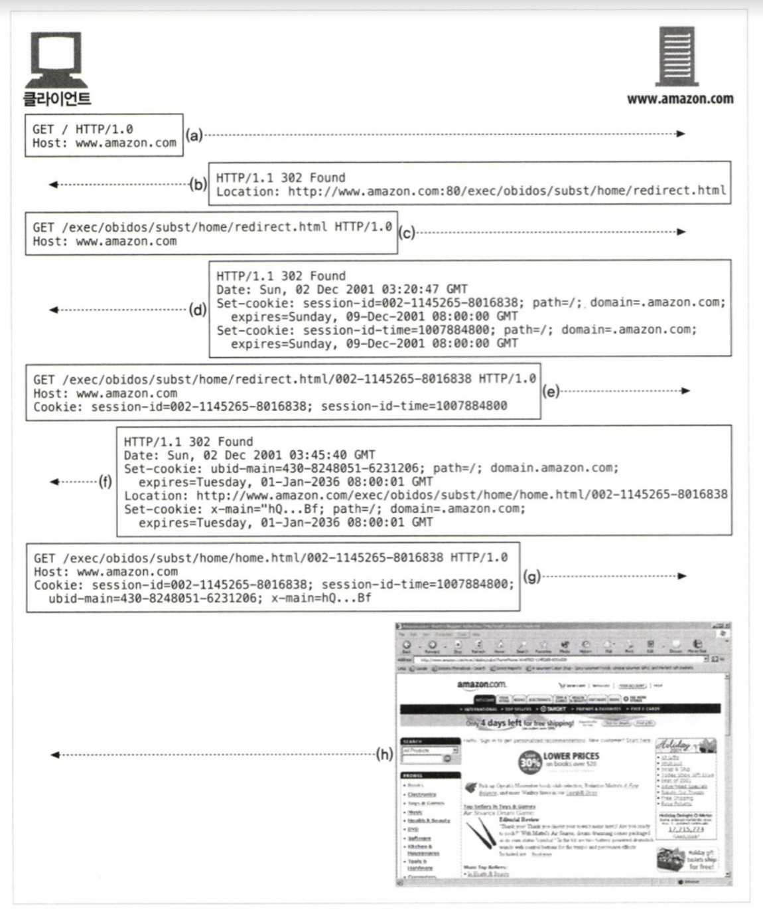

# 11. 클라이언트 식별과 쿠키

### 11.1 개별 접촉

#### HTTP의 특징

1. 익명이다.
2. 상태가 없다.
3. 요청과 응답으로 통신한다.

\(1\) 사용자를 식별하거나, \(2\) 연속적인 요청을 추적하기 위해서는, 약간의 정보가 필요하다.

#### 개인화 예

* 개별 인사 \(ex. 우빈 님, 안녕하세요?\)
* 사용자 맞춤 추천
* 주소, 신용카드 정보 입력 자동화 \(cf. DB에 저장하기도 함\)
* 세션 추적 \(ex. 장바구니\)

### 11.2 HTTP 헤더

<table>
  <thead>
    <tr>
      <th style="text-align:left">&#xC774;&#xB984;</th>
      <th style="text-align:left">&#xD0C0;</th>
      <th style="text-align:left">&#xC124;&#xBA85;</th>
    </tr>
  </thead>
  <tbody>
    <tr>
      <td style="text-align:left">From</td>
      <td style="text-align:left">&#xC694;&#xCCAD;</td>
      <td style="text-align:left">
        <p>ex. From: woobin@linecorp.com</p>
        <ul>
          <li>&#xB85C;&#xBD07;, &#xC2A4;&#xD30C;&#xC774;&#xB354;&#xB294; &#xC6F9;&#xB9C8;&#xC2A4;&#xD130;&#xAC00;
            &#xD56D;&#xC758; &#xBA54;&#xC77C;&#xC744; &#xBCF4;&#xB0BC; &#xC218; &#xC788;&#xB3C4;&#xB85D;
            &#xBA54;&#xC77C; &#xC8FC;&#xC18C;&#xB97C; &#xAE30;&#xC7AC;</li>
          <li>&#xC545;&#xC758;&#xC801;&#xC778; &#xC11C;&#xBC84; &#xC774;&#xBA54;&#xC77C;
            &#xC8FC;&#xC18C;&#xB97C; &#xBAA8;&#xC544;&#xC11C; &#xC2A4;&#xD338; &#xBA54;&#xC77C;&#xC744;
            &#xBC1C;&#xC1A1;&#xD558;&#xAE30;&#xB3C4; &#xD568;</li>
        </ul>
      </td>
    </tr>
    <tr>
      <td style="text-align:left">User-Agent</td>
      <td style="text-align:left">&#xC694;&#xCCAD;</td>
      <td style="text-align:left">
        <p>ex. User-Agent: Mozilla/5.0 (iPhone; CPU iPhone OS 11_0 like Mac OS X)
          ...</p>
        <ul>
          <li>&#xBE0C;&#xB77C;&#xC6B0;&#xC800; &#xC774;&#xB984;, &#xBC84;&#xC804; &#xC815;&#xBCF4;
            (+ &#xC6B4;&#xC601;&#xCCB4;&#xC81C; &#xC815;&#xBCF4;)</li>
          <li>&#xCF58;&#xD150;&#xCE20;&#xB97C; &#xCD5C;&#xC801;&#xD654;&#xD558;&#xB294;
            &#xB370; &#xC720;&#xC6A9;</li>
          <li>User-Agent&#xB85C; &#xD2B9;&#xC815; &#xC0AC;&#xC6A9;&#xC790;&#xB97C; &#xC2DD;&#xBCC4;&#xD560;
            &#xC218;&#xB294; &#xC5C6;&#xC74C;</li>
        </ul>
      </td>
    </tr>
    <tr>
      <td style="text-align:left">Referer</td>
      <td style="text-align:left">&#xC694;&#xCCAD;</td>
      <td style="text-align:left">
        <p>ex. referer: <a href="https://app.gitbook.com/">https://app.gitbook.com/</a>
        </p>
        <ul>
          <li>&#xC0AC;&#xC6A9;&#xC790;&#xAC00; &#xD604;&#xC7AC; &#xD398;&#xC774;&#xC9C0;&#xB85C;
            &#xC720;&#xC785;&#xD558;&#xAC8C; &#xD55C; &#xC6F9;&#xD398;&#xC774;&#xC9C0;&#xC758;
            URL</li>
          <li>&#xC6F9; &#xC0AC;&#xC6A9; &#xD589;&#xD0DC; &#xBD84;&#xC11D;</li>
          <li>Referer&#xB85C; &#xD2B9;&#xC815; &#xC0AC;&#xC6A9;&#xC790;&#xB97C; &#xC2DD;&#xBCC4;&#xD560;
            &#xC218;&#xB294; &#xC5C6;&#xC74C;</li>
        </ul>
      </td>
    </tr>
    <tr>
      <td style="text-align:left">Authorization</td>
      <td style="text-align:left">&#xC694;&#xCCAD;</td>
      <td style="text-align:left">&#xC0AC;&#xC6A9;&#xC790; &#xC774;&#xB984;&#xACFC; &#xBE44;&#xBC00;&#xBC88;&#xD638;
        (cf. 11.4)</td>
    </tr>
    <tr>
      <td style="text-align:left">Client-ip</td>
      <td style="text-align:left">&#xD655;&#xC7A5;(&#xC694;&#xCCAD;)</td>
      <td style="text-align:left">&#xD074;&#xB77C;&#xC774;&#xC5B8;&#xD2B8;&#xC758; IP &#xC8FC;&#xC18C; (cf.
        11.3)</td>
    </tr>
    <tr>
      <td style="text-align:left">X-Forwarded-For</td>
      <td style="text-align:left">&#xD655;&#xC7A5;(&#xC694;&#xCCAD;)</td>
      <td style="text-align:left">
        <p>X-Forwarded-For: &lt;client&gt; &lt;proxy1&gt; &lt;proxy2&gt; &#xD615;&#xC2DD;
          <br
          />ex. X-Forwarded-For: 203.0.113.195, 70.41.3.18, 150.172.238.178</p>
        <ul>
          <li>&#xD074;&#xB77C;&#xC774;&#xC5B8;&#xD2B8;&#xC758; IP &#xC8FC;&#xC18C; (cf.
            11.3)</li>
          <li>cf. &#xD45C;&#xC900;&#xD654;&#xB41C; &#xBC84;&#xC804;&#xC740; <a href="https://developer.mozilla.org/ko/docs/Web/HTTP/Headers/Forwarded">Forwarded</a> &#xD5E4;&#xB354;</li>
        </ul>
      </td>
    </tr>
    <tr>
      <td style="text-align:left">Cookie</td>
      <td style="text-align:left">&#xD655;&#xC7A5;(&#xC694;&#xCCAD;)</td>
      <td style="text-align:left">&#xC11C;&#xBC84;&#xAC00; &#xC0DD;&#xC131;&#xD55C; ID &#xB77C;&#xBCA8;
        (cf. 11.6)</td>
    </tr>
  </tbody>
</table>> 우빈이의 질문: 어디서도 Client-ip 헤더에 대한 정보를 찾을 수 없었다.

### 11.3 클라이언트 IP 주소

* 사용자 식별에 클라이언트 IP 주소 사용 \(ex. 인트라넷에서 특정 IP 주소에만 응답\)
* 보통 HTTP 헤더에 IP 주소가 들어가지는 않음
* 웹 서버 HTTP 요청을 보내 반대쪽 TCP 커넥션의 IP 주소를 알아냄

#### IP 주소의 문제점

1. IP 주소는 사용자가 아니라 컴퓨터를 가리킨다. 여러 사용자가 같은 컴퓨터를 사용할 수 있다.
2. ISP는 동적으로 IP 주소를 할당한다.
3. 많은 사용자가 NAT 방화벽을 통해 인터넷을 사용한다. NAT 장비들은 클라이언트들의 실제 IP 주소를 하나의 방화벽 IP 주소로 변환한다.
4. 서버가 프락시나 게이트웨이와 연결되어 있는 경우, 서버는 클라이언트의 IP 주소 대신 프락시의 IP 주소를 본다. \(프락시 확장 헤더\(Client-ip, X-Forwarded-For\)를 사용할 수도 있지만 모든 프락시가 그렇게 하지는 않는다.\)

### 11.4 사용자 로그인

1. 클라이언트가 요청
2. 서버는 401 Login Required 응답과 WWW-Authenticate 헤더를 반환해 로그인 요청
3. 사용자가 입력한 로그인 정보 토큰 Authorization 헤더에 담아 보냄 \(ex. `Authorization: Basic am910jRmdW4=`\)
4. 추후 요청에 대해서는 서버가 요청하지 않아도 사용자 이름과 비밀번호를 포함해 전달해 세션이 진행되는 내내 사용자에 대한 식별을 유지함

#### 사용자 로그인의 문제점

* 모든 사이트에 로그인하는 게 귀찮음
* 서로 다른 사용자 이름과 비밀번호를 기억해야 함

### 11.5 뚱뚱한 URL

1. 사용자가 처음 방문하면 유일한 ID가 생성됨
2. URL 처음이나 끝에 ID를 추가함 ex. `http://amazon.com/.../`**`002-1145265-801683`**
3. 서버가 ID를 포함한 요청을 받으면 사용자와 관련된 추가적인 정보\(ex. 장바구니, 프로필\)를 찾고, 응답을 뚱뚱한 URL로 만듦

#### 뚱뚱한 URL의 문제점

* URL이 못생겨서 사용자 혼란
* 공유 불가: 공유하면 뚱뚱한 URL에 담긴 개인정보가 같이 공유됨
* 캐시 접근 불가: URL이 계속 달라지기 때문에 캐시를 사용할 수 없음
* 서버 부하 증가: 뚱뚱한 URL에 해당하는 각 페이지들을 새로 그려야 함
* 세션 지속 불가: 사용자가 뚱뚱한 URL을 북마크하지 않는 이상 로그아웃하면 모든 정보를 잃음
* 사용자가 세션에서 이탈하기 쉬움

### 11.6 쿠키

#### 쿠키

* 사용자를 식별하고 세션을 유지하는 방식 중 가장 널리 사용됨
* 새로운 HTTP 헤더를 정의함
* 쿠키와 캐시가 충돌할 수 있어서 쿠키의 내용물은 캐싱하지 않음

#### 11.6.1 쿠키의 타입

|  | 세션 쿠키 | 지속 쿠키 |
| :--- | :--- | :--- |
| 용 | 사용자 설정과 선호를 저장하는 임시 쿠키 | 주기적으로 방문하는 사이트에 대한 설정 정보나 로그인 유 |
| 저장 방  | 브라우저를 닫으면 삭제됨 | 디스크에 저장되어 브라우저나 컴퓨터를 재시작해도 유지 |
| 파라미터 |  | Expires, Max-age 파라미 |

> 우빈: "discard 파라미터가 포함되어 있으면 세션 쿠키다"라는 내용은 2000년에 작성 [RFC 2965](https://tools.ietf.org/html/rfc2965)에 정의되어 있으나, 현재 이 문서는 [RFC 6265](https://tools.ietf.org/html/rfc6265)에 의해 대체되었으며 더이상 쓰이지 않는 것으로 생각됩니다. 이 책은 정말 오래되었군요!

#### 11.6.2 쿠키는 어떻게 동작하는가

1. 사용자가 웹 서버를 방문한다. 서버는 사용자에 대해 아무 것도 모른다.
2. 서버는 사용자를 식별하기 위한 값을 쿠키에 할당한다.
   * 쿠키는 `이름=값` 형태의 리스트이다.
   * 서버는 이 리스트를 `Set-Cookie` 헤더에 담아 클라이언트에 전달한다.
3. 브라우저는 서버에서 온 `Set-Cookie` 헤더에 있는 쿠키를 데이터베이스에 저장한다.
4. 사용자가 나중에 같은 사이트를 방문하면 브라우저는 `Cookie` 헤더에 쿠키를 담아 전송한다.

> 우빈: `Set-Cookie2` 역시 RFC 2965에 따라 현재는 **폐기**되었습니다.

#### 11.6.3 쿠키 상자: 클라이언트 측 상태

* 클라이언트 측 상태: 브라우저가 쿠키 정보를 저장하는 시스템
* 공식적으로는 HTTP 상태 관리 체계 \(HTTP State Management Mechanism\) 라고 불림

> 우빈: RFC 2965 문서 이름이랑 같아요.

#### 구글 크롬 쿠키

크롬은 Cookies라는 SQLite 파일에 쿠키를 저장한다.

> 우빈: 구글 크롬 쿠키를 직접 확인해 봅시다! \[개발자 도구\(F12\)\] - \[Application\] - \[Storage\] - \[Cookie\]. 책에 있는 필드 설명은 좀 오래 되었습니다. [공식 문서](https://developers.google.com/web/tools/chrome-devtools/storage/cookies#fields)에서 확인해 보세요. \[TODO\] 필드 설명

#### 마이크로소프트 인터넷 익스플로러 쿠키

> 우빈: 2020년대에는 **인터넷 익스플로러** 같은 걸 사용하는 사람이 없길 바라며 생략합니다.

#### 11.6.4 사이트마다 각기 다른 쿠키들

* 브라우저는 각 사이트에 모든 쿠키를 보내지 않는다.
* 보통 브라우저는 쿠키를 생성한 서버에게만 해당 쿠키 전달한다.
* 쿠키를 모두 전달하면 성능이 저하된다. 콘텐츠보다 쿠키 바이트가 더 클 수 있다.
* 쿠키의 이름=값 쌍들은 특정 서버에만 특화된 것으로 다른 사이트에서는 무의미한 값이다.
* 쿠키를 모두 전송하면 특정 사이트에서 만든 쿠키를 신뢰하지 않는 사이트로 보 개인정보 문제가 생길 수 있다.

#### 쿠키의 속성

서버는 쿠키를 생성할 때 Set-Cookie 응답 헤더에 여러 속성을 넣어 쿠키를 제어한다.

ex.

```text
Set-cookie: user="woobin"; domain="google.com"
Set-cookie: pref="florida project"; domain="google.com"; path="/movie/"
```

1. Domain:  어떤 사이트가 그 쿠키를 읽을 수 있는지 제어한다.
2. Path: 해당 경로에 속하는 페이지에만 쿠키를 전달한다.

ex. 광고 회사

* 광고는 웹사이트의 일부인 것처럼 보이지만, 실제로는 광고를 관리하는 광고사 서의 것이다.
* 광고에 관련 쿠키 광고사 서버에서 만든 지속 쿠키이다. 즉, 해당 쿠키의 도메인은 광고 회사로 설정되어 있다.
* 사용자가 A 사이트에서 B 사이트로 옮겨 가도 브라우저는 같은 지속 쿠키를 광고사 서버에 전송할 수 있다.

#### 11.6.5 쿠키 구성요소

현재 사용되는 쿠키 명세는 RFC 6265이다. 이 책에서는 현재 쓰이지 않는 Version 0 쿠키\(넷스케이프 쿠키\), Version 1 쿠키\(RFC 2965\)를 다룬다.

#### 11.6.6 Version 0\(넷스케이프\) 쿠키

1. 형식

```text
Set-cookie: name=value [; expires=date] [; path=path] [; domain=domain] [; secure]
Cookie: name1=value1 [; name2=value]
```

2. \(서버\) Version 0 Set-Cookie 헤더

<table>
  <thead>
    <tr>
      <th style="text-align:left">&#xC18D;&#xC131;</th>
      <th style="text-align:left">&#xD544;&#xC218;</th>
      <th style="text-align:left">&#xC124;&#xBA85;</th>
    </tr>
  </thead>
  <tbody>
    <tr>
      <td style="text-align:left">&#xC774;&#xB984;=&#xAC12;</td>
      <td style="text-align:left">&#xD544;</td>
      <td style="text-align:left">
        <p>&#xC138;&#xBBF8;&#xCF5C;&#xB860;, &#xC27C;&#xD45C;, &#xB4F1;&#xD638;,
          &#xACF5;&#xBC31;&#xC740; &#xD3EC;&#xD568;&#xD560; &#xC218; &#xC5C6;&#xB2E4;
          (&#xB2E8;, &#xD070;&#xB530;&#xC634;&#xD45C;&#xB85C; &#xAC10;&#xC2F8;&#xBA74;
          &#xAC00;&#xB2A5;)</p>
        <p>ex. Set-Cookie: user=Woobin</p>
      </td>
    </tr>
    <tr>
      <td style="text-align:left">Expires</td>
      <td style="text-align:left">&#xC120;&#xD0DD;</td>
      <td style="text-align:left">
        <p>&#xCFE0;&#xD0A4; &#xB9CC;&#xB8CC; &#xC2DC;&#xAC01; (GMT &#xD0C0;&#xC784;&#xC874;&#xB9CC;
          &#xC0AC;&#xC6A9; &#xAC00;&#xB2A5;)</p>
        <p>ex. Set-Cookie: user=Woobin; expires=Wednesday, 09-Feb-20 23:12:40 GMT</p>
      </td>
    </tr>
    <tr>
      <td style="text-align:left">Domain</td>
      <td style="text-align:left">&#xC120;&#xD0DD;</td>
      <td style="text-align:left">
        <p>&#xC11C;&#xBC84;&#xAC00; &#xD2B9;&#xC815; &#xB3C4;&#xBA54;&#xC778;&#xC5D0;&#xB9CC;
          &#xCFE0;&#xD0A4;&#xB97C; &#xC81C;&#xD55C;&#xC801;&#xC73C;&#xB85C; &#xC804;&#xB2EC;&#xD558;&#xAC8C;
          &#xD55C;&#xB2E4;.</p>
        <p>&#xB450; &#xAC1C;&#xC5D0;&#xC11C; &#xC138; &#xAC1C; &#xC601;&#xC5ED;&#xC744;
          &#xAC00;&#xC9C0;&#xB294; &#xB3C4;&#xBA54;&#xC778;&#xC744; &#xAE30;&#xC220;&#xD574;&#xC57C;
          &#xD55C;&#xB2E4;. (.com, .edu &#xAC19;&#xC740; &#xAC83;&#xB9CC;&#xC73C;&#xB85C;&#xB294;
          &#xC548;&#xB428;)</p>
        <p>Set-Coookie: user=Woobin; domain=&quot;google.com&quot;</p>
      </td>
    </tr>
    <tr>
      <td style="text-align:left">Path</td>
      <td style="text-align:left">&#xC120;&#xD0DD;</td>
      <td style="text-align:left">
        <p>&#xC11C;&#xBC84;&#xC5D0; &#xC788;&#xB294; &#xD2B9;&#xC815; &#xBB38;&#xC11C;&#xC5D0;&#xB9CC;
          &#xCFE0;&#xD0A4;&#xB97C; &#xD560;&#xB2F9;&#xD560; &#xC218; &#xC788;&#xB2E4;.</p>
        <p>Set-Cookie: user=Woobin; path=/orders</p>
      </td>
    </tr>
    <tr>
      <td style="text-align:left">Secure</td>
      <td style="text-align:left">&#xC120;&#xD0DD;</td>
      <td style="text-align:left">
        <p>&#xC774; &#xC18D;&#xC131;&#xC774; &#xD3EC;&#xD568;&#xB418;&#xC5B4; &#xC788;&#xC73C;&#xBA74;
          SSL &#xBCF4;&#xC548; &#xC5F0;&#xACB0;&#xC744; &#xC0AC;&#xC6A9;&#xD560;
          &#xB54C;&#xB9CC; &#xCFE0;&#xD0A4;&#xB97C; &#xC804;&#xC1A1;&#xD55C;&#xB2E4;.</p>
        <p>Set-Cookie: user=Woobin; secure</p>
      </td>
    </tr>
  </tbody>
</table>3. \(클라이언트\) Version 0 Cookie 헤더

클라이언트는 위의 필터들이 현재 요청하려고 하는 사이트에 들어맞으면서 아직 파기되지 않은 쿠키들을 함께 보낸다. Cookie 헤더에 한데 이어 붙여 보낸다.

#### 11.6.7 Version 1 \(RFC 2965\) 쿠키

**Version 0 쿠키와의 차이점**

* 쿠키마다 목적을 설명하는 설명문이 있다.
* 만료 주기와 상관없이 브라우저가 닫힐 때 쿠키를 삭제할 수 있다.
* 절대 날짜\(Expires\) 대신 초 단위의 상대 값\(Max-age\)으로 쿠키의 생명주기를 결정한다.
* 포트 번호로도 쿠키를 제어한다.
* 버전 번호가 추가되었다.
* Cookie 헤더에 $ 접두어가 있다.

1. \(서버\) Version 1 Set-Cookie2 헤더

| 속 | 필수 | 설 |
| :--- | :--- | :--- |
| 이름=값 | 필수 | 예약어 $로 시작해서는 안된다. |
| Version | 필수 | 쿠키 명세 버전 정수 값 ex. Version="1" |
| Comment | 선택 | 쿠키를 사용하려는 의도. UTF-8로 인코딩되어야 함. |
| CommentURL | 선택 | 쿠키의 목적과 정책이 담긴 URL 링크 |
| Discard | 선택 | 이 속성이 있으면 클라이언트는 프로그램이 종료될 때 쿠키를 삭제함 |
| Domain | 선택 | Version 0 참 |
| Max-age | 선택 | 쿠키의 유효기간을 초 단위의 정수 값으로 표 |
| Path | 선택 | Version 0 참 |
| Port | 선택 | 쿠키가 적용될 포트 번 |
| Secure | 선택 | Version 0 참 |

2. Version 1 Cookie 헤

* Set-Cookie2 필터 중에서 현재의 웹 사이트에 들어맞는 들어맞는 필터 정보에 달러 문자\($\)를 붙여서 전송한다.
* 클라이언트가 Cookie2 헤더를 보내고, 서버가 이를 인식할 수 있으면, 서버는 Set-Cookie2 헤더를 보내야 한다.
* 클라이언트가 같은 쿠키를 Set-Cookie와 Set-Cookie2에서 모두 받으면 Set-Cookie는 무시한다.
* 클라이언트가 Version 0 Version 1을 모두 지원하더라도, 서버가 Set-Cookie를 보내면 클라이언트는 Cookie 헤더를 보내야 한다. 단 Cookie2: $Version="1"을 같이 보내 업그레이드할 수 있음을 알린다.

#### 11.6.8 쿠키와 세션 추적

세션 쿠키를 사용해 사용자의 연속적인 트랜잭션을 추적한다. \(아래의 그림에서는 뚱뚱한 URL도 함께 사용한다.\)



#### 11.6.9 쿠키와 캐싱

쿠키와 관련된 문서를 캐싱하면 사용자의 쿠키가 다른 사용자에게 할당되거나, 개인 정보가 노출될 수 있다.

* Set-Cookie 빼고 캐시를 해도 된다면, 명시적으로 Cache-Control: no-cache="Set-Cookie"를 표시한다.
* 캐시를 해도 되는 문서에는 Cache-Control: public을 사용한다.
* \(서버의 응답에\) 어떤 캐시는 Set-Cookie 헤더를 제거한다.
  * 캐시가 모든 요청마다 원 서버에 재검사하도록 만들 수 있다.
  * 재검사를 위해 Cache-Control: must-revalidate, max-age=0을 추가한다.
* 더 보수적인 캐시는 Set-Cookie를 가지고 있는 응답은 아예 캐싱하지 않는다.
* \(클라이언트의 요청에서\) 보수적인 캐시는 Cookie 헤더가 있는 요청에 대한 응답은 캐시하지 않는다.
  * 이미지는 캐싱하고 텍스트는 캐싱하지 않을 수도 있다.
  * 이미지에 Max-age가 0인 Cookie 헤더를 설정해 매번 재검사하게 만들 수 있다.

#### 11.6.10 쿠키, 보안, 그리고 개인정보

쿠키 자체가 보안상으로 엄청 위험한 건 아니다.

> tl; dr [CIAC I-034 인터넷 쿠](https://packetstormsecurity.com/files/19214/ciac.i-034.internet.cookies.html): 쿠키의 위험성이 과대평가되었다는 평가서

* 원격 DB에 정보를 저장하고 데이터의 키 값을 쿠키에 저장하는 방식을 표준으로 사용하면 데이터가 서버와 클라 사이에 직접 오가지 않는다.
* 다만 광고 웹 사이트가 사용자를 추적하기 위해 지속 쿠키를 사용하는 것과 같은 오용은 조심하자.

