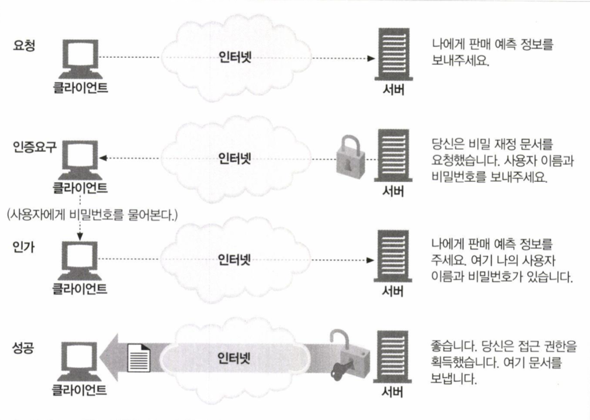
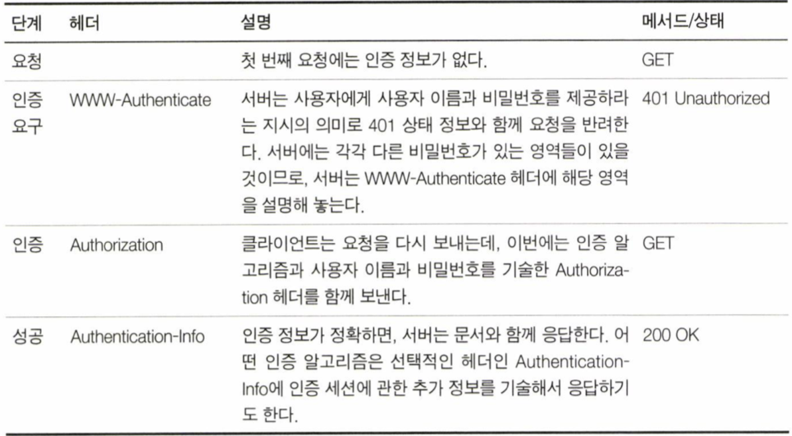
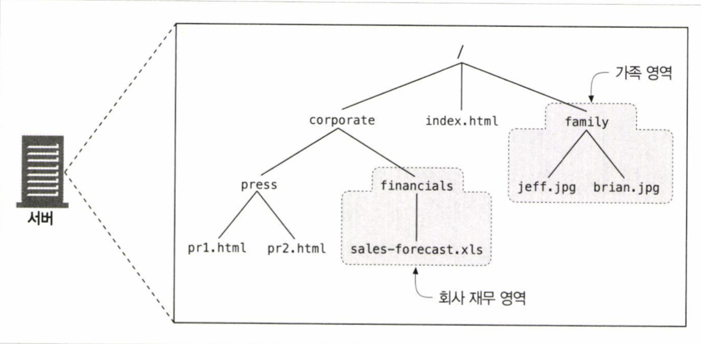
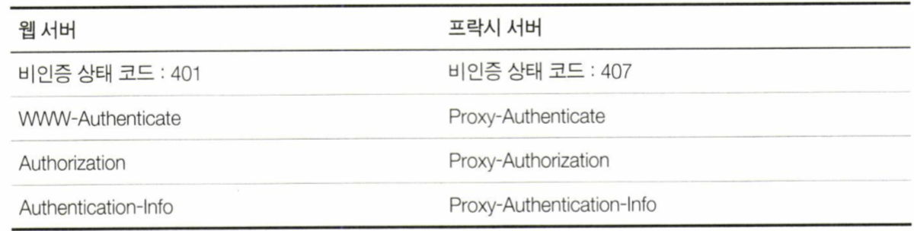

# Chapter 12. 기본 인증
* 웹은 많은 사람들이 편리하게 접근하고 공유할 수 있는 공간이다.
* 하지만 공유하길 원하지 않는 정보들에 대해 허가된 사용자만이 접근할 수 있는 공간의 필요성도 존재한다

## 12.1 인증
* 인증의 기본 개념은 사용자가 누구인지 증명하는 것이다
	* 물론 완벽한 인증은 존재하지 않지만, 정보가 많을수록 제대로 식별할 가능성이 높아진다

### 12.1.1 HTTP의 인증요구/응답 프레임워크
* HTTP는 자체 인증요구/응답 프레임워크를 제공한다

> 서버는 인증 요청을 하고, 클라이언트는 사용자의 인증 정보를 첨부해 다시 요청을 보낸다

### 12.1.2 인증 프로토콜과 헤더
* HTTP는 customize 가 가능한 제어 헤더를 통해 여러 인증 프로토콜에 맞게 확장할 수 있는 프레임워크를 제공한다

> 네 가지 인증 단계
* 요청
* 인증 요구
	* Basic : 기본 인증 스킴으로 ID/PW 를 base64 encoding 하여 전달
	* realm : 인증을 요구하는 공간이나 범위에 대한 설명
* 인증
	* WWW-Authenticate 헤더에 정의된 스킴에 맞춰 Authorization 헤더에 ID/PW 쌍을 기술하여 전송
* Authentication-info
	* 추가적인 인증 알고리즘에 대한 정보를 기술

### 12.1.3 보안 영역
* HTTP가 각 리소스마다 다른 접근 조건을 다루는 방법
* realm (보안 영역)
	* 접근이 제한된 문서들을 realm 그룹으로 나눔
	* realm 그룹은 각각 다른 사용자 권한을 요구

> realm 은 사용자가 권한의 범위를 이해하는 데 도움이 되는 형식으로 설정되어야 한다

## 12.2 기본 인증
* 웹 서버는 클라이언트의 요청을 거부하고 ID/PW 를 요구할 수 있다
	* 401 status code 와 함께 WWW-Authenticate 헤더에 스킴과 realm 을 기술하여 응답을 내려 인증 요구를 시작
	* Authentication-Info 헤더를 사용하지 않음

### 12.2.2 Base-64 사용자 이름/비밀번호 인코딩
* HTTP기본 인증은 사용자 이름과 비밀번호를 콜론으로 이어서 합치고 base-64 인코딩을 한다
	* binary data 를 6bits 단위로 끊어 공통의 ASCII 문자로 변환
> 왜 base64 인코딩을 하지?
> base64 인코딩은 6bits 를 하나의 character 로 변환하기 때문에 2bits 의 overhead 가 발생하며, encode-decode 과정에서 추가적인 cpu 연산까지 발생하는데 왜 base64 encoding 을 해서 전송하는 것일까?
> ASCII 는 7bits encoding 방식을 사용하기 때문에 남은 1bit 의 처리가 시스템별로 다르게 구현되어 있을 수 있다. 또한 일부 제어문자의 경우 시스템별로 다른 코드값을 가진다
> 따라서 공통 ASCII 코드문자로만 이루어진 데이터를 전송하여 예상치 못한 호환 문제를 방지하고, 추가적으로 HTTP 헤더에서 사용할 수 없는 문자를 포함한 문자열을 처리하기 위해 base64 encoding 을 사용하는 것

### 12.2.3 프락시 인증
* 프락시 서버를 사용하면 접근 정책을 중앙 관리할 수 있어 프락시를 통한 사용자 인증을 사용하는 경우도 있다

## 12.3 기본 인증의 보안 결함
* 기본 인증은 해당 요청이 탈취당했을 경우 누구나 쉽게 디코딩해서 인증 정보를 확인할 수 있다
	* 탈취당해도 원본을 확인할 수 없는 TLS 같은 암호화 채널을 사용하거나 다이제스트 인증 같은 프로토콜을 사용
* 탈취한 인증 정보를 직접 디코딩 할 수 없더라도 서버로 해당 문자열들 그대로 보내 인증에 성공할 수 있다
	* 기본 인증은 재전송 공격을 방지하기 위한 장치가 없음
* 중간에 프락시와 같은 중개자에 의해 인증 헤더가 아닌 다른 부분을 수정하여 트랜잭션의 의도를 바꾸는 경우 정상적인인증 동작을 보장하지 않는다
* 인증 정보를 요청하는 가짜로 위장한 서버에 대한 대책이 없다

> 기본인증은 우연한 사고를 예방하기 위한 1차적인 방어수단정도로 사용된다
