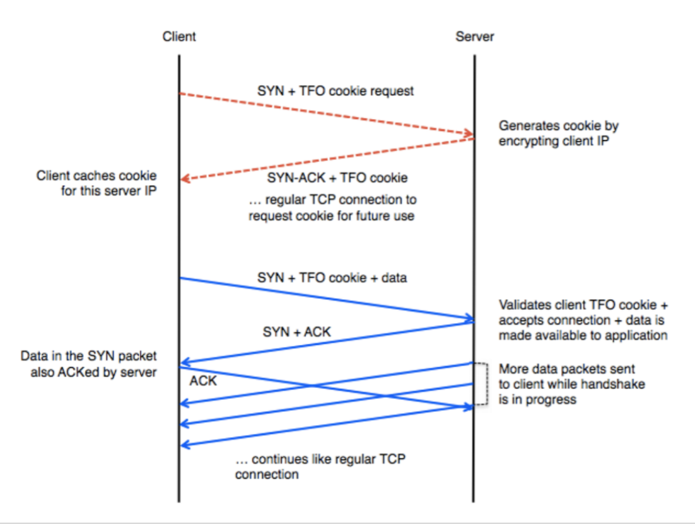

# 질문과 답변

## Q. HTTPS connections over proxy servers?

[https://stackoverflow.com/questions/516323/https-connections-over-proxy-servers](https://stackoverflow.com/questions/516323/https-connections-over-proxy-servers)

### A1. CONNECT 메소드 사용

* CONNECT 메소드를 사용해 HTTP를 TCP로 변환해 TCP 커넥션을 수립
* 프록시가 요청/응답을 읽거나, 수정하거나, 캐싱할 수 없음

### A2. 중간자\(man in the middle\)

1. 클라이언트가 HTTPS 연결을 시작한다.
2. 프록시가 커넥션을 인터셉트하고, 인증서를 발급한다. 단 이 인증서에는 클라이언트가 무조건 신뢰할 수 있는 서명이 있어야 한다.
3. 프록시가 타겟 서버와의 HTTPS 연결을 시작한다.
4. 프록시가 SSL 인증서의 무결성을 검사한다. 만약 유효하지 않은 인증서인 경우 에러를 표시한다.
5. 프록시가 임시 인증서를 통해 암호화/복호화하며 요청/응답을 스트리밍한다.
6. 즉 클라이언트-프록시, 프록시-서버의 이중 연결이 생기는 것
7. 클라이언트는 실제 서버와 통신하고 있지 않다는 응답을 받을 수 있음
8. 프록시가 요청/응답 정보를 읽을 수 있음
9. 서버와 클라이언트 사이에 도청자\(eavesdroppers\)가 없어야 한다는 TLS/SSL의 원칙과는 맞지 않는 접근 방법

### A3. SOCKS

OSI 레이어 5\(between the [presentation layer](https://en.wikipedia.org/wiki/Presentation_layer) and the [transport layer](https://en.wikipedia.org/wiki/Transport_layer) \)에 위치한 [SOCKS \(Wikipedia\)](https://en.wikipedia.org/wiki/SOCKS) 프록시 사용

### Q. TCP Fast Open

A.

* 최초 연결 설정 시 서버가 암호화 쿠키인 TFO cookie 를 생성하여 클라이언트에 저장
  * 클라이언트는 Fast Open option field 길이가 0인 SYN 패킷을 서버로 보낸다
  * 서버는 자신의 비밀키와 클라이언트 IP주소를 사용해 TFO cookie 를 생성하여 Fast Open option field 에 담아 SYN + ACK 패킷에 실어 클라이언트로 보낸다
  * 클라이언트는 TFO cookie 를 캐싱한다
* 클라이언트 재접속 시 SYN 패킷에 TFO cookie 와 함께 바로 데이터를 전송할 수 있음
* 서버는 TFO cookie 를 통해 클라이언트를 인증하며 인증 성공 시 final ACK 를 받지 않아도 요청 데이터 를 전송

**Summary**

* TCP Fast Open 은 3 way handshake 를 대체하는 목적이지 더 강력한 보안기능을 제공하는 것이 아니다
  * 수립된 TCP 커넥션에 대한 암호화나 중간자 공격에 대한 보호를 보장하지 않음

