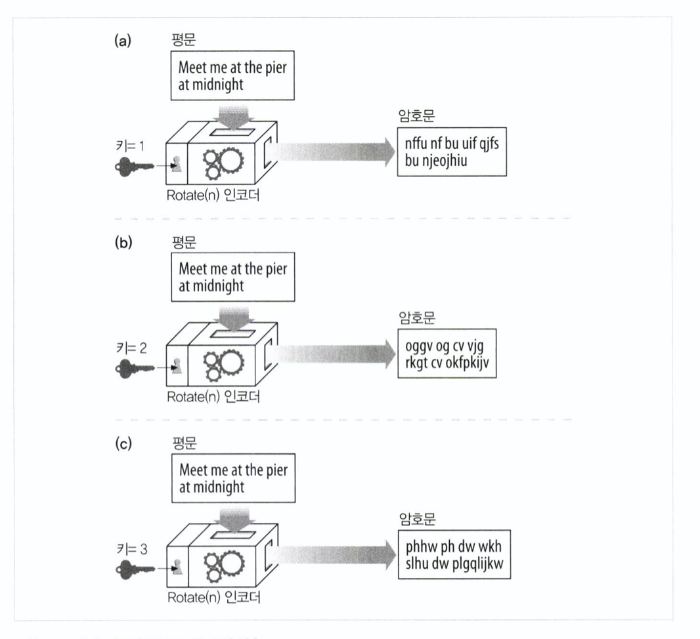
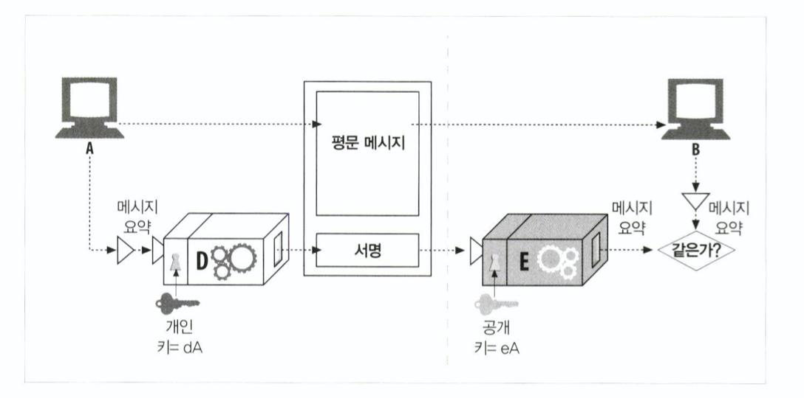
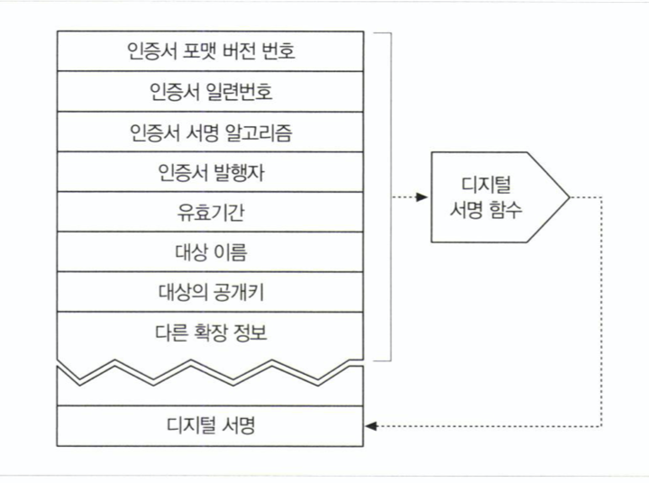
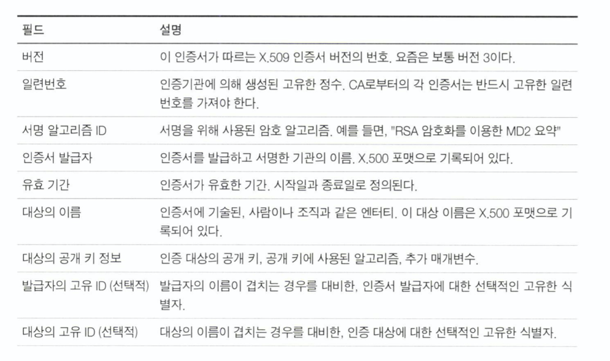
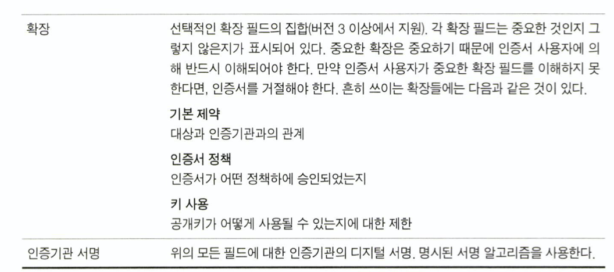
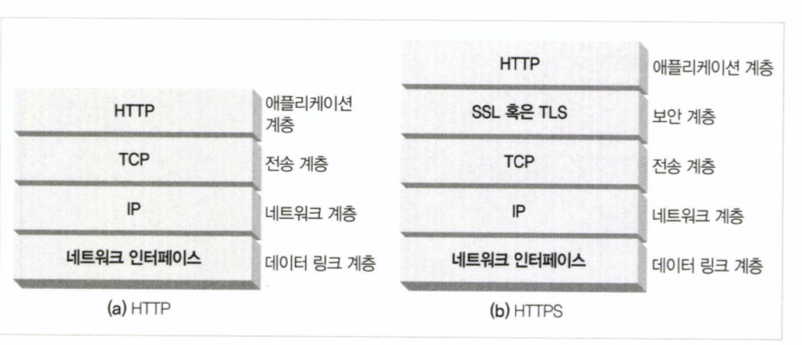
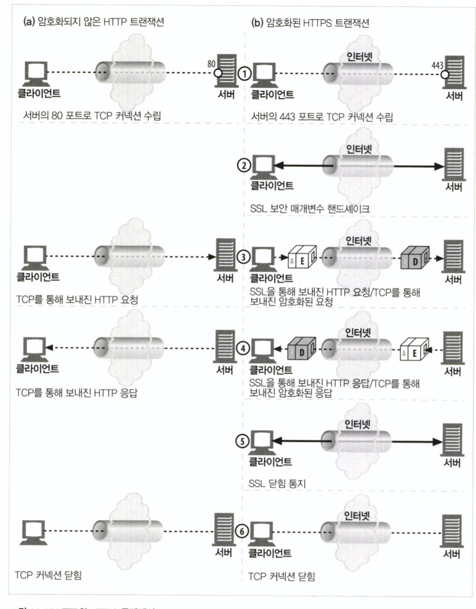
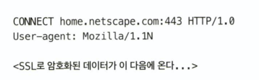

# 14. 보안 HTTP

## (1) 사용자 식별과 인증

### HTTP를 통해 사용자를 식별하고 인증하기

- 기본 인증
- 다이제스트 인증
- 메시지 무결성 제공

### 더욱 신뢰성 있는 (안전한) 인증 (HTTPS)

- HTTP + **암호화 기술**

## (2) 암호화 기술

### 대칭키 암호화

인코딩과 디코딩에 같은 키를 사용하는 알고리즘

### 비대칭키 암호화

인코딩과 디코딩에 다른 키를 사용하는 알고리즘

### 암호화를 하는 이유

- 제3자가 메시지를 볼 수 없게 하는 것
- 부정한 의도의 메시지 변조를 막는 것
- 특정한 사람이 인증된 사람이라는 것을 증명하고 이를 신뢰하기 위해

### 간단한 암호 예시

#### 각 글자를 세 번 뒤 글자로 교체하는 순환 암호

#### 암호 기계

글자의 순서를 바꾸고 메시지를 자르고 토막낸다.

### 키가 있는 암호

인코딩할 때 다음과 같이 키와 함께 인코딩한다.

그렇게 되면, 공격자가 디코더를 손에 넣더라도 올바른 디코딩 키를 알 수 없다면 올바르게 디코딩할 수 없다.

#### 관련 보안 이슈

- 대부분 인코딩 디코딩 알고리즘이 공개 되어 있다. 키를 절대 노출하면 안된다.
- 키 길이 : 짧을 수록 노출되기 쉽다.
    - 열거 공격 (Enumeration Attack) : 아무 값이나 넣는 Brute force attack.
    - 작고 중요하지 않은 업무에서 40비트 정도 (약 1조 가지의 키) 면 충분하다고 본다.
    - 일반적으로 128비트 키를 사용한다.

> 1995년 기준

### 대칭키 암호법

인코딩 할 때 사용하는 키와 디코딩 할 때 사용하는 키가 같은 암호 알고리즘.

예) DES, Triple-DES, RC2, RC4

#### 공유키

- 발송자와 수신자는 대화하기 위해 서로 공유하는 키를 가져야 한다.
    - 이 경우 대칭키 일 때 문제가 생긴다.
    - 만약 N 개의 노드가 서로 다른 N-1 개의 노드와 대화하려고 하면 N^2 만큼의 키를 중개자가 관리해야 한다.

### 공개키 암호법 (비대칭키 암호법)

인코딩 키를 공개하고 이 키로 암호화하도록 한다.

호스트 혼자 디코딩 키를 갖고 있으며 누구나 암호화하여 호스트에게 암호화된 메시지를 보낼 수 있다.

예) RSA

### 혼성 암호 체계 / 세션 키

- 공개키 암호방식 알고리즘 계산은 느린 경향이 있음.
- 실제로는 대칭과 비대칭을 섞어 사용함
    - 연결을 수립할 때는 공개키로 편리하게
    - 만들어진 안전한 채널을 통해 데이터를 암호화할 때는 대칭키로 빠르게

## (3) 디지털 서명

누가 메시지를 썼는지, 위조되지 않았는지를 증명하는 데 사용. (공개키 사용)

서명 : 개인키디코딩(다이제스트(메시지))

서명 확인 : 다이제스트(전달받은 메시지) == 공개키인코딩(서명)

### 디지털 인증서

- 온라인 신분증
- 신뢰할 수 있는 기관으로부터 보증 받은 사용자 or 회사의 정보 증명
- {이름, 유효기간, 발급 기관, 발급 기관의 서명, ....}

예시)

### X.509 v3 인증서

- 디지털 인증서에 단일 표준이 없음.
- 오늘날 대부분의 인증서가 따르는 표준이 X.509

### 인증서로 서버 인증하기

#### 브라우저가 HTTPS 요청할 때

- HTTPS 트랜잭션 연결 수립
- 인증서 부터 확인
- 서명 검사 (서명 기관을 검사)
    - 만약 신뢰할 만한 기관이라면 이미 브라우저가 공개키를 가지고 있다.
    - 만약 신뢰할 수 없다면 대화상자를 띄워주곤 한다. (유저가 허용한다고 하면 이후 서명을 검사한다.)

## (4) HTTPS 세부 스펙

> HTTP + 대칭 / 비대칭 인증서 암호화

- 복잡한 로직은 SSL 계층에 모듈화 되어있다.

### HTTPS 연결 수립

#### https 스킴 사용

- HTTP가 아닌 HTTPS 로 연결한다는 것을 알리기 위해
- 기본적으로 443 포트를 사용한다.

#### SSL 핸드쉐이크

- SSL 보안 매개변수를 교환하면서 SSL 핸드셰이크를 진행하게 된다.
    - 프로토콜 버전 번호 교환
    - **양쪽이 알고 있는 암호 선택**
        - (먼저 클라가 후보군을 보내면 서버에서 선택한다.)
    - 양쪽의 신원 입증
    - 채널 암호화를 위한 임시 세션 키 생성
- 이후부터는 클라이언트가 보안 계층에 메시지를 보낼 수 있게 된다.

#### 인증서 교환

##### 클라이언트 인증서

- 일반적으로 클라이언트 인증서를 서버에 보내진 않는다.
    - 웹 서버가 요구하면 보내야 한다.

##### 서버 인증서

- 클라이언트가 개인 정보 등을 보낼 때 신뢰할 만한 서버인지 확인해야 한다.
- HTTPS 연결에 있어 서버는 항상 인증서를 요구 받는다.
    - 최신 브라우저는 인증서가 없는 서버와 HTTPS 연결을 하지 않으려 한다.
- 보통 서버는 X.509 v3 에서 파생된 인증서를 보내준다.

#### 인증서 검사

##### 날짜 검사

- 유효한지? 만료되었거나 활성화되지 않았는지?

##### 서명자 신뢰도 검사

- 인증서에도 수준이 있다. 목적에 부합하는 신뢰도를 갖는지 검사한다.

##### 서명 검사

- 위에서 설명한 바와 같음. 공개키로 인코딩해서 비교한다.

##### 사이트 신원 검사

호스트의 도메인이 인증서에 적힌 도메인과 같은지 검사한다.

- 다른 이가 인증서를 복사해서 사용하는 것을 방지한다.
- 가상 호스팅을 사용하는 경우 (와일드카드를 사용한) 도메인이 일치하지 않을 수 있다.
    - 원서버가 보안 트랜잭션을 요구하는 유저들을 모두 리다이렉트 시키는 방법을 사용할 수 있다.

## (5) HTTPS 클라이언트

### OpenSSL

SSL과 TLS의 가장 인기 있는 오픈 소스 구현

### 간단한 HTTPS 클라이언트 절차

1. SSL 라이브러리 컨텍스트 초기화
2. 서버의 호스트명을 IP 주소로 변환
3. 서버의 443 포트로 TCP 커넥션 열기
4. TCP 커넥션을 통해 SSL 핸드셰이크
    1. SSL 핸드셰이크를 통해 암호가 협상 하에 선택됨.
    2. 서버 인증서를 받게 됨.
    3. 인증서 검사도 이루어졌음.
5. 핸드셰이크 완료
6. SSL을 통해 HTTP 요청 전송
7. SSL 스택으로부터 HTTP 응답 읽기
8. 커넥션 닫기

## (6) 프락시를 통한 보안 트래픽 터널링

### 프락시...

- TCP 레이어에 가기 전에 HTTP 메시지가 암호화 된다.
- 프락시들이 받은 트래픽은 HTTPS 트래픽으로, HTTP 헤더를 읽을 수가 없게 된다.
- 프락시는 어디에 요청을 보내야 하는가?

### 프락시를 위해

#### HTTPS SSL 터널링 프로토콜

- 암호화가 시작되기 전에 프락시가 읽을 수 있도록 CONNECT 확장 메서드를 사용
    - 종단 정보를 전송해준다.

