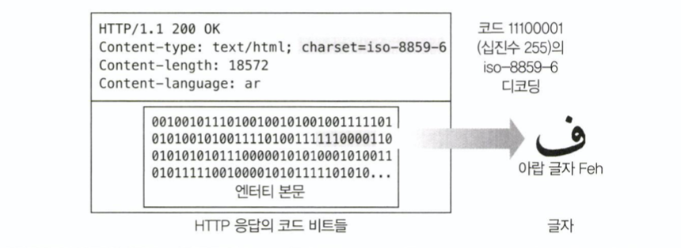
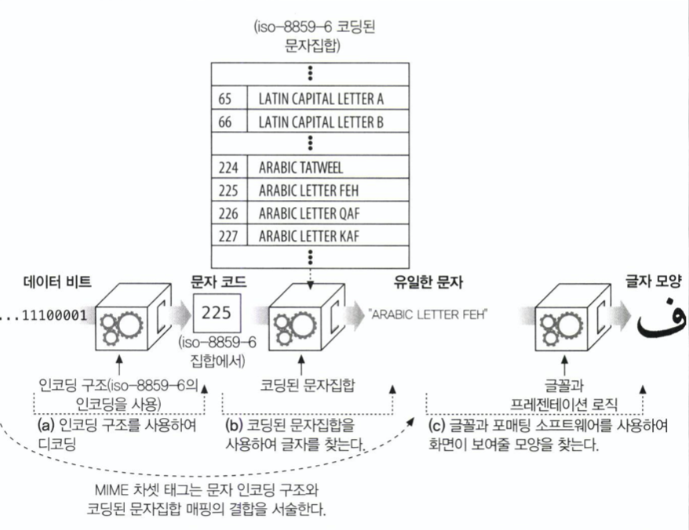
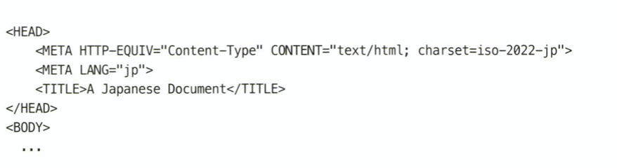

# Chapter 16. 국제

## 16.1 국제적인 콘텐츠를 다루기 위해 필요한 HTTP 지원
* HTTP 메세지는 어떤 콘텐츠든 담을 수 있다
	* HTTP의 엔터티 본문은 그저 비트 덩어리이다
	
  
  
* 비트 덩어리를 콘텐츠로 만들기 위한 트랜스코딩 정보를 제공하는 방법
	* 서버에서 클라이언트로 전달
		* Content-Type charset
		* Content-Language
	* 클라이언트가 서버로 전달
		* Accept-Language
		* Accept-Charset

## 16.2 문자집합과 HTTP
### 16.2.1 차셋(Charset)은 글자를 비트로 변환하는 인코딩이다
* Charset 은 엔터티 콘텐츠 비트를 어떤 체계의 문자로 구성되었는지 가리킨다
	* 콘텐츠에 사용된 문자열 트랜스코딩 알고리즘을 의미
### 16.2.2 문자집합과 인코딩은 어떻게 동작하는가
* 비트를 특정 문자로 디코딩하는 과정은 크게 두 단계를 거친다
1. 비트들을 코딩된 문자집합의 특정 문자로 변환
	1. 비트 -> 문자 코드 
	2. 문자 코드 -> 문자집합의 문자 코드와  대응하는 문자
2. 문자집합의 문자열은 이후 글꼴과 포매팅 소프트웨어를 통해 화면에 특정 글자로 표현된다
* 국제화된 문자 시스템은 문자의 의미와 표현을 분리한다
	* HTTP는 문자 데이터의 전송에만 집중할 수 있음
	* 글자의 표현, 출력은 사용자의 그래픽 디스플레이 소프트웨어의 역할

  
### 16.2.3 잘못된 차셋은 잘못된 글자들을 닣는다
* 잘못된 charset 매개변수를 사용하면 엉뚱하거나 깨진 글자를 보여주게 될 수 있다
### 16.2.4 표준화된 MIME 차셋 값
* 특정 문자 인코딩과 특정 코딩된 charset의 결합
* 표준화된 HTTP MIME charset 태그 헤더
	* Content-Type
	* Accept-Charset
* MIME charset 값들은 IANA 에 등록되어 있음
### 16.2.5 Content-Type charset 헤더와 META 태그
* 서버는 클라이언트에 MIME charset 태그를 Content-Type 헤더에 명시한다
* charset 이 명시되어있지 않다면 문서의 콘텐츠로부터 charset을 추측한다
	* HTML 의 <META HTTP-EQUIV="Content-Type"> 태그에 charset 을 서술
* 문자 인코딩을 추측하지 못했다면 iso-8859-1 로 가정한다

### 16.2.6 Accpet-Charset 헤더
* 클라이언트가 지원할 수 있는 문자 트랜스코딩 알고리즘을 명시
	* Accept-Charset 헤더에 클라이언트가 지원할 수 있는 charset 을 명시한다
* Accept-Charset 요청 헤더에 대응하는 Content-Charset 응답 헤더는 존재하지 않는다
	* Content-Type 의 charset 매개변수로 응답을 받음

## 16.3 다중언어 문자 인코딩에 대한 지침
### 16.3.1 문자집합 용어
* 문자
	* 글쓰기의 최소 단위
> 유니코드 :
>  여러 언어의 여러 글자에 알맞고 유일한 이름을 부여하기 위한 표준화된 이름 집합
* 글리프 (glyph)
	* 하나의 글자를 표현하기 위한 여러가지 패턴/방식
* 코딩된 문자 (coded character)
	* 각 글자에 대응하는 유일한 숫자
* 코드 공간 (coding space)
	* 각 문자 코드의 비트 개수
* 사용 가능 문자집합 (character repertorie)
	* 글자들에 대한 특정한 작업 집합
* 코딩된 문자집합 (coded character set)
	* 문자코드와 대응하는 실제 글자들의 집합
* 문자 인코딩 구조
	* 콘텐츠 비트들과 문자코드를 트랜스코딩하는 알고리즘
### 16.3.2 '차셋(Charset)'은 형편없는 이름이다
* MIME 차셋 태그는 이름과는 다르게 단순히 문자 집합 뿐 아니라 비트-문자 트랜스코딩 알고리즘의 개념을 포함한다
### 16.3.3 문자
* 쓰기의 기본 단위를 의미
* 글꼴이나 스타일과는 독립적이다
### 16.3.4 글리프(glyph), 연자(ligatures) 그리고 표현 형태
* 문자를 표현하는 특정한 방법
* 글리프를 바꾸었을 때 텍스트의 의미가 바뀐다면 두 글리프는 서로 다른 글자임을 의미한다
### 16.3.5 코딩된 문자집합(Coded Charter Set)
* 각 문자코드(정수) 와 대응되는 글자를 담고있는 집합
### 16.3.6 문자 인코딩 구조
* 문자 코드(정수)와 콘텐츠 비트들을 트랜스코딩하는 알고리즘
* 고정폭, 가변폭(비모달/모달) 을 가진

## 16.4 언어 태그와 HTTP
* 각 언어를 의미하는 표준화된 문자열
### 16.4.1 Content-Language 헤더
* 엔터티가 어떤 언어 사용자를 대상으로 하는지 서술
* 단순 텍스트 문서 뿐만이 아니라 오디오, 동영상, 어플리케이션 등 어떤 종류의 미디어라도 Content-Language 헤더를 사용할 수 있다
	* 한 번에 여러가지 언어를 나열할 수도 있다
### 16.4.2 Accept-Language 헤더
* 클라이언트의 언어 제약과 선호하는 언어 정보를 서술
### 16.4.3 언어 태그의 종류
* 언어 태그는 표준화된 문법을 가지고 있다
	* RFC 3066 "Tags for the Identification of Languages" 
### 16.4.4 서브태그
* 언어 태그는 하나 이상의 서브태그로 이루어진다
	* 각 서브태그는 하이픈(-) 으로 분리되어 구별
	* 첫 번째 서브태그는 메인 서브태그로 표준화되어 있음
	* 두 번째 서브태그는 선택적이며 자신만의 이름 표준을 가짐
	* 세 번째 서브태그부터는 자유양식

### 16.4.5 대소문자의 구분 및 표현
* 언어 태그는 대소문자를 구별하지 않음
* 관용적으로 언어는 소문자, 국가는 대문자로 표기해오고 있다
### 16.4.6 IANA 언어 태그 등록
* 첫 번째와 두 번째 언어 서브태그 값은 표준 문서들과 조직에 의해 정의된다
	* IANA 는 RFC 3066에 따라 표준 언어 태그 목록을 관리
* 표준 국가와 언어 값으로 구성될 수 없는 언어 태그들만이 등록될 필요가 있다
### 16.4.7 첫 번째 서브태그: 이름공간
* 일반적으로 ISO 639 표준 언어 집합에서 선택된 언어 토큰
* 'i' 일 경우 IANA에서 등록한 이름의 태그를 의미
* 'x' 일 경우 특정 개인이나 집단의 비표준 확장 서브태그
### 16.4.8 두 번째 서브태그: 이름공간
* 두 글자일 경우 ISO 3166 국가 코드와 지역 표준 집합에서 선택된 국가 토큰
* 3~8 글자일 경우 IANA 에 등록된 태그
* 그 외에는 잘못된 값
### 16.4.9 나머지 서브태그: 이름공간
* 8자 이하의 알파벳과 숫자로 이루어지기만 하면 됨

## 16.5 국제화된 URI
* URL는 국제화를 별로 지원하지 않음
	* US-ASCII의 부분집합으로 구성되어 있다 정도
### 16.5.1 국제적 가독성 vs 의미 있는 문자들
* 리소스 식별자의 가독성과 공유 가능성의 보장을 위해 ASCII 문자들의 제한된 집합으로 이루어지게 되었다고 함
### 16.5.2 URI에서 사용될 수 있는 문자들
* US-ASCII 의 부분집합
	* 예약된 문자
		* 정의된 의미와 역할에 맞게 사용
	* 예약되지 않은 문자
		* 제약 없음
	* 이스케이프
### 16.5.3 이스케이핑과 역이스케이핑(unescaping)
* 이스케이프
	* %  + 두 개의 16진수 값
	* 예약된 문자나 지원하지 않는 글자를 URI 에 삽입하기 위한 방법
* 언이스케이핑은 한 번만 해야한다
	* 이스케이프로 사용되지 않은 문자를 이스케이프 문자로 처리해 데이터의 손실이 발생할 수 있음
### 16.5.4 국제 문자들을 이스케이핑하기
* 이스케이프 값들은 US-ASCII 코드 범위에 있어야 한다
### 16.5.5 URI에서의 모달 전환
* ASCII 문자열을 사용하여 URI 상의 다른 문자집합 글자를 표현하는 방법

## 16.6 기타 고려사항
### 16.6.1 헤더와 명세에 맞지 않는 데이터
* HTTP 헤더는 US-ASCII 문자집합의 글자로만 이루어져야 한다
	* 모든 문자 구분 라이브러리들이 ASCII 범위를 벗어난 글자를 지원하는 것은 아니다
### 16.6.2 날짜
* 올바른 GMT 날짜 형식을 따라야 하지만 그렇지 않은 케이스가 많다
	* 클라이언트는 명세에 맞지 않아도 관대하게 처리
	* 서버는 날짜 형식에 대해 보수적으로 다루어야 한다
### 16.6.3 도메인 이름
* 국제화 문자를 포함하는 도메인 이름을 '국제화 도메인 이름'이라고 한다
	* 브라우저는 퓨니코드 (punycode)를 이용해 이를 지원
> Punycode :
> 유니코드 문자열을 호스트명에서 사용 가능한 문자만으로 이루어진 문자열로 변환하는 방법. RFC 3492
