# 20. 리다이렉션과 부하 균형

## 20.1 왜 리다이렉트인가?
* HTTP 애플리테이션의 요구사항
	* 신뢰할 수 있는 HTTP 트랜잭션 수행
	* 지연 최소화
	* 네트워크 대역폭 절약

### 요구사항을 충족하기 위한 방안
* 여러개의 end point
	* fault tolerance
	* 지연이 더 낮은 end point 로 접근
	* 요청이 분산되어 네트워크 혼잡을 줄임
* 리다이렉션과 부하 균형은 동반되는 개념이다

## 20.2 리다이렉트 할 곳
* 서버, 프락시, 캐시, 게이트웨이는 클라이언트 입장에선 모두 서버이다
	* 모두 리다이렉션을 지원
* 특정 종류의 end point만을 위해 설계된 리다이렉션도 존재함
* 웹 서버
	* IP 별로 요청을 다룸
	* 동일한 URL 요청에 대한 리다이렉션 처리
* 프락시
	* 프로토콜별로 요청을 다룸

### 20.3 리다이렉션 프로토콜의 개요
* HTTP를 가장 빠른 가용한 웹 서버로 보내는 것이 리다이렉션의 목표이다
	* HTTP 애플리케이션과 라우팅 장치에 영향을 받음
		* 브라우저가 메세지를 프락시 서버로 보내도록 설정이 가능
		* DNS resolver 는 클라이언트의 위치에 따라 다른 IP 주소를 내려줄 수 있음
		* 스위치 또는 라우터 장비에서 TCP/IP 주소를 기반으로 라우팅할 수 있음
		* 웹 서버는 HTTP 리다이렉트를 사용해 요청을 다른 웹 서버로 가도록 할 수 있다
* 일반 리다이렉션 방법
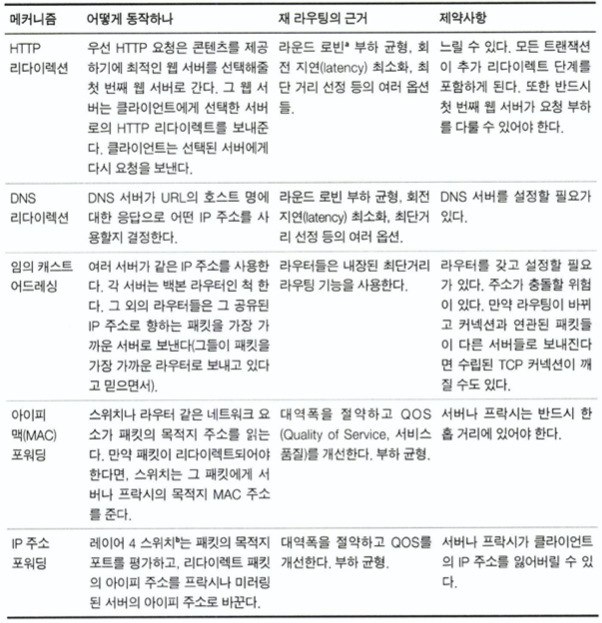
* 프락시와 캐시 리다이렉션 기법
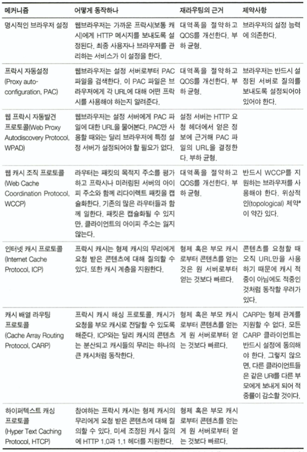

## 20.4 일반 리다이렉션 기법
### 20.4.1HTTP 리다이렉션
* 리다이렉팅 서버가 콘텐츠 서버의 부하나 거리를 고려하여 최선의 서버로 요청을 리다이렉트
	* 어떻게 최선의 서버를 결정하나?
* 특징
	* 클라이언트의 IP 주소에 기반한 결정
* 단점
	* 리다이렉팅 서버의 부하가 커질 수 있음
	* RTT 가 한번 더 발생하기 때문에 지연이 커짐
	* SPF (리다이렉팅 서버)

### 20.4.2 DNS 리다이렉션
* DNS는 하나의 도메인에 여러 IP 주소가 등록되는 것을 허용
* 웹 서버들을 모니터링하는 authoriative server 가 존재
* 다양한 resolving 알고리즘이 있음
	* 라운드 로빈
		* 웹 서버 팜 전체에 대한 부하 균형 유지에 초점
		* 서버의 위치와 상태에 대한 고려가 없음
		* 다중 주소 집합의 첫 번째 주소만 사용하는 클라이언트를 고려해 룩업 당 주소를 순환시켜 첫 번째에 위치하는 주소를 다르게 한다
	* 부하 균형 알고리즘
		* 웹 서버의 부하를 추적하여 부하가 가장 낮은 서버를 목록의 첫 번째에 위치시킴
	* 근접 라우팅 알고리즘
		* 사용자와 가장 가까운 위치의 웹 서버로 라우팅
	* 결함 마스킹 알고리즘
		* 네트워크 상태를 모니터링하여 장애 지점을 피해 라우팅
* 단점
	* DNS 캐싱
		* 하나의 클라이언트에 대한 부하 분산에 실패
	* 클라이언트가 아닌 로컬 DNS 서버의 아이피 주소에 기반한 결정

### 20.4.3 임의 캐스트 어드레싱
* 백본 라우터의 최단거리 라우팅에 의존하는 방법
* 특징
	* advertise 를 통해 백본 라우터는 최단거리의 웹 서버를 알고 있음
	* 백본 라우터가 임의 캐스트 주소를 목적지로 하는 패킷을 받으면 자신이 알고 있는 최단거리 웹 서버로 라우팅
* 단점
	* 반드시 라우팅 프로토콜이 사용해야 함
	* 주소 충돌을 처리할 수 있어야 함, 라우팅 누수 위험
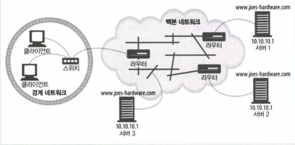

### 20.4.4 아이피 맥 포워딩
* 레이어-4 스위치를 사용해 특정 IP 주소와 포트번호에 대한 요청을 특정 MAC 장비로 포워딩
* 단점
	* 웹 서버들은 스위치와 한 홉 거리에 위치해야 함
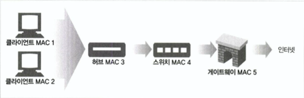
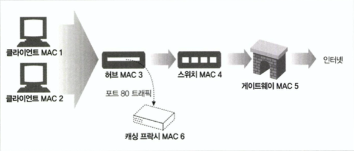
### 20.4.5 아이피 주소 포워딩
* 레이어-4 스위치를 사용해 특정 IP 주소와 포트번호에 대해 목적지 IP 주소의 변경에 따라 라우팅
* 맥 포워딩과 유사하지만 IP 주소에 기반한 라우팅이며, 한 홉 거리에 있을 필요가 없다
* NAT
	* 클라이언트와 서버 사이의 스위치가 중간에서 목적지와 출발지 주소를 번역해줌
	* 출발지 주소가 클라이언트의 주소 그대로 남는다면 스위치를 거치지 않고 응답을 내려줄 수 있는 경로가 없다

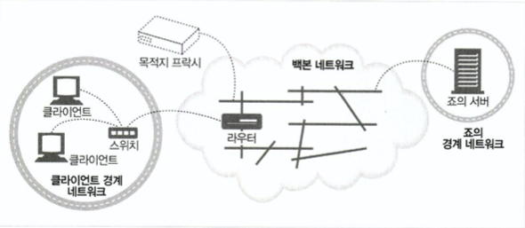

### 20.4.6 네트워크 구성요소 제어 프로토콜
* Network Element Control Protocol 은 네트워크 구성요소들과 서버 구성요소들의 통신 수단이다
* 명시적으로 부하 균형을 지원하지는 않는다
	* SE 가 NE 에 부하 균형 정보를 제공
	* MAC 포워딩, GRE 캡슐화, NAT 와 같은 패킷 전달 방식들을 제공
* 예외에 대한 개념을 지원
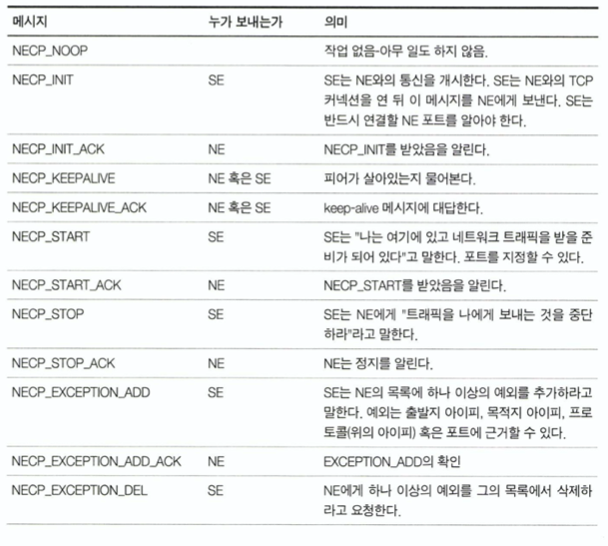
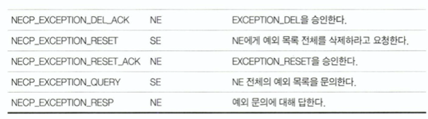

## 20.5 프락시 리다이렉션 방법
### 20.5.1 명시적 브라우저 설정
* 브라우저는 프락시 이름, 아이피 주소, 포트번호를 설정할 수 있는 메뉴가 존재
	* 미리 설정되있는 브라우저를 제공하기도 함
* 단점
	* 프락시로부터 응답이 없어도 원 서버에 접촉하지 않음
	* 네트워크 아키텍쳐가 변경에 유연하게 대처하기 어렵다
### 20.5.2 프락시 자동 설정
* 브라우저가 동적으로 자신의 프락시 설정을 변경
	* URL 마다 프락시가 지정되어 있는 PAC 파일을 받아온다
	* PAC 파일이 존재하는 서버는 미리 지정되어 있음
	* 매 재시작 시 PAC 파일을 받아온다
* PAC 파일은 도메인에 대해 프락시와 원 서버 중 어느쪽으로 먼저 접근해야하는지 반환하는 자바스크립트 파일이다
	* DNS 주소나 서브넷, 호스트명과 관련된 매개변수들에 기반한 결과를 반환할 수 있다
* 네트워크 아키텍쳐가 변경될 경우 PAC 파일에 반영 -> 브라우저 설정과 무관

### 20.5.3 웹 프락시 자동발견 프로토콜
* 웹 브라우저가 수동 설정이나 트래픽 인터셉터에 의존하지 않고 프락시를 발견할 수 있는 방법을 제공
* PAC 파일 자동발견
	* WPAD 는 HTTP 클라이언트가 PAC 파일 위치를 알아내 적절한 프락시 서버 이름을 알 수 있게 한다
	* 부하균형이나 장애 대처 등의 추가 기능을 위해 직접적으로 프락시 서버 이름을 알아내진 않는다
* WPAD 프로토콜 클라이언트 예시
	* WPAD 로 PAC CURL 탐색
	* URL 에 해당하는 PAC 파일을 받아옴
	* PAC 파일을 실행해 프락시 서버 알아냄
	* 프락시 서버에 요청
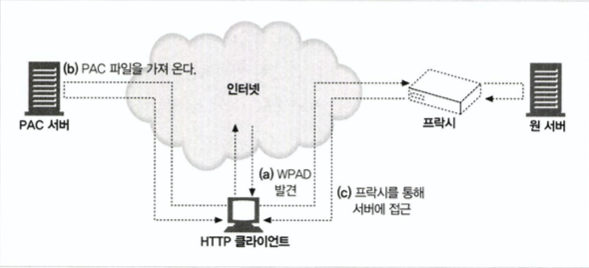

* WPAD 알고리즘
* 성공할 때 까지 순차실행
	* DHCP (Dynamic Host Configuration Protocol)
	* SLP (Service Location Protocol)
	* DNS에게 잘 알려진 호스트 명
	* DNS SRV 레코드
	* TXT 레코드의 DNS 서비스 URL 들
* WPAD 클라이언트는 DHCP 와 DNS 에게 잘 알려진 호스트명만 요구됨
* 모든 프로세스를 실패하면 프락시를 사용 안하는 것으로 설정
* DHCP를 이용한 CURL 발견
	* WPAD 클라이언트가 DHCP 질의를 통해 CURL 을 얻음
	* DHCP 서버가 CURL 을 저장하고 있어야 함
		* DHCP 옵션코드 252에 저장
* DNS A 레코드 룩업
	* 프락시 서버의 IP 주소들이 DNS 서버에 저장되어있어야 함
	* 모든 룩업 요청은 wpad 접두어가 붙은 QNAME 을 가짐
* PAC 파일 가져오기
	* 위의 방법으로 얻어온 CURL 로 GET 요청
	* 클라이언트가 다룰 수 있는 CFILE 포맷 정보가 담긴 Accept 헤더가 포함되어야 함
	
#### WPAD 가 실행되는 시점	
* 웹 클라이언트가 시작될 때
* 클라이언트 호스트 아이피 주소가 변경된 네트워크 스택으로부터 특정 이벤트를 받을 때마다
* PAC 파일이 만료되었을 때
	* 전체 WPAD 프로세스를 재실행해야 함
	* 조건부 요청으로 PAC 파일을 받아올 수 없다

## 20.6 캐시 리다이렉션 방법
* 고성능, 높은 신뢰성, 콘텐츠 지각 디스패칭까지 고려해야 해서 일반적인 리다이렉션 프로토콜보다 복잡하다
### 20.6.1 WCCP 리다이렉션
* 라우터와 캐시 사이 통신을로 라우터가 캐시를 검사하고 특정 트래픽을 특정 캐시로 포워딩
* WCCP 리다이렉션 동작
	* WCCP 를 제공하는 라우터, 다른 캐시와 의사소통이 가능한 캐시가 포함된 네트워크
	* 라우터들의 집합과 그 대상이 되는 캐시들이 WCCP 서비스 그룹을 구성
		* 서비스 그룹 설정으로 트래픽 분류와 로드밸런싱 방법에 대해 명시한다
	* HTTP 트래픽 리다이렉션 설정이 되있다면 HTTP 요청을 서비스 그룹의 캐시로 보낸다
	* 서비스 그룹 라우터는 HTTP 요청을 아이피 주소의 해시나 마스크/값 집합 대조 스킴 중 하나에 근거하여 서비스 그룹의 캐시를 선택
	* 라우터는 요청 패킷을 캐시의 아이피 주소와 함께 캡슐화하거나 아이피 맥 포워딩하여 캐시로 보냄
	* 캐시가 요청을 처리할 수 없다면 라우터로 돌아온다
	* 서비스 그룹의 구성원들은 지속적인 하트비트 메세지로 다른 구성원들의 가용성을 체크
* WCCP2 메세지들
* 
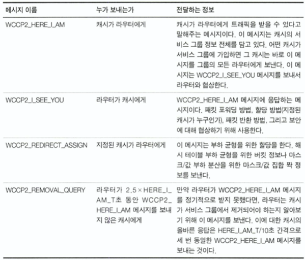
* 메세지 구성요소
	* 각 WCCP2 메세지를 헤더와 구성요소로 되어있다
	* 헤더는 메세지 종류, 버전, 길이를 포함
	* 각 구성요소는 종류와 길이를 서술하는 4바이트 헤더로 시작한다
		* 구성요소 길이는 헤더의 길이를 포함하지 않음
	* 
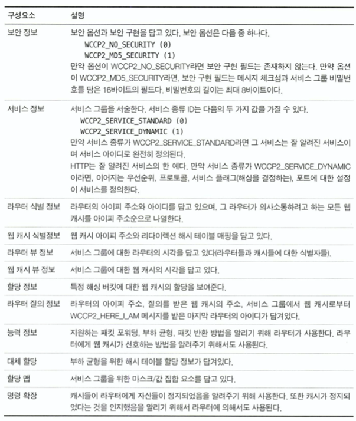
* 서비스 그룹
	* 서비스 그룹은 WCCP 메세지를 교환할 수 있는 라우터와 캐시들의 집합
	* 라우터들은 웹 트래픽을 서비스 그룹의 캐시로 포워딩
	* 라우터와 캐시는 Here I am 과 I See You 메세지로 서비스그룹 설정 정보를 교환
* GRE 패킷 캡슐화
	* WCCP 지원 라우터들은 HTTP 패킷을 특정 서버의 IP 주소와 함께 캡슐화해서 리다이렉트함
	* GRE 임을 나타내는 IP 헤더 proto 필드로 식별
	* 클라이언트 IP 주소를 잃어버리지 않는다
	* 
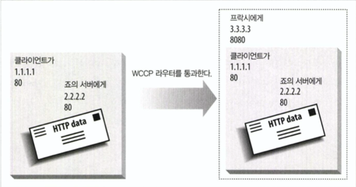
* WCCP 부하 균형
	* 라우터들과 서버들은 지속적인 하트비트 메세지로 가용상태를 체크
	* 가용불가로 판단되면 라우터는 트래픽을 리다이렉트하지 않고 인터넷으로 포워딩
	
## 20.7 인터넷 캐시 프로토콜
* 형제 캐시에 일어난 캐시 적중을 확인할 수 있도록 하는 프로토콜
* 원 서버보다 형제 캐시로부터 컨텐츠를 받아오는 비용이 더 적을 것을 전제로 함
* 근처 모든 캐시에 특정 URL 을 가지는지 질의
	* 응답은 HIT / MISS
	* HIT 응답을 준 캐시에 HTTP 커넥션을 열 수 있다
* Network byte order 를 따르는 32비트 구조체, UDP 기반
	* OP 코드
	* 버전
	* 길이
	* 요청번호
	* 옵션
	* 옵션 데이터
	* 발송자 호스트 주소
	* 페이로드

## 20.8 캐시 배열 라우팅 프로토콜
* 여러개의 프락시 서버 배열이 하나의 캐시처럼 보이도록 관리해주는 프로토콜
* 하나의 그룹 안에 중복 엔트리가 허용되는 ICP 와 달리 CARP는 해시를 사용해 중복을 허용하지 않음
	* ICP는 질의를 주변 모든 캐시에 브로드캐스팅하지만, CARP 는 특정 캐시 서버에만 질의
* 단점
	* 몇몇 캐시 서버가 다운되면 해시 함수가 수정되어야하고, 캐시된 컨텐츠들의 재배치로 인한 비용이든다

## 20.9 하이퍼텍스트 캐싱 프로토콜
* 형제 캐시에 질의할 때 URL 과 모든 요청 및 응답 헤더를 사용
	* HTTP/0.9 기반으로 설계된 ICP 한계 보완
* 자체 인증기능을 제공 
* 캐싱 정책
	* SET 메세지로 캐시된 문서들에 대한 정책 변경이 가능
	* 
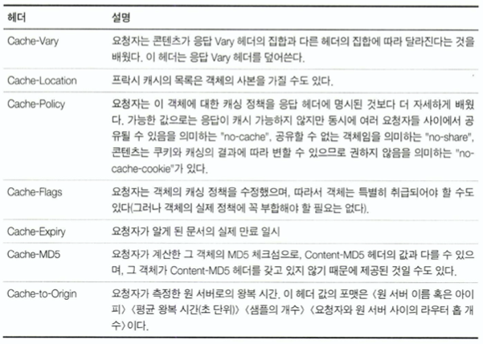
